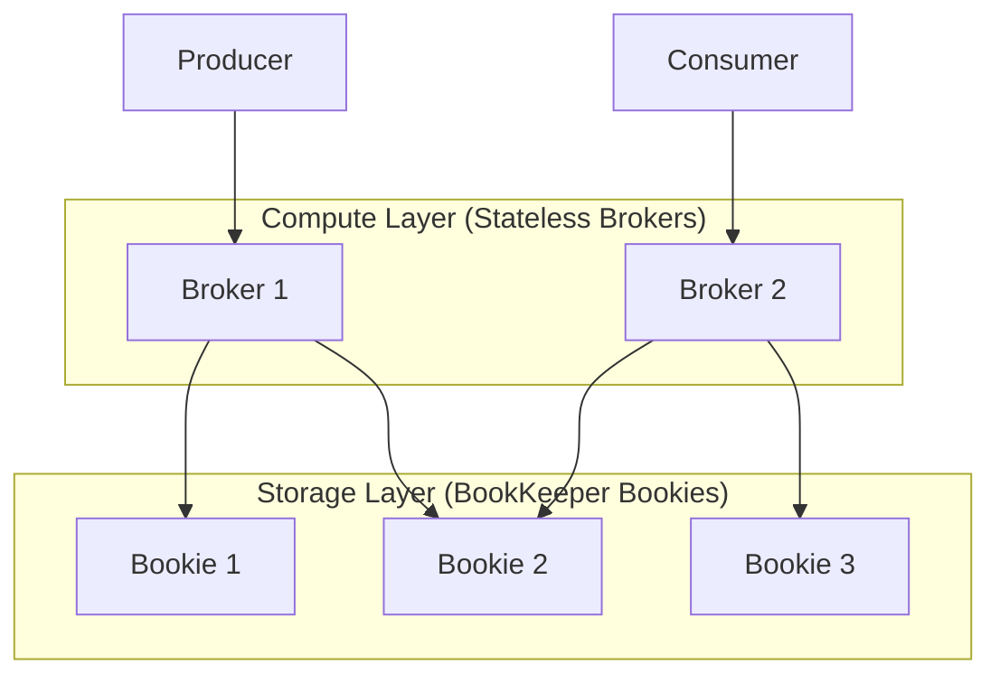

# Apache Pulsar

## Definition
Apache Pulsar is a cloud-native, multi-tenant pub/sub messaging system with built-in storage separation. Unlike Kafka, Pulsar separates compute (brokers) from storage (BookKeeper bookies), enabling elastic scaling without data rebalancing.



## Real-World Example
**Yahoo Mail**: Processes billions of events daily with Pulsar. Yahoo chose Pulsar because it can handle both real-time streaming and queue-style workloads with a single infrastructure.

## Key Features

- **Segment-centric storage** — Data stored in Apache BookKeeper (separate from brokers)
- **Geo-replication** — Built-in, cross-region, active-active replication
- **Multi-tenancy** — Native isolation: Tenant → Namespace → Topic
- **Unified model** — Supports both stream (persistent, ordered) and queue (shared, competing)
- **Exactly-once** — Built-in deduplication and transactional messaging
- **Function-as-a-Service** — Lightweight compute functions on events (Pulsar Functions)

## Architecture

```
┌─────────────────────────────────────────────────────┐
│                   Pulsar Cluster                      │
├─────────────────────────────────────────────────────┤
│                                                       │
│  Producer ──► Broker (compute layer)                  │
│                        │                              │
│                        ▼                              │
│              BookKeeper (storage layer)                │
│              ┌────┬────┬────┬────┐                    │
│              │Bk 1│Bk 2│Bk 3│Bk N│                    │
│              └────┴────┴────┴────┘                    │
│                        │                              │
│                        ▼                              │
│  Consumer ◄── Broker (read from BookKeeper)           │
│                                                       │
│  Benefits:                                             │
│  - Add brokers: no data migration needed               │
│  - Add bookies: data rebalanced automatically          │
│  - Brokers are stateless (scale independently)         │
│                                                       │
└─────────────────────────────────────────────────────┘
```

## Pulsar vs Kafka

| Aspect | Pulsar | Kafka |
|--------|--------|-------|
| **Storage** | Separate (BookKeeper) — brokers don't store data | Coupled — broker stores data on local disk |
| **Scaling** | Add brokers: no rebalance | Add brokers: partition rebalance required |
| **Geo-replication** | Built-in, native | MirrorMaker (external tool) |
| **Latency** | Lower p99 (segmented architecture) | Higher p99 (rebalance impact) |
| **Multi-tenancy** | Native: tenant → namespace → topic | Topic-level only (no namespace isolation) |
| **Deployment complexity** | Higher (2 systems: brokers + bookies) | Lower (single system) |
| **Performance** | ~200K msg/sec per broker | ~1M msg/sec per broker |

## When to Choose Pulsar Over Kafka

```
Choose Pulsar when:
- You need native geo-replication
- Multi-tenancy is a core requirement
- You want independent compute/storage scaling
- You need low-latency p99 with frequent rebalances
- You want unified queuing + streaming (not just streaming)

Choose Kafka when:
- Maximum throughput is critical (> 1M msg/sec)
- Simpler operations (single system)
- Rich ecosystem (connectors, stream processing)
- Your team knows Kafka well
```

## Interview Questions

1. How does Pulsar's storage separation (broker vs bookie) benefit operations?
2. Compare Pulsar and Kafka for geo-replicated workloads
3. What is a BookKeeper and how does it work?
4. When would you choose Pulsar over Kafka?
5. How does Pulsar handle multi-tenancy?
6. How does Pulsar achieve exactly-once messaging?
