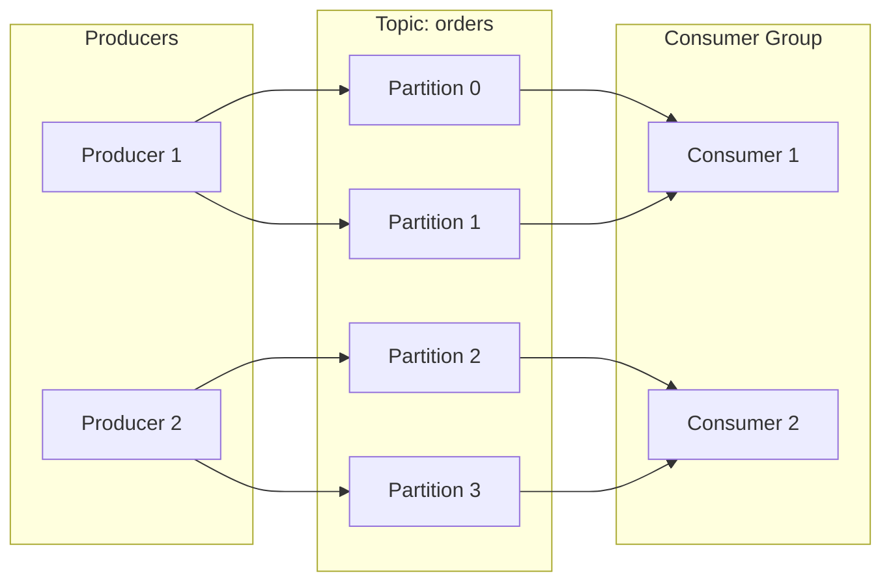

# Producer & Consumer

## Producer
A producer sends messages to a queue/topic.

```
Producer ──send()──► Queue/Topic
   │                      │
   ack ◄──────────────────┘
```

**Key properties**:
- **acks**: 0 (fire-forget), 1 (leader), -1 (all replicas)
- **retries**: Automatic retry on failure
- **batch.size**: Group messages for efficiency
- **linger.ms**: Max wait time before sending batch

## Consumer
A consumer receives messages from a queue/topic.

```
Consumer ◄──poll()─── Queue/Topic
   │
   ack ──────────────► (commit offset)
```

**Key properties**:
- **auto.offset.reset**: earliest/latest/none
- **enable.auto.commit**: Auto or manual offset commit
- **max.poll.records**: Max per poll call

## Consumer Group

```
Topic: orders [P0] [P1] [P2] [P3]
                │    │    │    │
Consumer Group:  C1   C1   C2   C2
(orders-service) 

Each partition assigned to one consumer in group.
If C1 fails: partitions rebalanced.


