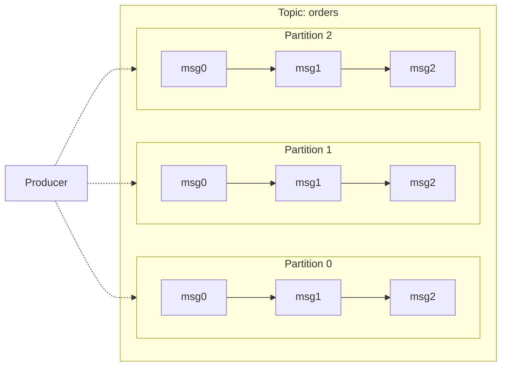

# Partition & Offset

## Partition
A partition is an ordered, immutable sequence of records within a topic.

```
Topic: "orders"
┌─────────────────────────────────────┐
│ Partition 0: [msg0] [msg1] [msg2]   │
├─────────────────────────────────────┤
│ Partition 1: [msg0] [msg1] [msg2]   │
├─────────────────────────────────────┤
│ Partition 2: [msg0] [msg1] [msg2]   │
└─────────────────────────────────────┘
```

**Partition key**: Producers can specify a key; same key → same partition (ordering per key).

## Offset
An offset is a unique sequential ID for each message within a partition.



```
Partition 0 (offsets):
┌──────┬──────┬──────┬──────┬──────┐
│ 0    │ 1    │ 2    │ 3    │ 4    │
│ msgA │ msgB │ msgC │ msgD │ msgE │
└──────┴──────┴──────┴──────┴──────┘
         ▲                        ▲
      Consumer is here        Latest
      (offset=1)             (offset=5)
```

**Consumer tracks**: current offset per partition. On restart, starts from last committed offset.
