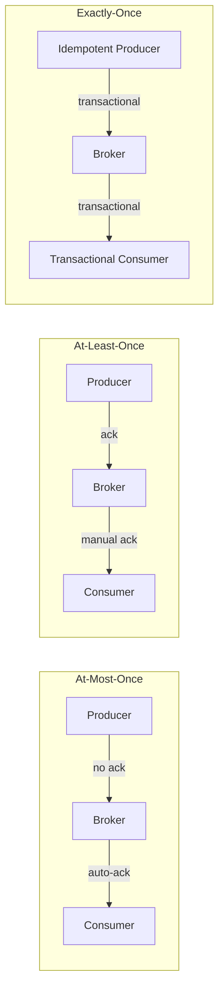

# Delivery Guarantees

## At-Most-Once
Message may be lost but never redelivered.

```
Producer ──► Broker (no ack) ──► Consumer (auto-ack)
                                        │
                                  Message processed ONCE
                                  or not at all

Use case: Logging, metrics (loss acceptable)
```

## At-Least-Once
Message never lost but may be redelivered.

```
Producer ──► Broker (ack) ──► Consumer (manual ack)
                                    │
                              Fail before ack ──► Redeliver

Use case: Notifications, email (duplicates tolerable)
```

## Exactly-Once
Message delivered exactly once — the gold standard.

```
Producer ──► Idempotent Producer ──► Broker ──► Transactional Consumer
    │                                  │
    └──── Transactional API ───────────┘
    
Kafka: enable.idempotence=true + transactions
SQS FIFO: Deduplication ID + Exactly-once processing

Use case: Payments, financial transactions
```

## Comparison

| Guarantee | Loss Risk | Duplicate Risk | Performance |
|-----------|-----------|----------------|-------------|
| At-most-once | ✅ Possible | ❌ No | Fastest |
| At-least-once | ❌ No | ✅ Possible | Fast |
| Exactly-once | ❌ No | ❌ No | Slowest |


