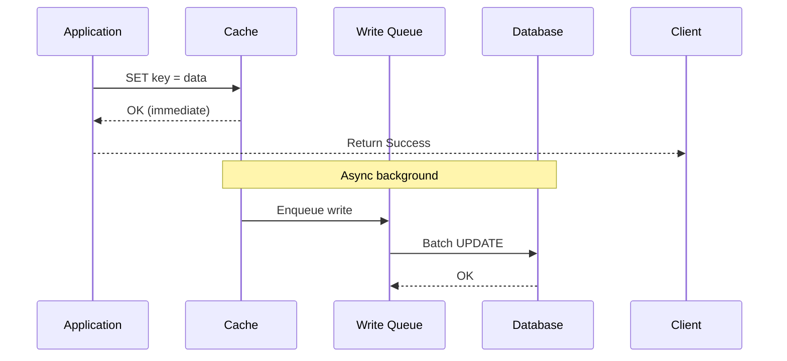

# Write Back Pattern

## Definition
Write Back (also called Write Behind) writes data to the cache and immediately acknowledges success. The write to the database happens asynchronously in the background.



## Flow Diagram

```
Write Request
       │
       ▼
Write to Cache ───► Return Success Immediately
       │
       │ (async background)
       ▼
Write to Database (batched, delayed)
```

## Code Example

```python
def update_user_async(user_id, data):
    key = f"user:{user_id}"
    
    # Write to cache immediately
    cache.set(key, data)
    
    # Queue database write (async)
    write_queue.enqueue({
        'table': 'users',
        'query': 'UPDATE users SET name = ? WHERE id = ?',
        'params': [data['name'], user_id]
    })
    
    return {"success": True}

# Background worker processes the queue
def process_write_queue():
    while True:
        batch = write_queue.dequeue_batch(100)
        db.execute_batch(batch)
```

## Advantages
- Very fast writes (cache speed)
- Can batch database writes
- Reduces database load
- Tolerates database latency spikes

## Disadvantages
- Data loss risk if cache fails before DB write
- Complex error handling
- Cache-DB inconsistency window

## Interview Questions
1. When would you accept the data loss risk of write-back?
2. How do you handle cache failure with pending writes?
3. Compare write-back vs write-through for analytics
4. What durability guarantees can you add to write-back?
5. Design a write-back cache for a social media like counter
