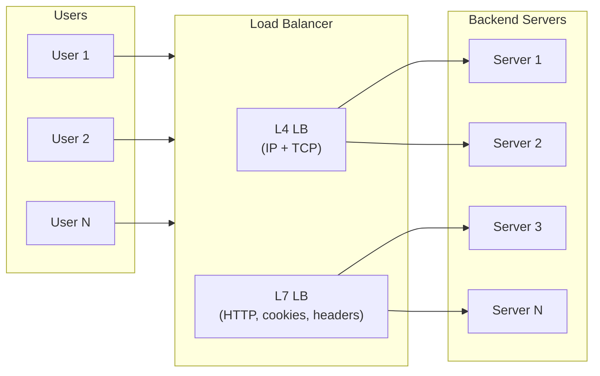
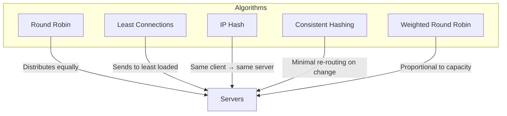
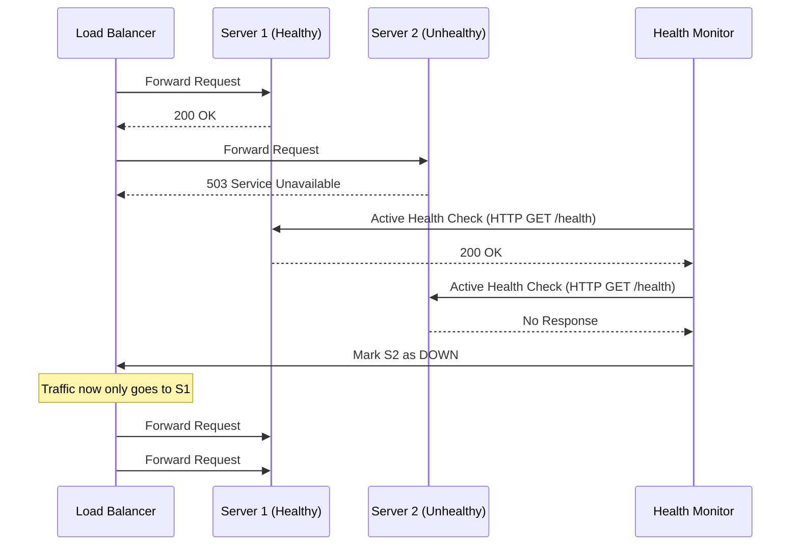
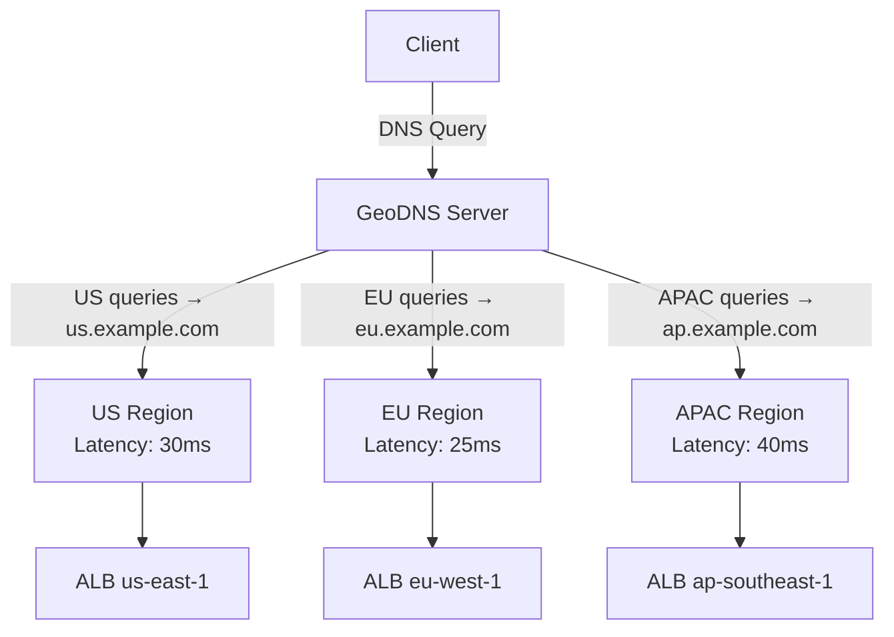

# Load Balancers

## Definition

A load balancer distributes incoming network traffic across multiple backend servers to ensure no single server becomes overwhelmed. It improves availability, fault tolerance, and scalability by enabling horizontal scaling and providing health-check-driven failover.



## Real-World Example

**Amazon**: Uses ALB (Application Load Balancer) and NLB (Network Load Balancer) to distribute traffic across millions of EC2 instances. When Amazon.com experiences Prime Day traffic spikes, load balancers dynamically route requests across auto-scaling groups spanning multiple availability zones.

## L4 vs L7 Load Balancing

| Feature | L4 (Transport Layer) | L7 (Application Layer) |
|---------|---------------------|----------------------|
| OSI Layer | Layer 4 (TCP/UDP) | Layer 7 (HTTP/HTTPS) |
| Decision basis | IP, port, protocol | URL, headers, cookies, content |
| Performance | Very high (kernel-level) | Moderate (application-level parsing) |
| Features | NAT, DSR, direct routing | Path-based routing, SSL termination, rewriting |
| Use case | TCP/UDP traffic, database load balancing | Web applications, API gateways |
| Examples | NLB, HAProxy (TCP mode), Nginx (stream) | ALB, HAProxy (HTTP mode), Nginx (HTTP) |

## Load Balancing Algorithms



| Algorithm | Description | Pros | Cons |
|-----------|-------------|------|------|
| **Round Robin** | Sequentially distributes requests | Simple, fair distribution | Doesn't account for server load |
| **Least Connections** | Sends to server with fewest active connections | Adapts to varying request times | More state tracking overhead |
| **IP Hash** | Hashes client IP to select server | Session persistence without cookies | Uneven distribution with small client pools |
| **Consistent Hashing** | Hash ring minimizes re-mapping on changes | Stable when adding/removing servers | Slightly more complex |
| **Weighted** | Assigns weights based on server capacity | Handles heterogeneous servers | Requires tuning weights |

## Health Checks

| Type | Mechanism | Pros | Cons |
|------|-----------|------|------|
| **Active** | LB periodically sends health probes (TCP, HTTP, ICMP) | Deterministic, configurable intervals | Adds network overhead |
| **Passive** | LB monitors real traffic — marks server down after N consecutive failures | Zero overhead | Slower to detect failures |
| **Hybrid** | Active probes + passive monitoring | Best of both | Most complex to configure |



## Session Persistence (Sticky Sessions)

| Method | Mechanism | Limitation |
|--------|-----------|------------|
| **Cookie-based** | LB sets a cookie mapping client to server | Client can reject cookies |
| **Source IP Hash** | Hash of client IP determines server | Clients behind NAT all map to same server |
| **Session Affinity** | LB tracks session-to-server mapping | Stateful, memory overhead |
| **Sticky Cookie Duration** | LB-generated cookie with TTL | Stale mappings after server failure |

## Load Balancer Comparison

| Feature | AWS ALB | AWS NLB | HAProxy | Nginx | Envoy |
|---------|---------|---------|---------|-------|-------|
| Layer | L7 | L4 | L4/L7 | L4/L7 | L4/L7 |
| Performance | Up to 100K req/s | Up to 25M req/s | 2M+ req/s | 1M+ req/s | 1M+ req/s |
| SSL Termination | Yes | Yes (TLS) | Yes | Yes | Yes |
| Health Checks | Active | Active | Active+Passive | Active+Passive | Active+Passive |
| Sticky Sessions | Cookie-based | Source IP | Cookie+Source IP | Cookie+Source IP | Cookie+Source IP |
| Pricing | Per hour + LCU | Per hour + NLCU | Free (OSS) | Free (OSS) | Free (OSS) |
| Configuration | AWS Console/API | AWS Console/API | Config file | Config file | xDS API/Config |

## DNS Load Balancing



| Method | Description | Use Case |
|--------|-------------|----------|
| **GeoDNS** | Returns IP of the nearest geographic region | Regional content delivery |
| **Latency-based** | Routes to region with lowest measured latency | Global real-time apps |
| **Weighted Round Robin DNS** | Distributes traffic by weight across IPs | Canary deployments, A/B testing |
| **Failover DNS** | Routes to secondary region if primary is unhealthy | Disaster recovery |

## Anycast Routing

Anycast advertises the same IP address from multiple locations. Routers direct traffic to the nearest (by BGP metrics) location. Used by Cloudflare, AWS Global Accelerator, and Google Cloud HTTP Load Balancing.

```
User in Tokyo
    │
    ▼
BGP Router ──► Anycast IP 1.2.3.4
    │
    ├── Nearest: Tokyo PoP (5ms)
    │   └── Server in Tokyo
    │
    └── Farther: Singapore PoP (80ms)
        └── Only if Tokyo fails
```

## Code Example

```python
import hashlib
import bisect

class ConsistentHashLoadBalancer:
    def __init__(self, nodes=None, replicas=100):
        self.replicas = replicas
        self.ring = {}
        self.sorted_keys = []
        if nodes:
            for node in nodes:
                self.add_node(node)

    def _hash(self, key):
        return int(hashlib.md5(key.encode()).hexdigest(), 16)

    def add_node(self, node):
        for i in range(self.replicas):
            hash_key = self._hash(f"{node}:{i}")
            self.ring[hash_key] = node
            bisect.insort(self.sorted_keys, hash_key)

    def remove_node(self, node):
        for i in range(self.replicas):
            hash_key = self._hash(f"{node}:{i}")
            del self.ring[hash_key]
            self.sorted_keys.remove(hash_key)

    def get_node(self, key):
        if not self.sorted_keys:
            return None
        hash_key = self._hash(key)
        idx = bisect.bisect_right(self.sorted_keys, hash_key)
        if idx == len(self.sorted_keys):
            idx = 0
        return self.ring[self.sorted_keys[idx]]

lb = ConsistentHashLoadBalancer(["server1", "server2", "server3"])
for request_id in range(10):
    server = lb.get_node(f"request:{request_id}")
    print(f"Request {request_id} → {server}")
```

## Interview Questions

1. What are the trade-offs between L4 and L7 load balancing?
2. How does consistent hashing improve load balancer scalability over modulo-based routing?
3. Design a global load balancing solution for a multi-region SaaS platform
4. How do you handle session persistence when a backend server fails?
5. Explain how active and passive health checks work together to improve fault tolerance
6. Compare ALB, NLB, HAProxy, and Envoy for a Kubernetes microservices architecture
7. How does anycast routing differ from DNS-based global load balancing?
