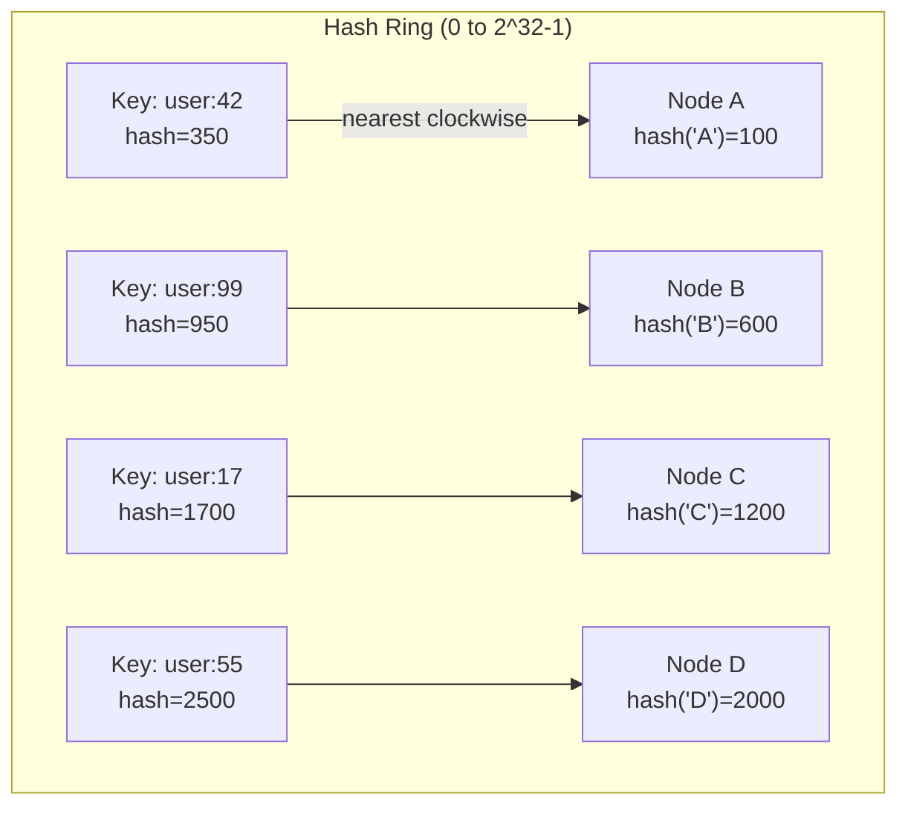
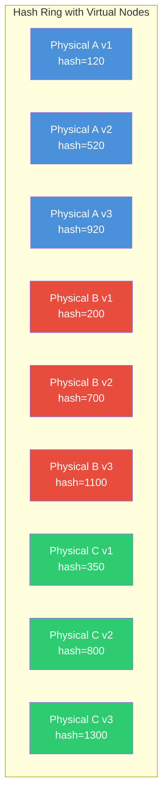

# Consistent Hashing

## Definition

Consistent hashing is a distributed hashing scheme that maps keys to nodes on a virtual ring. Unlike modulo-based sharding where adding or removing a node causes nearly all keys to remap, consistent hashing ensures only K/N keys are relocated on average (where K is total keys and N is total nodes).

## Real-World Example

**DynamoDB**: Uses consistent hashing to partition data across storage nodes. When a new node joins the cluster, only a fraction of the keyspace (approximately 1/N) needs to be rebalanced, allowing DynamoDB to scale from 10 to 1000 nodes without massive data migration.

## The Problem with Modulo-Based Sharding

```python
def modulo_shard(key, num_nodes):
    return hash(key) % num_nodes

# With 4 nodes:
node = modulo_shard("user:42", 4)  # → node 2

# Adding node 5 changes the result for ALL keys:
node = modulo_shard("user:42", 5)  # → node 3 (moved!)
```

| Scenario | Keys Reassigned |
|----------|----------------|
| Add 1 node to 4-node cluster | ~80% of keys |
| Remove 1 node from 5-node cluster | ~80% of keys |
| Any change | Nearly all keys |

## Hash Ring Concept



In consistent hashing:

1. Both nodes and keys are hashed onto a ring (0 to 2^32 - 1)
2. Each key is assigned to the nearest node clockwise
3. When a node is added or removed, only keys in that node's arc are remapped

## Virtual Nodes

Without virtual nodes, physical servers with slightly different hash positions can receive unbalanced load. Virtual nodes (vnodes) solve this by mapping each physical node to multiple points on the ring.



**Without virtual nodes (3 nodes):** Each server owns 1/3 of the ring. If hash distribution is uneven, one server gets 50% of keys.

**With 100 virtual nodes per server:** Each server owns 100 scattered arcs. The law of large numbers ensures near-perfect 1/N distribution.

## Replication Factor on the Ring

For fault tolerance, keys are replicated to the next N *clockwise* servers after their primary assignment:

```python
def get_nodes(key, ring, replication_factor=3):
    primary = find_nearest_clockwise(key, ring)
    return [ring[(primary + i) % len(ring)] 
            for i in range(replication_factor)]
```

| Replication Factor | Reads Required | Fault Tolerance |
|-------------------|----------------|-----------------|
| 1 (no replication) | 1 | 0 node failures |
| 3 | 1 (or read repair) | 1 failure (with quorum) |
| N (all nodes) | Any | 2+ failures |

## Implementation in Production Systems

| System | Consistent Hashing Usage | Virtual Nodes |
|--------|------------------------|---------------|
| **DynamoDB** | Primary key → hash ring → storage node | Yes (1000 vnodes/node) |
| **Cassandra** | Partition key → token ring → replica nodes | Yes (256 vnodes/node default) |
| **Redis Cluster** | Key hash slot (16384 slots) across nodes | No (fixed slot count) |
| **Memcached** | Client-side consistent hashing (libketama) | Yes (160 vnodes/node) |
| **Couchbase** | VBucket mapping (1024 vBuckets across nodes) | Yes (vBucket abstraction) |

## Comparison: Modulo vs Consistent Hashing

| Property | Modulo Sharding | Consistent Hashing |
|----------|----------------|--------------------|
| Keys moved on node add | ~N-1/N | ~1/N |
| Keys moved on node remove | ~N-1/N | ~1/N |
| Load distribution | Fair (if hash uniform) | Fair (with virtual nodes) |
| Complexity | Trivial | Moderate |
| Use case | Fixed cluster size | Elastic scaling |
| Example | Application-level sharding | Cassandra, DynamoDB |

## Code Example

```python
import hashlib
import bisect

class ConsistentHashRing:
    def __init__(self, virtual_nodes=150):
        self.virtual_nodes = virtual_nodes
        self.ring = {}
        self.nodes = set()
        self.sorted_keys = []

    def _hash(self, key):
        h = hashlib.md5(key.encode()).hexdigest()
        return int(h, 16)

    def add_node(self, node_id):
        self.nodes.add(node_id)
        for i in range(self.virtual_nodes):
            vnode_key = f"{node_id}:vnode:{i}"
            h = self._hash(vnode_key)
            self.ring[h] = node_id
            bisect.insort(self.sorted_keys, h)

    def remove_node(self, node_id):
        self.nodes.discard(node_id)
        for i in range(self.virtual_nodes):
            vnode_key = f"{node_id}:vnode:{i}"
            h = self._hash(vnode_key)
            if h in self.ring:
                del self.ring[h]
                self.sorted_keys.remove(h)

    def get_node(self, key):
        if not self.sorted_keys:
            return None
        h = self._hash(key)
        idx = bisect.bisect_right(self.sorted_keys, h)
        if idx == len(self.sorted_keys):
            idx = 0
        return self.ring[self.sorted_keys[idx]]

    def get_nodes(self, key, count=3):
        if not self.sorted_keys or count < 1:
            return []
        h = self._hash(key)
        idx = bisect.bisect_right(self.sorted_keys, h)
        result = []
        seen = set()
        for i in range(len(self.sorted_keys)):
            ring_idx = (idx + i) % len(self.sorted_keys)
            node = self.ring[self.sorted_keys[ring_idx]]
            if node not in seen:
                seen.add(node)
                result.append(node)
            if len(result) == count:
                break
        return result

ring = ConsistentHashRing(virtual_nodes=100)
ring.add_node("redis-a")
ring.add_node("redis-b")
ring.add_node("redis-c")

key = "user:12345"
primary = ring.get_node(key)
replicas = ring.get_nodes(key, 3)
print(f"Key: {key}")
print(f"Primary: {primary}")
print(f"Replicas: {replicas}")
```

```go
package main

import (
	"crypto/md5"
	"fmt"
	"sort"
	"strconv"
)

type HashRing struct {
	nodes         map[uint32]string
	sortedKeys    []uint32
	virtualNodes  int
}

func NewHashRing(virtualNodes int) *HashRing {
	return &HashRing{
		nodes:        make(map[uint32]string),
		virtualNodes: virtualNodes,
	}
}

func (r *HashRing) hash(key string) uint32 {
	h := md5.Sum([]byte(key))
	return uint32(h[0])<<24 | uint32(h[1])<<16 | uint32(h[2])<<8 | uint32(h[3])
}

func (r *HashRing) AddNode(nodeID string) {
	for i := 0; i < r.virtualNodes; i++ {
		vnode := fmt.Sprintf("%s:vnode:%d", nodeID, i)
		h := r.hash(vnode)
		r.nodes[h] = nodeID
		r.sortedKeys = append(r.sortedKeys, h)
	}
	sort.Slice(r.sortedKeys, func(i, j int) bool {
		return r.sortedKeys[i] < r.sortedKeys[j]
	})
}

func (r *HashRing) RemoveNode(nodeID string) {
	newSortedKeys := []uint32{}
	for _, h := range r.sortedKeys {
		if r.nodes[h] == nodeID {
			delete(r.nodes, h)
		} else {
			newSortedKeys = append(newSortedKeys, h)
		}
	}
	r.sortedKeys = newSortedKeys
}

func (r *HashRing) GetNode(key string) string {
	if len(r.sortedKeys) == 0 {
		return ""
	}
	h := r.hash(key)
	idx := sort.Search(len(r.sortedKeys), func(i int) bool {
		return r.sortedKeys[i] >= h
	})
	if idx == len(r.sortedKeys) {
		idx = 0
	}
	return r.nodes[r.sortedKeys[idx]]
}

func main() {
	ring := NewHashRing(100)
	ring.AddNode("cassandra-a")
	ring.AddNode("cassandra-b")
	ring.AddNode("cassandra-c")

	for i := 0; i < 10; i++ {
		key := "user:" + strconv.Itoa(i)
		node := ring.GetNode(key)
		fmt.Printf("%-10s → %s\n", key, node)
	}
}
```

## Interview Questions

1. Why does modulo-based sharding cause so many keys to move when a node is added?
2. How do virtual nodes improve load distribution in consistent hashing?
3. Explain how DynamoDB uses consistent hashing for scalable partition management
4. How does replication factor interact with the hash ring for fault tolerance?
5. Compare consistent hashing in Redis Cluster (hash slots) vs Cassandra (token ring)
6. What happens to in-flight requests when a node is removed from a consistent hash ring?
7. Design a distributed cache using consistent hashing with 3 replicas per key
