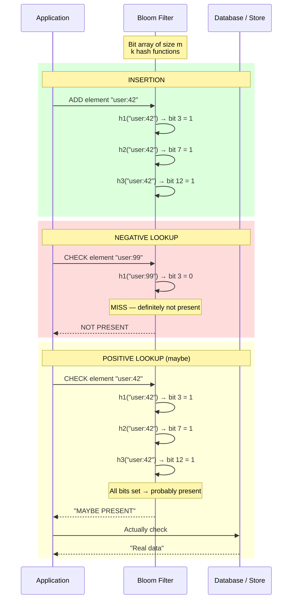
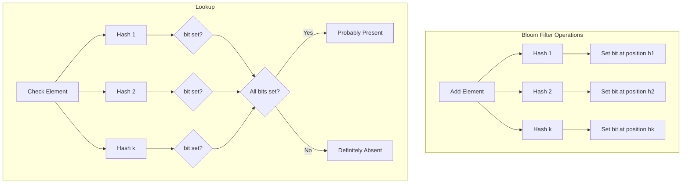
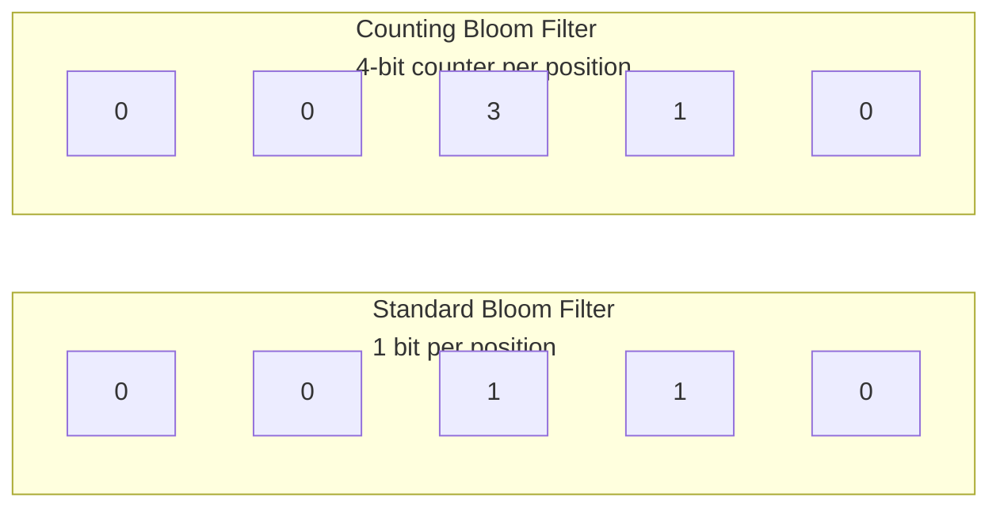

# Bloom Filters

## Definition

A Bloom filter is a space-efficient probabilistic data structure used to test whether an element is a member of a set. It guarantees zero false negatives (if it says "not present", it's definitely absent) but has a configurable false positive rate (it may say "present" when it's not). The filter is backed by a bit array and multiple independent hash functions.

## Real-World Example

**Chrome Safe Browsing**: Chrome downloads a bloom filter of known malicious URLs (tens of thousands of entries) — only ~32KB in size. Before visiting a URL, Chrome checks the filter locally. On a match, it queries Google's servers for confirmation. This avoids sending every URL to Google (privacy + performance) while catching 99.9% of malicious sites.

## How Bloom Filters Work



## Architecture



## Key Parameters

| Parameter | Symbol | Impact |
|-----------|--------|--------|
| Bit array size | m | Larger m = lower false positive rate |
| Number of hash functions | k | Optimal k = (m/n) * ln(2) |
| Number of elements | n | More elements = higher false positive rate |
| False positive rate | p | p ≈ (1 - e^(-kn/m))^k |

**Optimal k**: k_opt = (m / n) * ln(2)

**Required bits for target false positive rate**: m = -n * ln(p) / (ln(2))^2

| Elements (n) | Desired FP Rate | Bits Needed (m) | Optimal Hashes (k) | Size |
|-------------|----------------|-----------------|-------------------|------|
| 10,000 | 1% | 95,256 | 6.6 ≈ 7 | 12 KB |
| 1,000,000 | 1% | 9,585,059 | 6.6 ≈ 7 | 1.2 MB |
| 1,000,000 | 0.1% | 14,377,440 | 9.96 ≈ 10 | 1.8 MB |
| 10,000,000 | 1% | 95,818,384 | 6.6 ≈ 7 | 11.4 MB |

## Use Cases

| Use Case | Benefit | Example |
|----------|---------|---------|
| **Cache Stampede Prevention** | Avoid DB lookup for nonexistent keys | If bloom filter says key absent, skip cache + DB entirely |
| **CDN Lookup** | Quickly check if asset is in cache tier | Akamai edge servers check bloom filter before fetching |
| **Spam Detection** | Check if email is known spam | Gmail checks bloom filter of spam hashes (fast reject) |
| **Cassandra/DynamoDB** | Check if partition key might exist before query | Cassandra bloom filters per SSTable |
| **HBase** | Skip HFile scans for nonexistent keys | HBase bloom filters on row keys, column families |
| **Chrome Safe Browsing** | Test URLs against malware database locally | 32KB filter for 1M+ malicious URLs |
| **Medium Feed Dedup** | Show only new articles to users | Bloom filter of read article IDs |

## Counting Bloom Filter

Standard bloom filters don't support deletion (you can't unset a bit because other entries share it). Counting bloom filters extend each bit to a counter (2-4 bits per counter). On add, increment counters. On remove, decrement counters.



| Feature | Standard Bloom Filter | Counting Bloom Filter |
|---------|----------------------|----------------------|
| Deletion support | No | Yes |
| Memory per position | 1 bit | 2-4 bits |
| Counter overflow risk | N/A | Yes (use 4 bits max 15) |
| Common use | Membership test only | Cache with eviction |

## Scalable Bloom Filter

A scalable bloom filter starts with a small filter and adds new filters as the element count grows. Old filters are read-only and never reset — lookup checks all filters sequentially.

```
Initial filter: m bits, k hashes, capacity n
    │
First resize: Create new filter, double m
    │
Second resize: Create new filter, double m again
    │
Lookup(item): Check filter[0] OR filter[1] OR filter[2] ...
```

## Cuckoo Filter vs Bloom Filter

| Feature | Cuckoo Filter | Bloom Filter |
|---------|--------------|--------------|
| Space efficiency | Better (2-3 bits per entry at 3% FP) | ~9.6 bits per entry at 1% FP |
| Lookup speed | Similar | Similar |
| Insert speed | Fast (expected O(1)) | O(k) |
| Deletion | Native support (fingerprint removal) | Requires counting variant |
| Maximum load factor | ~95% with 2 hash functions | ~100% (degrading FP rate) |
| Locality | Good (2 candidate buckets) | Random access across bits |

## Code Example

```python
import hashlib
import math
from bitarray import bitarray

class BloomFilter:
    def __init__(self, n, fp_prob=0.01):
        self.fp_prob = fp_prob
        self.n = n
        self.m = self._get_size(n, fp_prob)
        self.k = self._get_hashes(self.m, n)
        self.bit_array = bitarray(self.m)
        self.bit_array.setall(0)

    def _get_size(self, n, p):
        m = -n * math.log(p) / (math.log(2) ** 2)
        return int(m)

    def _get_hashes(self, m, n):
        k = (m / n) * math.log(2)
        return int(k)

    def _hashes(self, item):
        h1 = int(hashlib.md5(item.encode()).hexdigest(), 16)
        h2 = int(hashlib.sha1(item.encode()).hexdigest(), 16)
        return [(h1 + i * h2) % self.m for i in range(self.k)]

    def add(self, item):
        for pos in self._hashes(item):
            self.bit_array[pos] = 1

    def check(self, item):
        for pos in self._hashes(item):
            if not self.bit_array[pos]:
                return False
        return True

    def __len__(self):
        bits_set = self.bit_array.count(1)
        estimate = -self.m * math.log(1 - bits_set / self.m) / self.k
        return int(estimate)

bf = BloomFilter(10000, 0.01)
bf.add("user:42")
bf.add("user:99")
bf.add("product:shoes")

print(bf.check("user:42"))       # True (definitely added)
print(bf.check("user:99999"))    # False (never added)
print(bf.check("product:shoes")) # True
```

```python
# Cache stampede prevention with Bloom Filter
class CacheWithBloom:
    def __init__(self, cache, db, bloom):
        self.cache = cache
        self.db = db
        self.bloom = bloom

    def get(self, key, ttl=3600):
        if not self.bloom.check(key):
            return None
        result = self.cache.get(key)
        if result is not None:
            return result
        result = self.db.query("SELECT data FROM items WHERE key = ?", key)
        if result is None:
            self.bloom.add(key)
            return None
        self.cache.setex(key, ttl, result)
        return result

    def set(self, key, value, ttl=3600):
        self.bloom.add(key)
        self.cache.setex(key, ttl, value)
        self.db.execute("INSERT OR REPLACE INTO items VALUES (?, ?)", key, value)
```

## Best Practices

1. **Choose optimal k**: Use k = (m/n) * ln(2) for minimum false positive rate
2. **Pre-allocate**: Decide maximum capacity (n) upfront — adding too many elements degrades FP rate
3. **Use cryptographically weak hashes**: Non-crypto hashes like MurmurHash or xxHash are faster and good enough
4. **Partition large filters**: For very large sets, partition into fixed-size segments
5. **Monitor false positive rate**: Track actual FP rate vs theoretical — if it exceeds threshold, resize or rebuild
6. **Combine with cache**: Bloom filter as first gatekeeper, cache as second, DB as source of truth

## Interview Questions

1. How does a bloom filter achieve space efficiency compared to a hash set?
2. Why does a bloom filter never produce false negatives?
3. Design a bloom filter-based cache stampede prevention system for a high-traffic API
4. How do you handle deletion in a bloom filter (counting variant vs cuckoo filter)?
5. What happens to the false positive rate when a bloom filter exceeds its designed capacity?
6. Compare bloom filters and cuckoo filters for a CDN cache lookup scenario
7. How does Cassandra use bloom filters to optimize read paths?
