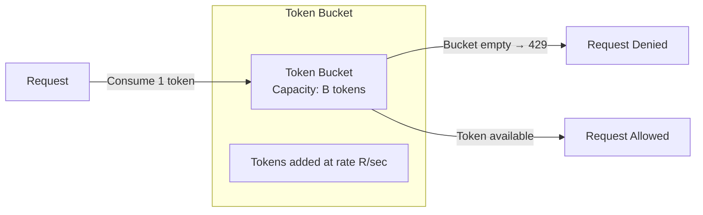
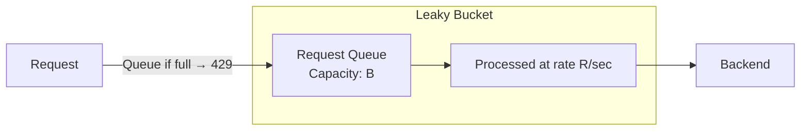
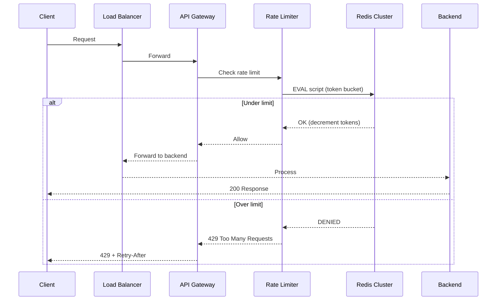

# Rate Limiters

## Definition

A rate limiter controls the rate of traffic sent by a client or service. It prevents abuse, ensures fair resource allocation, and protects backend systems from being overwhelmed. Rate limiters can be implemented at the client, API gateway, or application layer using various algorithms.

## Real-World Example

**Twitter**: Enforces rate limits on their REST API — 300 requests per 3-hour window for most endpoints, 450 for authenticated users. When exceeded, the API returns HTTP 429 with a `Retry-After` header. The rate limiter uses a sliding window approach across their infrastructure.

## Rate Limiting Algorithms

### Token Bucket



A token bucket has capacity **B** (burst) and refills at rate **R** tokens per second. Each request consumes one token. Bursts up to B are allowed, but sustained traffic is limited to R/s.

**Pros**: Allows bursts, simple, memory-efficient (2 counters)
**Cons**: Two parameters to tune (R, B)

### Leaky Bucket



Requests enter a FIFO queue of size **B**. The queue drains at rate **R** per second. If the queue is full, the request is rejected.

**Pros**: Smooth output, easy to implement
**Cons**: No burst support (straight pipeline)

### Fixed Window Counter

| Window Start | Window End | Counter | Status |
|-------------|------------|---------|--------|
| 10:00:00 | 10:00:59 | 95/100 | Allowed |
| 10:00:45 | 10:00:59 | 100/100 | Denied |
| 10:01:00 | 10:01:59 | 10/100 | Allowed (new window) |

Counts requests in fixed time windows (e.g., 100 req/min at minute boundaries). Simple but has a **boundary problem** — 100 requests at 10:00:59 + 100 at 10:01:00 = 200 requests within 2 seconds.

**Pros**: Minimal memory, O(1) check
**Cons**: Spike at window boundaries

### Sliding Window Log

```python
# Store timestamps for each client
window = 60   # 60 seconds
limit = 100    # 100 requests

def allow_request(client_id, timestamp):
    log = get_log(client_id)
    log = [t for t in log if t > timestamp - window]
    set_log(client_id, log)
    if len(log) >= limit:
        return False
    log.append(timestamp)
    return True
```

**Pros**: Precise, no boundary spikes
**Cons**: O(n) memory per client (stores all timestamps)

### Sliding Window Counter

Hybrid approach: tracks the current window counter + previous window counter, interpolating to approximate a true sliding window.

```
Allow if: current_count + (overlap_ratio * previous_count) < limit

Example (100 req/min):
  Previous (10:00): 80 requests
  Current (10:01):  40 requests (15s into window)
  Overlap ratio: 45/60 = 0.75
  Estimated count: 40 + (0.75 * 80) = 100
  Result: 100 >= 100 → DENY
```

**Pros**: O(1) memory, no boundary spike
**Cons**: Approximate (not perfectly precise)

### GCRA (Generic Cell Rate Algorithm)

GCRA tracks a **theoretical arrival time** (TAT) — the earliest time the next request is expected. If a request arrives before TAT minus a tolerance/limit, it's denied.

```
TAT = theoretical arrival time
T  = inter-request interval (1/rate)
τ  = burst tolerance (limit)

If arrival_time >= TAT - τ:
    new_TAT = max(TAT, arrival_time) + T
    ALLOW
Else:
    DENY
```

Used by Redis `CL.THROTTLE` command (Redis Stack).

## Comparison Table

| Algorithm | Space Complexity | Time Complexity | Memory per Client | Burst Support | Boundary Spike | Accuracy |
|-----------|-----------------|-----------------|-------------------|---------------|----------------|----------|
| Token Bucket | O(1) | O(1) | 2 counters | Yes | N/A | Exact |
| Leaky Bucket | O(1) | O(1) | 1 counter + queue | No | N/A | Exact |
| Fixed Window | O(1) | O(1) | 1 counter | No | Yes | Approximate |
| Sliding Window Log | O(n) | O(n) | n timestamps | No | No | Exact |
| Sliding Window Counter | O(1) | O(1) | 2 counters | No | No | Approximate |
| GCRA | O(1) | O(1) | 2 timestamps | Yes | N/A | Exact |

## Distributed Rate Limiting (Redis + Lua)



```lua
-- Token Bucket in Lua (Atomic Redis operation)
local key = KEYS[1]
local max_tokens = tonumber(ARGV[1])
local refill_rate = tonumber(ARGV[2])
local now = tonumber(ARGV[3])
local cost = tonumber(ARGV[4])

local info = redis.call("HMGET", key, "tokens", "last_refill")
local tokens = info[1]
local last_refill = info[2]

if tokens == false then
    tokens = max_tokens
    last_refill = now
end

local elapsed = math.max(0, now - last_refill)
local refill_amount = elapsed * refill_rate

tokens = math.min(max_tokens, tokens + refill_amount)
last_refill = now

if tokens >= cost then
    tokens = tokens - cost
    redis.call("HMSET", key, "tokens", tokens, "last_refill", last_refill)
    redis.call("EXPIRE", key, math.ceil(max_tokens / refill_rate) * 2)
    return {1, tokens}
else
    redis.call("HMSET", key, "tokens", tokens, "last_refill", last_refill)
    redis.call("EXPIRE", key, math.ceil(max_tokens / refill_rate) * 2)
    return {0, tokens, math.ceil((cost - tokens) / refill_rate)}
end
```

```python
import time
import redis

class DistributedTokenBucket:
    def __init__(self, redis_client, key, max_tokens, refill_rate):
        self.redis = redis_client
        self.key = f"ratelimit:{key}"
        self.max_tokens = max_tokens
        self.refill_rate = refill_rate

    def allow(self, cost=1):
        script = """
        local key = KEYS[1]
        local max_tokens = tonumber(ARGV[1])
        local refill_rate = tonumber(ARGV[2])
        local now = tonumber(ARGV[3])
        local cost = tonumber(ARGV[4])
        local info = redis.call("HMGET", key, "tokens", "last_refill")
        local tokens = info[1]
        local last_refill = info[2]
        if tokens == false then
            tokens = max_tokens
            last_refill = now
        end
        local elapsed = math.max(0, now - last_refill)
        tokens = math.min(max_tokens, tokens + elapsed * refill_rate)
        if tokens >= cost then
            tokens = tokens - cost
            redis.call("HMSET", key, "tokens", tokens, "last_refill", now)
            redis.call("EXPIRE", key, math.ceil(max_tokens / refill_rate) * 2)
            return {1, tokens}
        else
            redis.call("HMSET", key, "tokens", tokens, "last_refill", now)
            redis.call("EXPIRE", key, math.ceil(max_tokens / refill_rate) * 2)
            return {0, tokens}
        end
        """
        result = self.redis.eval(script, 1, self.key, self.max_tokens, self.refill_rate, int(time.time()), cost)
        return result[0] == 1

r = redis.Redis(host="localhost", port=6379)
limiter = DistributedTokenBucket(r, "api:client:42", max_tokens=100, refill_rate=10)
for i in range(120):
    if limiter.allow():
        print(f"Request {i}: ALLOWED")
    else:
        print(f"Request {i}: RATE LIMITED")
        time.sleep(0.05)
```

## Real-World Rate Limit Policies

| Service | Endpoint | Limit | Window | Algorithm |
|---------|----------|-------|--------|-----------|
| Twitter API | GET /statuses/user_timeline | 300 requests | 3 hours | Sliding window |
| GitHub API | Authenticated requests | 5000 requests | 1 hour | Token bucket |
| AWS API Gateway | Regional per-account | 10,000 req/s (default) | Per second | Token bucket |
| Google Maps API | Geocoding | 50 req/s (free tier) | Per second | Token bucket |
| Stripe API | Global | 100 read req/s | Per second | Sliding window |
| Instagram API | Content publishing | 200 req/hour/user | Per hour | Fixed window |

## Best Practices

1. **Return proper headers**: `X-RateLimit-Limit`, `X-RateLimit-Remaining`, `X-RateLimit-Reset`, `Retry-After`
2. **Fail open vs fail closed**: Fail open during rate limiter outage (allow traffic) — better than blocking all traffic
3. **Multi-tier limiting**: Global (cluster-wide) + Local (per-instance) for defense in depth
4. **Client identification**: Use API key, user ID, or IP (with care for NAT)
5. **Graceful degradation**: Return 429 with `Retry-After` instead of dropping connections
6. **Queue excess requests**: For internal services, queue and process as capacity allows

## Interview Questions

1. Compare token bucket and sliding window log algorithms — when would you use each?
2. How do you implement distributed rate limiting across 10 API servers?
3. Why does the fixed window counter algorithm have a boundary spike problem?
4. Design a rate limiter for a real-time chat application (WebSocket connections)
5. How does GCRA (Generic Cell Rate Algorithm) differ from token bucket?
6. What headers should a rate-limited API return to clients?
7. How do you handle rate limiter failure (Redis down) in production?
