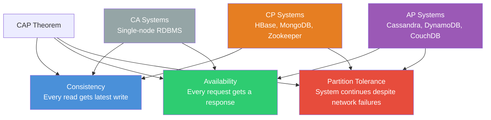
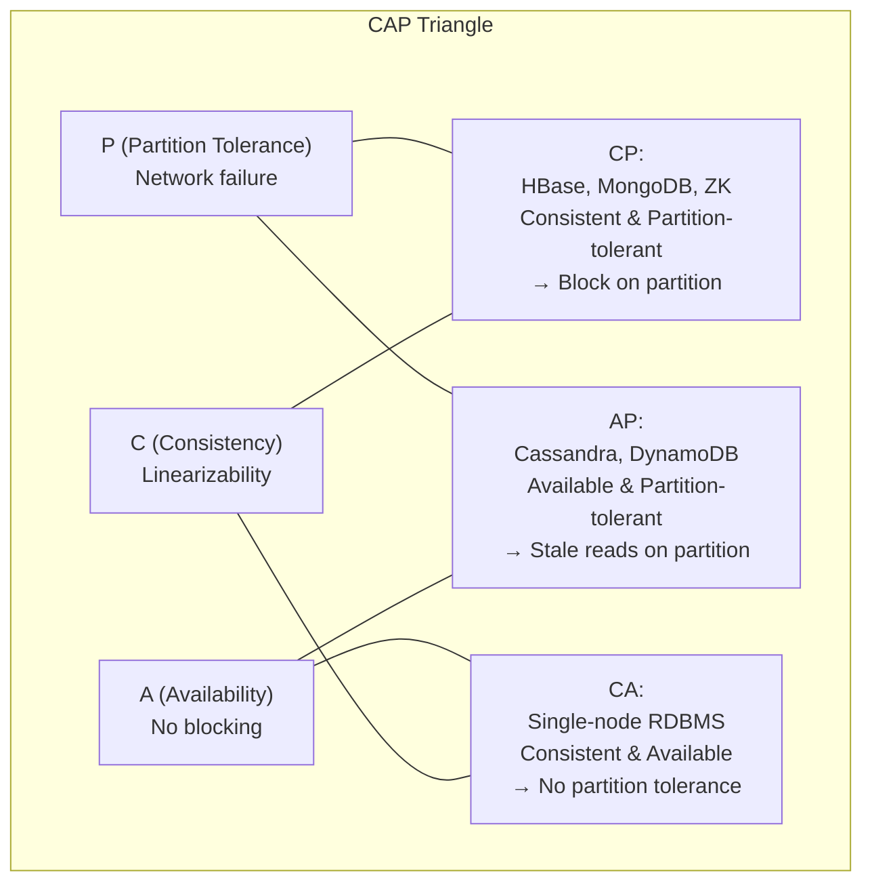
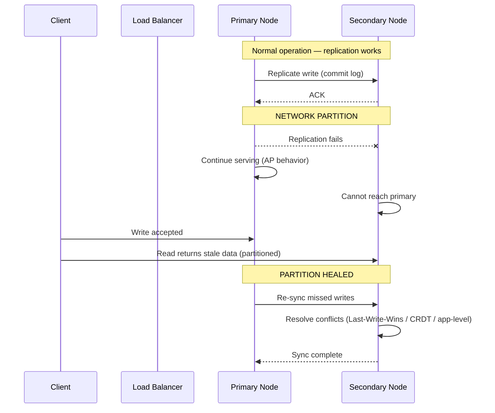

# CAP Theorem & PACELC

## Definition

**CAP Theorem** (Brewer's Theorem) states that a distributed data store can only guarantee at most two of three properties simultaneously: Consistency, Availability, and Partition Tolerance.

**PACELC** extends CAP by reasoning about the trade-off between Consistency and Latency when the system is *E*lecting (not partitioned). It states: If Partition (P) occurs, trade Consistency vs Availability; Else (E), trade Consistency vs Latency (L).

## Real-World Example

**Amazon DynamoDB**: DynamoDB is built as an **AP** system (with eventual consistency by default). During a network partition, DynamoDB remains available — writes may not be immediately visible to all readers, but the system never rejects requests. Within the same region (no partition), DyanmoDB offers tunable consistency at the cost of latency (strongly consistent reads require quorum and are slower).

## CAP Triangle





## CAP Breakdown

### Consistency (C) — Linearizability

Every read receives the most recent write or an error. All nodes see the same data at the same time.

- **Strong consistency**: Reads always return the latest write. Requires synchronization (slower).
- **Eventual consistency**: Reads may return stale data. Eventually (seconds) all replicas converge.
- **Causal consistency**: Causally related operations seen in order by all.

### Availability (A) — Every Request Gets a Response

Every non-failing node returns a response for every request (within timeout), regardless of state. There is no blocking waiting for synchronization.

- **High availability**: 99.99%+ uptime, multi-AZ, auto-failover.
- **HA vs Partition**: During a partition, an available system must still respond, even if it's a stale response.

### Partition Tolerance (P) — Network Failures

The system continues to operate despite messages being lost, delayed, or reordered between nodes. Partitions are unavoidable in distributed systems — you must tolerate them.

**Network partition scenarios:**
```
Node A ──── network cut ──── Node B
    │                          │
    Requests routed to A    Requests routed to B
    A accepts writes        B accepts writes
    └── After partition heals ──┘
              Conflict resolution required
```

## PACELC Extension

| State | Trade-off | Implications |
|-------|-----------|--------------|
| **P** (Partition) | C (Consistency) vs A (Availability) | During network failure: reject writes to stay consistent, or accept writes and reconcile later |
| **E** (Else — no partition) | C (Consistency) vs L (Latency) | Normal operation: strong consistency adds latency (quorum), weaker consistency is faster |

```
PACELC:
  IF Partition (P) → trade C vs A
  ELSE (E)         → trade C vs L (latency)

Examples:
  DynamoDB:        P → AP   (available during partition)
                   E → EL   (eventual consistency = low latency)
  
  HBase:           P → CP   (consistent during partition)  
                   E → EC   (strong consistency = higher latency)
  
  Cassandra:       P → AP   (available during partition)
                   E → EL   (tunable consistency, low latency by default)
```

## Real-World Database Mapping

| System | CAP Class | PACELC | Partition Behavior | Normal Behavior |
|--------|-----------|--------|-------------------|-----------------|
| **HBase** | CP | PC/EC | Region servers unavailable | Strong consistency via HDFS |
| **MongoDB** | CP (default) | PC/EC | Secondary becomes read-only | Strong consistency with primary |
| **Zookeeper** | CP | PC/EC | Leader election, unavailable | Linearizable writes |
| **Cassandra** | AP | PA/EL | Available (stale reads possible) | Tunable consistency |
| **DynamoDB** | AP | PA/EL | Available (eventual reads) | Eventual by default, strong optional |
| **CouchDB** | AP | PA/EL | Available, conflict resolution | Multi-version, conflict resolution |
| **PostgreSQL** | CA | N/A (no partition tolerance) | No distributed support | ACID, strong consistency |
| **Single-node RDBMS** | CA | N/A | Single point of failure | Strong consistency |

## Network Partition Handling



### Retry Logic for Partition Resilience

```python
import time
import random
from typing import Callable

def with_retry(operation: Callable, max_retries=3, base_delay=0.1):
    last_exception = None
    for attempt in range(max_retries):
        try:
            return operation()
        except NetworkPartitionError as e:
            last_exception = e
            delay = base_delay * (2 ** attempt) + random.uniform(0, 0.05)
            time.sleep(delay)
        except QuorumNotMetError as e:
            last_exception = e
            delay = base_delay * (2 ** attempt) + random.uniform(0, 0.05)
            time.sleep(delay)
    raise last_exception

def write_with_fallback(key, value):
    try:
        with_retry(lambda: primary_db.write(key, value, consistency="quorum"))
    except (NetworkPartitionError, QuorumNotMetError):
        if strategy == "AP":
            primary_db.write(key, value, consistency="one")
            partition_log.record(key, value)
        elif strategy == "CP":
            raise SystemUnavailable("Cannot meet consistency requirements")
```

## Code Example: CAP Trade-off Simulation

```python
import random
import time

class DistributedNode:
    def __init__(self, node_id, strategy="AP"):
        self.node_id = node_id
        self.strategy = strategy
        self.store = {}
        self.peers = []
        self.partitioned = False

    def write(self, key, value, quorum=2):
        if self.partitioned:
            if self.strategy == "CP":
                raise Exception("CP: Rejecting write due to partition")
            elif self.strategy == "AP":
                self.store[key] = value
                return "AP: Write accepted (local only, may conflict)"
        acks = 1
        for peer in self.peers:
            try:
                peer.replicate(key, value)
                acks += 1
            except Exception:
                pass
        if acks >= quorum:
            self.store[key] = value
            return f"Write committed (quorum={acks})"
        raise Exception(f"Write failed (quorum={acks}/{quorum})")

    def read(self, key, consistency="eventual"):
        if consistency == "strong":
            versions = [self.store.get(key)]
            for peer in self.peers:
                versions.append(peer.store.get(key))
            versions = [v for v in versions if v is not None]
            if not versions:
                return None
            latest = max(versions, key=lambda v: v.get("timestamp", 0))
            return latest.get("data")
        return self.store.get(key, {}).get("data")

    def replicate(self, key, value):
        if self.partitioned:
            raise Exception("Node partitioned")
        self.store[key] = value

nodes = [DistributedNode(f"node-{i}", "AP") for i in range(3)]
for node in nodes:
    node.peers = [n for n in nodes if n != node]

nodes[1].partitioned = True
try:
    result = nodes[0].write("user:42", {"data": "Alice", "timestamp": time.time()})
    print(f"Node 0: {result}")
    stale_read = nodes[1].read("user:42")
    print(f"Node 1 (partitioned, AP): read = {stale_read} (may be None/stale)")
    consistent_read = nodes[0].read("user:42", consistency="strong")
    print(f"Node 0 (strong read): {consistent_read}")
except Exception as e:
    print(f"Error: {e}")
```

## Interview Questions

1. Explain why you cannot have all three of C, A, and P in a distributed system
2. How does the PACELC extension improve upon the original CAP theorem?
3. Given a social media feed service, would you design it as CP or AP? Why?
4. How does DynamoDB handle the consistency-latency trade-off during normal operation (no partition)?
5. What happens to MongoDB during a network partition? How does it choose between C and A?
6. Design a leader election protocol that remains available during a partition
7. How do CRDTs (Conflict-free Replicated Data Types) help AP systems resolve conflicts?
8. Why is "CA" essentially impossible in a distributed system? What real systems are labeled CA?
