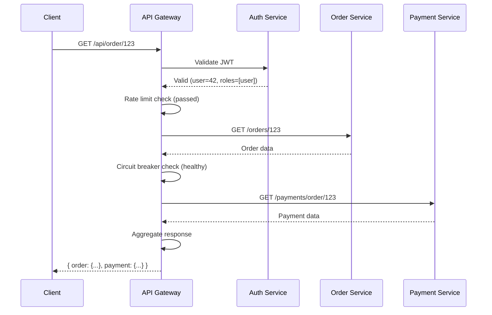
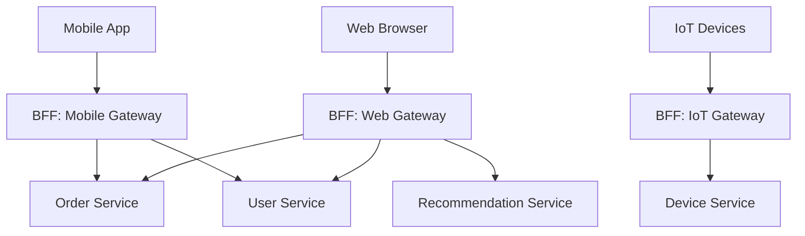
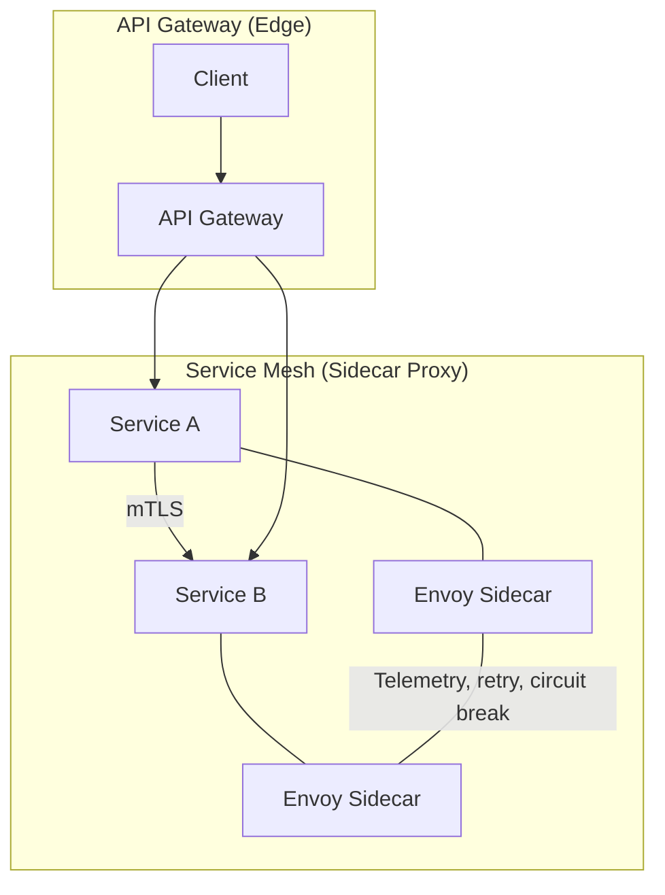

# API Gateway Design

## Definition

An API Gateway is a dedicated server that acts as a single entry point for all client requests in a microservices architecture. It handles cross-cutting concerns like routing, authentication, rate limiting, aggregation, protocol translation, caching, logging, and circuit breaking — abstracting the internal service topology from clients.

## Real-World Example

**Netflix**: Uses Zuul (later Zuul 2) as their API gateway handling 1+ million requests per second. Zuul routes requests to the appropriate backend service, implements dynamic routing rules via Eureka service discovery, filters traffic for authentication and throttling, and provides edge-level resilience with Hystrix circuit breakers.

## Gateway Responsibilities

```mermaid
graph TD
    Client[Client Apps] --> Gateway[API Gateway]
    
    subgraph Gateway
        R[Routing]
        A[Authentication]
        RL[Rate Limiting]
        AG[Aggregation]
        PT[Protocol Translation]
        C[Caching]
        L[Logging]
        CB[Circuit Breaking]
    end
    
    Routing --> Services[Microservices]
    Authentication --> [[Auth Service]]
    RateLimiting --> [[Redis]]
    Aggregation --> Services
    ProtocolTranslation --> Services
    Caching --> [[Cache]]
    Logging --> [[ELK Stack]]
    CircuitBreaking --> Services
    
    Services --> S1[Order Service]
    Services --> S2[Payment Service]
    Services --> S3[User Service]
    Services --> S4[Inventory Service]
```

### 1. Routing

The gateway inspects the request path, headers, or domain and routes to the appropriate backend service:

```
GET /api/orders/123     → order-service:8080
GET /api/users/42       → user-service:8080
POST /api/payments      → payment-service:8080
```

### 2. Authentication & Authorization

The gateway validates JWT tokens, API keys, or OAuth2 tokens before requests reach internal services. This centralizes security policy:

```python
def authenticate(request):
    token = request.headers.get("Authorization")
    payload = jwt.decode(token, public_key, algorithms=["RS256"])
    request.context.user_id = payload["sub"]
    request.context.roles = payload["roles"]
```

### 3. Rate Limiting

Per-client or per-endpoint traffic throttling (see [Rate Limiters](14-rate-limiters.md)). Returns 429 when limits are exceeded.

### 4. Aggregation

The gateway can compose responses from multiple services into a single response, reducing client-side chattiness:

```
Client request: GET /api/order/123/details

Gateway internally calls:
  - order-service:  GET /orders/123
  - user-service:   GET /users/{order.user_id}
  - payment-service: GET /payments/{order.payment_id}

Gateway returns:
  { order: {...}, user: {...}, payment: {...} }
```

### 5. Protocol Translation

Translates between different protocols for clients vs internal services:

| Client Protocol | Internal Protocol |
|----------------|-------------------|
| HTTP/REST | HTTP/REST |
| HTTP/REST | gRPC |
| WebSocket | HTTP/REST |
| HTTP/1.1 | HTTP/2 |
| GraphQL | REST (or GraphQL) |

### 6. Caching

Caches responses for idempotent GET endpoints to reduce backend load. Cache keys often include query parameters and authentication context.

### 7. Logging & Monitoring

Centralized access logs, request tracing, and metrics collection for all traffic entering the system.

### 8. Circuit Breaking

If a downstream service is unhealthy, the gateway stops routing requests to it and returns a fallback response (e.g., cached data, degraded experience).



## Edge vs Internal Gateway

| Aspect | Edge Gateway | Internal Gateway |
|--------|-------------|-----------------|
| Location | DMZ, internet-facing | Inside VPC/service mesh |
| Audience | External clients | Internal services |
| Auth | OAuth2, JWT, API keys | mTLS, service tokens |
| Rate limiting | Per-client (global) | Per-service, per-caller |
| TLS termination | Yes (public certs) | Optional (internal PKI) |
| Examples | AWS API Gateway, Kong, Zuul | Envoy, Linkerd (sidecar) |

## BFF (Backend for Frontend) Pattern

Each client type gets its own dedicated gateway, optimized for its specific needs:



| BFF Type | Optimized For | Example Differences |
|----------|--------------|-------------------|
| Mobile Gateway | Small payloads, binary formats | Returns compact JSON, GraphQL |
| Web Gateway | HTML rendering, SEO | Returns full HTML or JSON for hydration |
| IoT Gateway | Binary protocols, MQTT | Protocol translation (MQTT → gRPC) |
| Partner Gateway | Rate-limited, documented | Full API contracts, usage plans |

## Gateway Comparison

| Feature | Kong | AWS API Gateway | Envoy | Nginx | Zuul (Spring Cloud) |
|---------|------|----------------|-------|-------|-------------------|
| Layer | L7 | L7 | L4/L7 | L4/L7 | L7 (Java) |
| Performance | ~50K req/s | ~10K req/s (throttled) | 100K+ req/s | 100K+ req/s | ~20K req/s |
| Routing | Host, path, headers, methods | URI, method, headers | Host, path, headers | Host, path, headers | Path, headers |
| Auth plugins | JWT, OAuth2, OIDC, LDAP | Cognito, Lambda authorizer | External auth (ext_authz) | Basic auth, LDAP | Custom Java filters |
| Rate limiting | Redis-backed | Per-stage, per-method | gRPC-based | nodelimited | Java-based |
| Service discovery | DNS, Consul, K8s | NLB, CloudMap | xDS (Envoy, Consul, K8s) | DNS upstream | Eureka, Consul |
| Protocol | HTTP, gRPC, WebSocket, TCP | HTTP, WebSocket | HTTP, gRPC, TCP, WebSocket | HTTP, TCP, UDP | HTTP |
| Baked-in caching | Yes (Redis, memcache) | Yes | Via CDN | proxy_cache | Custom |
| Deployment | Docker, K8s, DB-backed | Managed | Sidecar, gateway, K8s | Standalone, K8s | JVM application |

## Gateway vs Service Mesh



| Aspect | API Gateway | Service Mesh |
|--------|-------------|--------------|
| Scope | Edge / north-south traffic | Internal / east-west traffic |
| Function | Auth, routing, rate limiting, aggregation | mTLS, retry, observability, traffic policy |
| Location | Entry point to the system | Sidecar alongside each service |
| Configuration | Route rules, API definitions | Destination rules, virtual services |
| Examples | Kong, AWS API Gateway, Zuul | Istio, Linkerd, Consul Connect |
| Can replace? | No (different concerns) | No (they complement each other) |

## OpenAPI / Swagger Integration

```yaml
openapi: 3.0.0
info:
  title: Order API
  version: 1.0.0
x-amazon-apigateway:
  api-key-source: HEADER
  throttling:
    burstLimit: 100
    rateLimit: 50
paths:
  /orders:
    get:
      parameters:
        - name: userId
          in: query
          schema:
            type: string
      x-amazon-apigateway-integration:
        uri: "http://order-service/orders"
        httpMethod: "GET"
        type: HTTP_PROXY
      responses:
        "200":
          description: List of orders
    post:
      x-amazon-apigateway-integration:
        uri: "http://order-service/orders"
        httpMethod: "POST"
        type: HTTP_PROXY
      requestBody:
        content:
          application/json:
            schema:
              type: object
              properties:
                productId:
                  type: string
                quantity:
                  type: integer
```

## Code Example: Simple Micro Gateway

```python
from flask import Flask, request, jsonify, Response
import requests
import jwt
import time

app = Flask(__name__)

SERVICES = {
    "users": "http://user-service:8081",
    "orders": "http://order-service:8082",
    "payments": "http://payment-service:8083",
}

JWT_SECRET = "your-256-bit-secret"
CACHE = {}
RATE_LIMITS = {}


def authenticate(token):
    try:
        payload = jwt.decode(token, JWT_SECRET, algorithms=["HS256"])
        return payload
    except jwt.InvalidTokenError:
        return None


def rate_limit(client_id, max_reqs=100, window=60):
    now = time.time()
    if client_id not in RATE_LIMITS:
        RATE_LIMITS[client_id] = []
    RATE_LIMITS[client_id] = [t for t in RATE_LIMITS[client_id] if t > now - window]
    if len(RATE_LIMITS[client_id]) >= max_reqs:
        return False
    RATE_LIMITS[client_id].append(now)
    return True


def cache_get(key, ttl=30):
    if key in CACHE:
        val, ts = CACHE[key]
        if time.time() - ts < ttl:
            return val
        del CACHE[key]
    return None


def cache_set(key, value):
    CACHE[key] = (value, time.time())


@app.route("/api/<service>/<path:subpath>", methods=["GET", "POST", "PUT", "DELETE"])
def gateway(service, subpath):
    user = authenticate(request.headers.get("Authorization", "").replace("Bearer ", ""))
    if not user:
        return jsonify({"error": "Unauthorized"}), 401

    if not rate_limit(user.get("sub", "anonymous")):
        return jsonify({"error": "Rate limit exceeded"}), 429

    if service not in SERVICES:
        return jsonify({"error": "Service not found"}), 404

    cache_key = f"{service}:{subpath}:{request.query_string.decode()}"
    if request.method == "GET":
        cached = cache_get(cache_key)
        if cached:
            return cached

    try:
        resp = requests.request(
            method=request.method,
            url=f"{SERVICES[service]}/{subpath}",
            params=request.args,
            json=request.get_json(silent=True),
            headers={"X-User-Id": user["sub"], "X-User-Roles": ",".join(user.get("roles", []))},
            timeout=5,
        )
    except requests.ConnectionError:
        return jsonify({"error": "Service unavailable", "service": service}), 503
    except requests.Timeout:
        return jsonify({"error": "Service timed out", "service": service}), 504

    if request.method == "GET" and 200 <= resp.status_code < 300:
        cache_set(cache_key, (resp.content, resp.status_code, resp.headers.items()))

    return Response(resp.content, status=resp.status_code, headers=dict(resp.headers))


@app.route("/api/aggregate/order/<order_id>")
def aggregate_order(order_id):
    user = authenticate(request.headers.get("Authorization", "").replace("Bearer ", ""))
    if not user:
        return jsonify({"error": "Unauthorized"}), 401

    try:
        order_resp = requests.get(f"{SERVICES['orders']}/orders/{order_id}", timeout=5)
        order = order_resp.json() if order_resp.ok else None
        payment_resp = requests.get(f"{SERVICES['payments']}/payments/order/{order_id}", timeout=5)
        payment = payment_resp.json() if payment_resp.ok else None
    except (requests.ConnectionError, requests.Timeout):
        return jsonify({"error": "Service unavailable"}), 503

    return jsonify({
        "order": order,
        "payment": payment,
        "aggregated_at": time.time(),
    })


if __name__ == "__main__":
    app.run(port=8080)
```

## Best Practices

1. **Keep the gateway stateless**: Store session in Redis/external cache, not in-memory
2. **Use circuit breakers** for downstream service failures — fail fast, don't let threads pile up
3. **Implement rate limiting at the gateway**, not in each service
4. **Expose health/readiness endpoints** for the gateway itself
5. **Version your APIs** in the URL path (/v1/orders, /v2/orders) for backward compatibility
6. **Log correlation IDs** (trace context) across every hop — use X-Request-Id or W3C trace context
7. **Avoid business logic** in the gateway — it orchestrates, it doesn't implement

## Interview Questions

1. Compare API Gateway vs Service Mesh — when would you use each?
2. What is the BFF pattern and when should you use it?
3. How does an API Gateway handle partial failures in aggregated endpoint calls?
4. Design an API Gateway for a microservices platform serving 10M+ daily active users
5. How would you implement canary deployments through an API Gateway?
6. What happens when the API Gateway itself becomes a bottleneck or single point of failure?
7. Compare Kong, Envoy, and AWS API Gateway for a multi-cloud strategy
