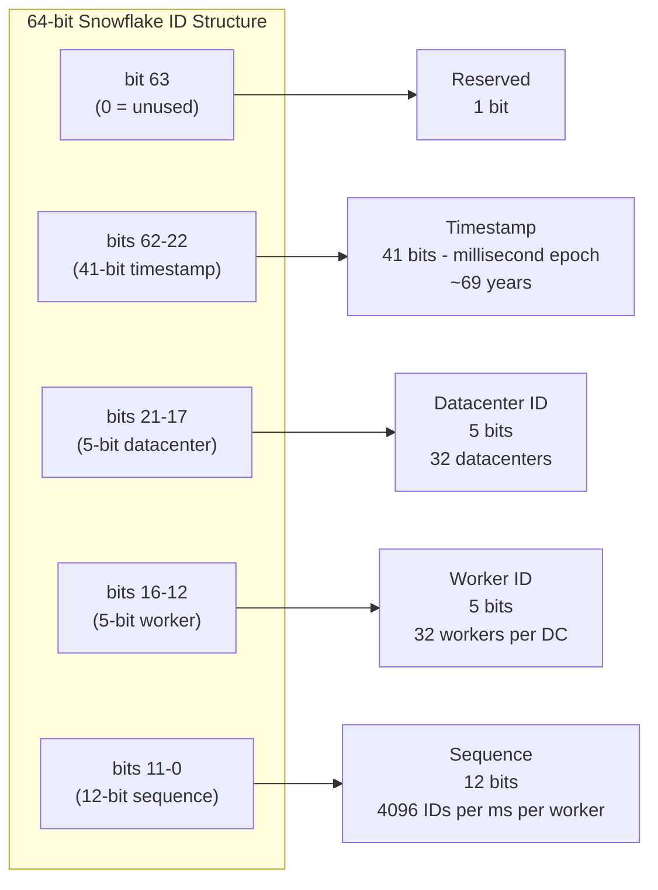
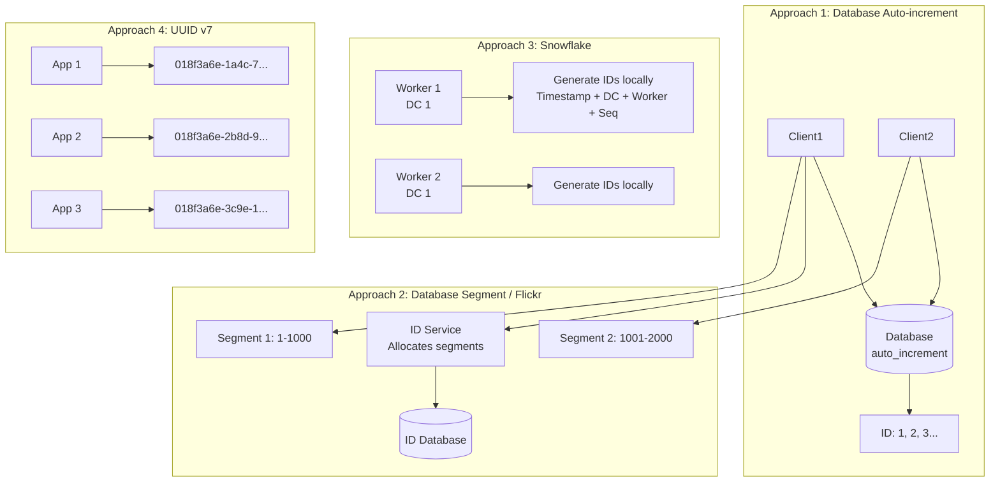

# ID Generation

## Definition

Distributed ID generation creates unique identifiers across multiple nodes without a central coordinator. IDs must be unique, scalable, and often sortable by time. Common approaches include UUIDs, snowflake-style IDs, database sequences, and hybrid timestamp-based schemes.

## Real-World Example

**Twitter Snowflake**: Generates 64-bit IDs at microsecond precision across thousands of servers. Each ID encodes a timestamp, datacenter ID, worker ID, and sequence number. Snowflake generates up to 4,096 IDs per millisecond per worker — enough for Twitter's peak traffic of ~6,000 tweets per second.

## ID Generation Approaches

| Approach | Size | Ordering | Uniqueness | Performance | Use Case |
|----------|------|----------|------------|-------------|----------|
| UUID v4 | 128 bits | Random | Global (collision ~impossible) | Fast (client-side) | Stateless entities, offline systems |
| UUID v7 | 128 bits | Time-ordered (ms) | Global | Fast (client-side) | Sortable identifiers |
| Snowflake | 64 bits | Time-ordered (ms) | Global (per machine) | Very fast (local counter) | OLTP, database primary keys |
| Auto-increment | 32-64 bits | Sequential | Single-database | Moderate (DB bottleneck) | Small-scale, single-node |
| ULID | 128 bits | Time-ordered (ms) | Global | Fast | Sortable, human-readable |
| NanoID | 21-36 chars | Random | High | Fast | URL-friendly, compact |

## UUID v4 vs v7

| Feature | UUID v4 | UUID v7 |
|---------|---------|---------|
| Format | 550e8400-e29b-41d4-a716-446655440000 | 018f3a6e-1a4c-7b93-a716-446655440000 |
| Timestamp | None (random) | Unix ms timestamp (bit 0-47) |
| Sortable | No (random ordering) | Yes (chronological) |
| B-tree inserts | Random (page splits, fragmentation) | Sequential (no splits) |
| Collision rate | ~5e-11 per 1B IDs | ~5e-11 per 1B IDs |
| Standard | IETF RFC 4122 | IETF Draft (2023+) |

**Why UUID v7 matters for databases**: Random UUID v4 values cause index fragmentation in B-trees — each insert goes to a random page. UUID v7 inserts are sequential, reducing page splits and improving cache locality.

## Snowflake Algorithm



**Snowflake bit layout (64-bit total):**

| Field | Bits | Range | Description |
|-------|------|-------|-------------|
| Sign | 1 | Always 0 | Reserved for future use (signed 64-bit) |
| Timestamp | 41 | 0 to 2^41-1 | Milliseconds since custom epoch (~69 years) |
| Datacenter ID | 5 | 0 to 31 | 32 datacenters maximum |
| Worker ID | 5 | 0 to 31 | 32 workers per datacenter |
| Sequence | 12 | 0 to 4095 | Incremented per ID; resets on new ms |

**Maximum throughput per worker**: 4096 IDs/ms = ~4 million IDs/second

**Timestamp encoding**: `current_time_ms - custom_epoch_ms`

## Distributed ID Generation Approaches



### 1. Database Auto-Increment

```sql
CREATE TABLE id_sequence (
    id BIGINT AUTO_INCREMENT PRIMARY KEY,
    stub CHAR(1) NOT NULL DEFAULT 'a'
);

INSERT INTO id_sequence (stub) VALUES ('a');
SELECT LAST_INSERT_ID();  -- Returns unique ID: 1, 2, 3...
```

**Problem**: Single point of failure, write bottleneck.

### 2. Database Segment (Flickr-style)

Allocate ranges — the ID service grabs a segment and hands it out locally. Reduces DB round trips.

```sql
CREATE TABLE id_segments (
    service_name VARCHAR(100) PRIMARY KEY,
    next_start BIGINT NOT NULL,
    step_size INT NOT NULL DEFAULT 1000
);

UPDATE id_segments
SET next_start = next_start + step_size
WHERE service_name = 'orders'
RETURNING next_start - step_size AS segment_start, next_start - 1 AS segment_end;
```

### 3. Snowflake (Fully Distributed)

No database calls for ID generation. Each worker independently generates IDs using local timestamp + config.

### 4. UUID v7 (Client-side)

Generate IDs entirely client-side with timestamp prefix for ordering.

## Time-Based Ordering Guarantees

Snowflake and UUID v7 guarantee **time-monotonic ordering**: an ID generated at time T1 is always less than an ID at time T2 (T2 > T1). This enables efficient range scans and chronological sorting.

```python
# Snowflake: IDs sort by time
id_1pm = 175928847299117056  # generated at 13:00:00.000
id_2pm = 175932847299117056  # generated at 14:00:00.000

assert id_1pm < id_2pm  # True — time-ordered
```

**Clock skew handling**: If a machine clock moves backward, Snowflake workers wait until the clock catches up before generating new IDs.

## Real-World Implementations

| System | Algorithm | ID Size | Info |
|--------|-----------|---------|------|
| **Twitter Snowflake** | Timestamp + DC + worker + sequence | 64-bit | 4096 IDs/ms/worker, custom epoch (2010-11-04) |
| **Instagram** | Custom Snowflake variant | 64-bit | Logical shard ID (13 bits) + logical type (1 bit) + auto-increment (50 bits) per shard |
| **Flickr Ticketing** | Database segment allocation | 64-bit | Ticket servers allocate 1K ID ranges, local cache distributes |
| **DynamoDB** | Autogenerated ULID (sortable) | 128-bit | Used for sort key in time-ordered tables |
| **MongoDB ObjectId** | Timestamp + machine + PID + counter | 96 bits (12 bytes) | 4-byte timestamp + 5-byte random + 3-byte counter |
| **Snowflake (3rd party)** | Redis-backed serial number | 64-bit | Lua script to increment sequence in Redis |

## Code Example: Snowflake ID Generator

```python
import time
import threading

class SnowflakeGenerator:
    def __init__(self, datacenter_id, worker_id, epoch=1288834974657):
        self.datacenter_id = datacenter_id
        self.worker_id = worker_id
        self.epoch = epoch
        self.sequence = 0
        self.last_timestamp = -1
        self.lock = threading.Lock()

        self.datacenter_id_bits = 5
        self.worker_id_bits = 5
        self.sequence_bits = 12

        self.max_datacenter_id = (1 << self.datacenter_id_bits) - 1
        self.max_worker_id = (1 << self.worker_id_bits) - 1
        self.max_sequence = (1 << self.sequence_bits) - 1

        self.worker_shift = self.sequence_bits
        self.datacenter_shift = self.sequence_bits + self.worker_id_bits
        self.timestamp_shift = self.sequence_bits + self.worker_id_bits + self.datacenter_id_bits

        if not (0 <= datacenter_id <= self.max_datacenter_id):
            raise ValueError(f"datacenter_id must be 0-{self.max_datacenter_id}")
        if not (0 <= worker_id <= self.max_worker_id):
            raise ValueError(f"worker_id must be 0-{self.max_worker_id}")

    def _wait_for_next_millis(self, last_timestamp):
        timestamp = self._current_timestamp()
        while timestamp <= last_timestamp:
            timestamp = self._current_timestamp()
        return timestamp

    def _current_timestamp(self):
        return int(time.time() * 1000)

    def next_id(self):
        with self.lock:
            timestamp = self._current_timestamp()
            if timestamp < self.last_timestamp:
                raise Exception(f"Clock moved backwards. Refusing ID for {self.last_timestamp - timestamp}ms")
            if timestamp == self.last_timestamp:
                self.sequence = (self.sequence + 1) & self.max_sequence
                if self.sequence == 0:
                    timestamp = self._wait_for_next_millis(self.last_timestamp)
            else:
                self.sequence = 0
            self.last_timestamp = timestamp
            return (
                ((timestamp - self.epoch) << self.timestamp_shift)
                | (self.datacenter_id << self.datacenter_shift)
                | (self.worker_id << self.worker_shift)
                | self.sequence
            )

    def parse_id(self, id_value):
        sequence = id_value & self.max_sequence
        worker_id = (id_value >> self.worker_shift) & self.max_worker_id
        datacenter_id = (id_value >> self.datacenter_shift) & self.max_datacenter_id
        timestamp = (id_value >> self.timestamp_shift) + self.epoch
        return {
            "timestamp": timestamp,
            "datetime": time.strftime("%Y-%m-%d %H:%M:%S", time.gmtime(timestamp / 1000)),
            "datacenter_id": datacenter_id,
            "worker_id": worker_id,
            "sequence": sequence,
        }

generator = SnowflakeGenerator(datacenter_id=1, worker_id=1)
for i in range(5):
    id_value = generator.next_id()
    parsed = generator.parse_id(id_value)
    print(f"ID: {id_value}")
    print(f"  Parsed: {parsed}")
```

```go
package main

import (
	"fmt"
	"sync"
	"time"
)

type Snowflake struct {
	mu             sync.Mutex
	epoch          int64
	datacenterID   int64
	workerID       int64
	sequence       int64
	lastTimestamp  int64

	datacenterBits  int64
	workerBits      int64
	sequenceBits    int64
	maxSequence     int64
	timestampShift  int64
	datacenterShift int64
	workerShift     int64
}

func NewSnowflake(datacenterID, workerID int64, epoch int64) *Snowflake {
	sequenceBits := int64(12)
	workerBits := int64(5)
	datacenterBits := int64(5)

	return &Snowflake{
		epoch:           epoch,
		datacenterID:    datacenterID,
		workerID:        workerID,
		sequence:        0,
		lastTimestamp:   -1,
		datacenterBits:  datacenterBits,
		workerBits:      workerBits,
		sequenceBits:    sequenceBits,
		maxSequence:     (1 << sequenceBits) - 1,
		workerShift:     sequenceBits,
		datacenterShift: sequenceBits + workerBits,
		timestampShift:  sequenceBits + workerBits + datacenterBits,
	}
}

func (s *Snowflake) NextID() (int64, error) {
	s.mu.Lock()
	defer s.mu.Unlock()

	now := time.Now().UnixMilli()
	if now < s.lastTimestamp {
		return 0, fmt.Errorf("clock moved backwards %dms", s.lastTimestamp-now)
	}
	if now == s.lastTimestamp {
		s.sequence = (s.sequence + 1) & s.maxSequence
		if s.sequence == 0 {
			for now <= s.lastTimestamp {
				now = time.Now().UnixMilli()
			}
		}
	} else {
		s.sequence = 0
	}
	s.lastTimestamp = now
	id := ((now - s.epoch) << s.timestampShift) |
		(s.datacenterID << s.datacenterShift) |
		(s.workerID << s.workerShift) |
		s.sequence
	return id, nil
}

func main() {
	epoch := int64(1288834974657)
	sf := NewSnowflake(1, 1, epoch)
	for i := 0; i < 5; i++ {
		id, _ := sf.NextID()
		fmt.Printf("Snowflake ID: %d\n", id)
		time.Sleep(1 * time.Millisecond)
	}
}
```

## Instagram ID Generation

Instagram adapted Snowflake for sharded MySQL. Their 64-bit ID structure:

| Bits | Field | Description |
|------|-------|-------------|
| 1 | Sign | Always 0 |
| 41 | Timestamp | Milliseconds since custom epoch |
| 13 | Logical shard ID | 8192 logical shards mapped to physical DBs |
| 1 | Type | Always 0 (reserved for future types) |
| 8 | Sequence | Auto-increment within shard per ms |

## Best Practices

1. **Use the right ID type for the job**: UUID v4 for client-side offline generation, Snowflake for database primary keys, ULID for human-readable sorted IDs
2. **Handle clock skew**: Snowflake implementations must detect and handle backward-moving clocks (wait or fail)
3. **Plan for ID exhaustion**: 64-bit IDs at 4K/ms/worker last for ~69 years — enough for most systems
4. **Prefer time-ordered IDs for B-tree indexes**: UUID v7 or Snowflake prevents index fragmentation
5. **Make IDs opaque to clients**: Never encode business logic into ID format that clients should decode
6. **Monitor sequence overflow**: If a worker hits 4096 IDs in a millisecond, ensure it waits for next ms

## Interview Questions

1. Why are UUID v4 values bad for database primary key performance?
2. How does Twitter Snowflake guarantee unique IDs across thousands of workers without coordination?
3. Design a distributed ID generator for a system generating 10 million IDs per second
4. How does Instagram's ID generation differ from standard Snowflake? Why?
5. What happens to Snowflake IDs if a server's clock jumps forward or backward?
6. Compare Flickr's ticket server approach with Snowflake for high-throughput ID generation
7. How would you design an ID system that must be both globally unique and lexicographically sortable by creation time?
