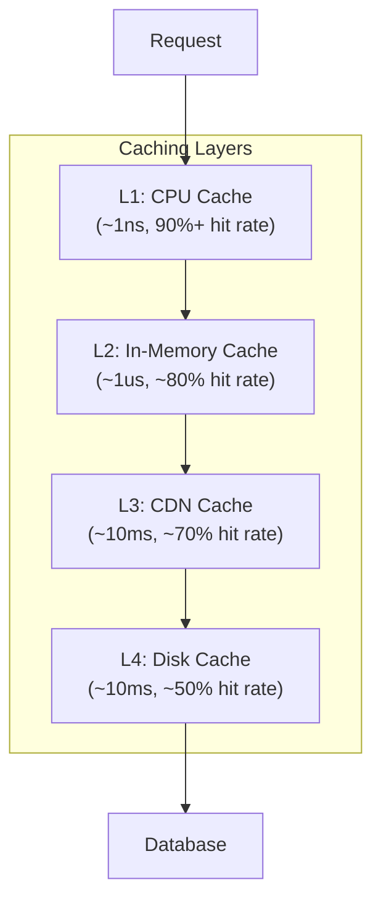

# 04 — Caching

> Speed up your systems by storing frequently accessed data closer to where it's needed.



## Topics

### Cache Technologies
| # | Topic | Description |
|---|-------|-------------|
| 1 | [Redis](01-redis.md) | In-memory data structure store |
| 2 | [Memcached](02-memcached.md) | Simple distributed memory cache |
| 3 | [CDN Caching](03-cdn-caching.md) | Edge content delivery |
| 4 | [Browser Cache](04-browser-cache.md) | Client-side HTTP caching |
| 5 | [Application Cache](05-application-cache.md) | In-process and local caches |

### Caching Patterns
| # | Topic | Description |
|---|-------|-------------|
| 6 | [Cache Aside](06-cache-aside.md) | Lazy loading pattern |
| 7 | [Write Through](07-write-through.md) | Synchronous write pattern |
| 8 | [Write Back](08-write-back.md) | Async write pattern |
| 9 | [Read Through](09-read-through.md) | Transparent cache loading |
| 10 | [Refresh Ahead](10-refresh-ahead.md) | Proactive refresh pattern |

## Quick Reference

```
Cache Level          Latency    Hit Rate    Use Case
L1 (CPU)              ~1ns      90%+        CPU caches
L2 (In-memory)        ~1μs      ~80%        Redis, Memcached
L3 (CDN)              ~10ms     ~70%        Static assets
L4 (Disk)             ~10ms     ~50%        Page cache, buffer pool

Eviction Policies:
  LRU:  Least Recently Used (most common)
  LFU:  Least Frequently Used
  FIFO: First In, First Out
  TTL:  Time-To-Live expiry
```

## Cache Performance Impact

```
Without Caching:
  Request ──► Database ──► 100ms

With Caching (90% hit rate):
  Request ──► Cache (10ms) ──► 90% hit
         ──► Cache Miss ──► DB (100ms) ──► 10% miss
  
  Average latency: (0.9 × 10ms) + (0.1 × 100ms) = 19ms
  Improvement: 5x faster
```

---

Previous: [03 — Databases](../03-Databases/README.md)
Next: [05 — Message Queues](../05-Message-Queues/README.md)
