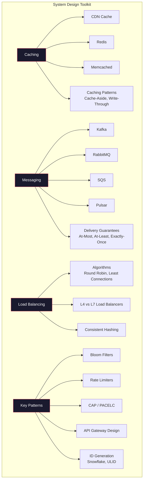

# 05 — System Design

> Foundations of large-scale system architecture. Caching, messaging, load balancing, and design patterns for building systems that handle millions of users.

## Topics

### Cache Technologies
| # | Topic | Description |
|---|-------|-------------|
| 1 | [Redis](01-redis.md) | In-memory data structure store |
| 2 | [Memcached](02-memcached.md) | Simple distributed memory cache |
| 3 | [CDN Caching](03-cdn-caching.md) | Edge content delivery |
| 4 | [Browser Cache](04-browser-cache.md) | Client-side HTTP caching |
| 5 | [Application Cache](05-application-cache.md) | In-process and local caches |

### Caching Patterns
| # | Topic | Description |
|---|-------|-------------|
| 6 | [Cache Aside](06-cache-aside.md) | Lazy loading pattern |
| 7 | [Write Through](07-write-through.md) | Synchronous write pattern |
| 8 | [Write Back](08-write-back.md) | Async write pattern |
| 9 | [Read Through](09-read-through.md) | Transparent cache loading |
| 10 | [Refresh Ahead](10-refresh-ahead.md) | Proactive refresh pattern |

### Message Queues
| # | Topic | Description |
|---|-------|-------------|
| 11 | [Kafka](01-kafka.md) | Distributed event streaming, partitions, replication |
| 12 | [RabbitMQ](02-rabbitmq.md) | AMQP message broker, exchanges, queues |
| 13 | [Amazon SQS](03-sqs.md) | Managed queue service, at-least-once delivery |
| 14 | [Apache Pulsar](04-pulsar.md) | Multi-tenant streaming platform |
| 15 | [ActiveMQ](05-activemq.md) | JMS-compliant broker |
| 16 | [Producer-Consumer](06-producer-consumer.md) | Messaging patterns |
| 17 | [Partition & Offset](07-partition-offset.md) | Kafka partition architecture |
| 18 | [Delivery Guarantees](08-delivery-guarantees.md) | At-most-once, at-least-once, exactly-once |

### Advanced Patterns
| # | Topic | Description |
|---|-------|-------------|
| 19 | [Load Balancers](11-load-balancers.md) | L4 vs L7, algorithms, health checks |
| 20 | [Consistent Hashing](12-consistent-hashing.md) | Hash ring, virtual nodes, rebalancing |
| 21 | [Bloom Filters](13-bloom-filters.md) | Probabilistic data structures |
| 22 | [Rate Limiters](14-rate-limiters.md) | Token bucket, sliding window, GCRA |
| 23 | [CAP / PACELC](15-cap-pacelc.md) | Tradeoff framework extended |
| 24 | [API Gateway Design](16-api-gateway-design.md) | Kong, Envoy, AWS, BFF pattern |
| 25 | [ID Generation](17-id-generation.md) | Snowflake, Instagram, ULID, UUIDv7 |

---

Previous: [04 — Databases](../04-Databases/README.md)
Next: [06 — Distributed Systems](../06-Distributed-Systems/README.md)
