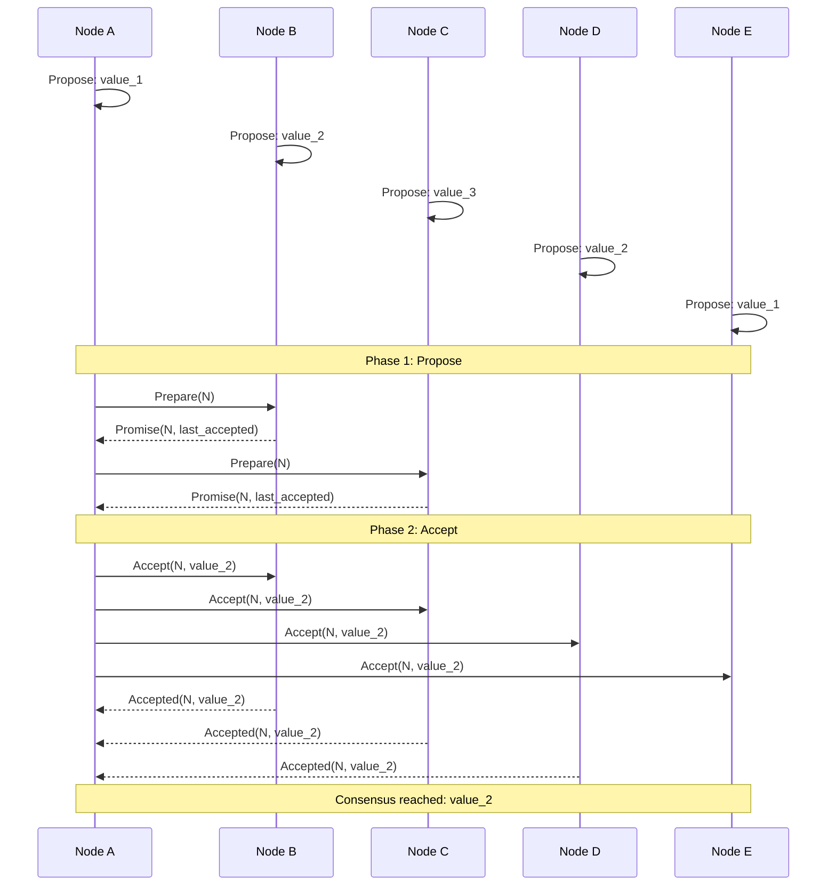

# Consensus

## Definition
Consensus is a fundamental problem in distributed computing where multiple nodes must agree on a single value or state. It's the foundation for leader election, atomic broadcast, and replicated state machines.

## The Consensus Problem

## Properties of Consensus
- **Validity**: Decided value was proposed
- **Agreement**: No two nodes decide differently
- **Termination**: Every correct node eventually decides
- **Integrity**: No node decides twice

## FLP Impossibility
The FLP result proves that in an asynchronous system, consensus is impossible if even one node can crash. Practical systems work around this with:
- Timeouts
- Leader-based protocols
- Failure detectors
- Randomized algorithms

## Protocols

| Protocol | Fault Tolerance | Performance | Complexity |
|----------|----------------|-------------|------------|
| Paxos | Tolerates N/2 failures | Moderate | High |
| Raft | Tolerates N/2 failures | Good | Medium |
| Zab (ZooKeeper) | Tolerates N/2 failures | Good | Medium |
| PBFT | Byzantine (1/3 failures) | Lower | Very High |

## Interview Questions
1. What is the consensus problem in distributed systems?
2. Explain the FLP impossibility result
3. Why do we need consensus in a distributed database?
4. Compare Paxos and Raft consensus protocols
5. How does etcd use Raft for Kubernetes coordination?
