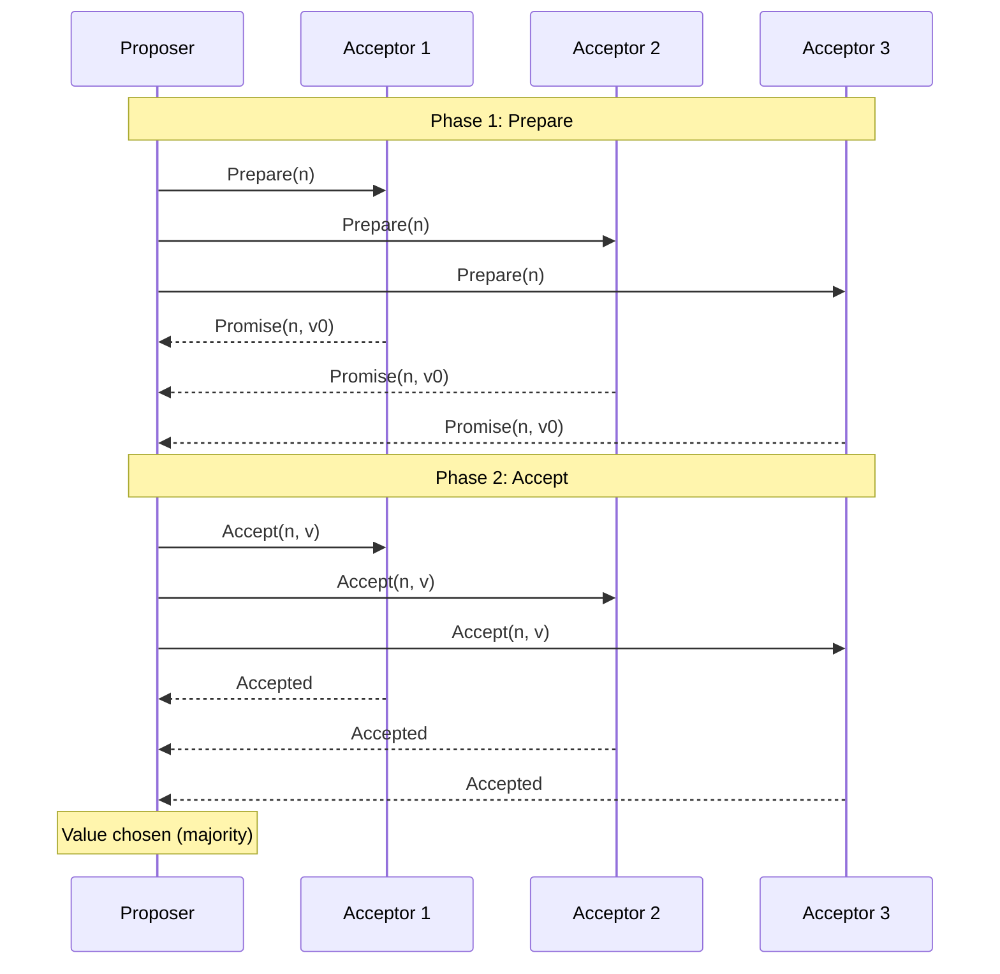

# Paxos

## Definition
Paxos is a family of consensus protocols for reaching agreement in a network of unreliable processors. It's the foundational consensus algorithm in distributed systems.



## Basic Paxos (Simplified)

### Roles
- **Proposer**: Proposes values
- **Acceptor**: Votes on proposals
- **Learner**: Learns the decided value
- **Leader**: Special single proposer (Multi-Paxos)

### Phase 1: Prepare
```
Proposer          Acceptors
    │                 │
    ├── Prepare(n) ──►│ n = proposal number
    │◄── Promise(n, v)│ Acceptors promise not to
    │                 │ accept lower-numbered proposals
```

### Phase 2: Accept
```
Proposer          Acceptors
    │                 │
    ├── Accept(n, v)─►│ Propose value v
    │◄── Accepted ────│ Majority accepts
    │                 │ Value is chosen
```

## Multi-Paxos
- Elects a stable leader (Phase 1 once)
- Leader proposes all subsequent values
- Majority accept on each proposal
- Log replication for state machines

## Interview Questions
1. Explain the two phases of Basic Paxos
2. What does Paxos guarantee about safety?
3. Why is Paxos considered hard to understand and implement?
4. How does Multi-Paxos improve on Basic Paxos?
5. Where is Paxos used in production systems?
