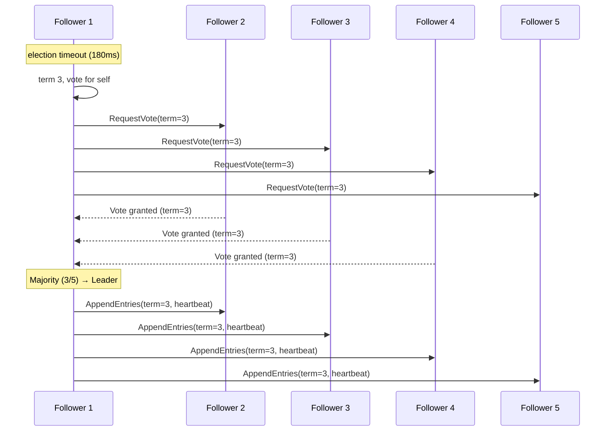
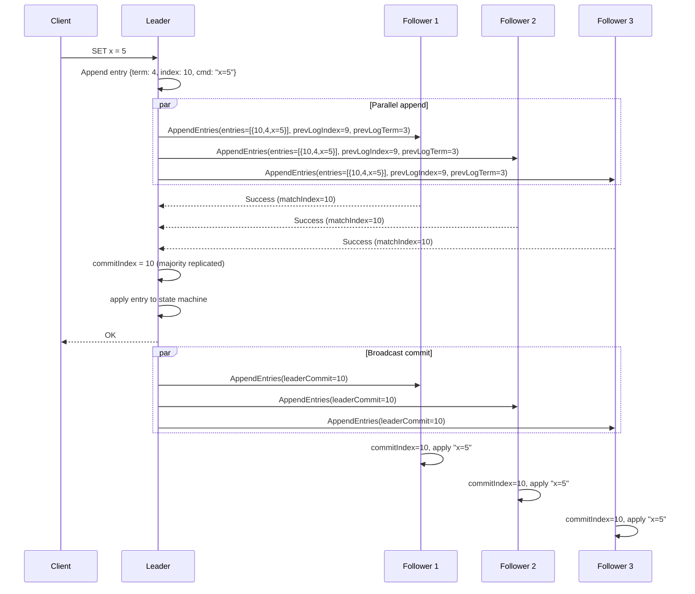
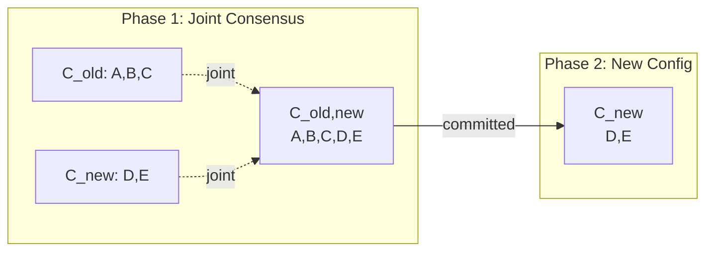
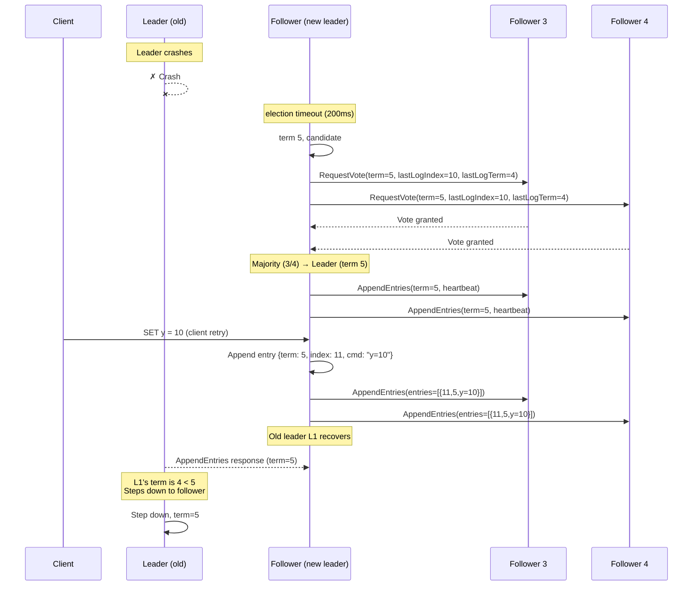

# Raft

## Definition
Raft is a consensus protocol designed to be more understandable than Paxos while providing equivalent fault tolerance. It achieves consensus via a strong leader approach, where log entries flow from leader to followers.

## What is Raft?
Raft is a consensus algorithm for managing a replicated log across a cluster of nodes. It provides the same fault tolerance and performance as Paxos but decomposes consensus into three relatively independent subproblems: leader election, log replication, and safety.

## Real-World Example
**etcd**: Kubernetes' primary key-value store uses Raft as its consensus engine. When a Kubernetes control plane operation occurs (e.g., creating a pod), etcd's Raft cluster ensures the operation is durably replicated across a quorum of nodes before the API server acknowledges success.

## Design Goals
- **Understandability**: Raft was specifically designed to be easy to understand and implement. It uses fewer "edge cases" than Paxos through strong leadership and a restricted problem space.
- **Complete Consensus**: Provides exactly-once semantics for log entries
- **Fault Tolerance**: Tolerates up to (N-1)/2 node failures
- **Performance**: Comparable to Paxos with simpler implementation

## Raft vs Paxos

| Aspect | Raft | Paxos |
|--------|------|-------|
| **Design goal** | Understandability first | Formal correctness proof |
| **Leader** | Strong, continuous leader (re-elected on failure) | Transient per-proposal (Multi-Paxos adds leader) |
| **Log flow** | Unidirectional: Leader → Followers | Possible multiple proposers |
| **Election** | Randomized timeouts, explicit | Not part of core protocol |
| **Membership changes** | Joint consensus | Complex, often manual |
| **Implementation** | ~20 operations in spec | Many edge cases |
| **Adoption** | etcd, Consul, TiDB, MongoDB | Google Chubby, Apache ZooKeeper (Zab variant) |
| **Complexity** | Moderate | High |

## Architecture

```mermaid
graph TB
    subgraph Cluster["Raft Cluster (5 nodes)"]
        L[Leader<br/>term: 3] -->|AppendEntries<br/>heartbeat| F1[Follower]
        L -->|AppendEntries| F2[Follower]
        L -->|AppendEntries| F3[Follower]
        L -->|AppendEntries| F4[Follower]
        
        subgraph Leader_State["Leader State"]
            CI[commitIndex: 7]
            LA[lastApplied: 7]
            NI[nextIndex: [8,8,8,8]]
            MI[matchIndex: [7,7,7,7]]
        end
        
        subgraph Follower_State["Follower State"]
            FI[commitIndex: 7]
            FL[lastApplied: 7]
        end
    end
    
    Client -->|Propose| L
    L -->|Reply| Client
    
    style L fill:#e74c3c,color:#fff
    style F1 fill:#3498db,color:#fff
    style F2 fill:#3498db,color:#fff
    style F3 fill:#3498db,color:#fff
    style F4 fill:#3498db,color:#fff
```

## Server States

```
┌─────────────────────────────────────────────────────┐
│                  Raft Server States                  │
├─────────────────────────────────────────────────────┤
│                                                       │
│  ┌──────────┐    starts up     ┌──────────┐          │
│  │          │ ──────────────►  │          │          │
│  │ Follower │                  │ Candidate│          │
│  │          │ ◄────────────── │          │          │
│  └────┬─────┘   discovers     └────┬─────┘          │
│       │    existing leader          │                 │
│       │                             │                 │
│       │ election timeout            │ wins election   │
│       ▼                             ▼                 │
│  ┌──────────┐                  ┌──────────┐          │
│  │          │                  │          │          │
│  │Candidate │                  │  Leader  │          │
│  │          │                  │          │          │
│  └──────────┘                  └────┬─────┘          │
│       ▲                             │                 │
│       │  discovers                   │ crashes /      │
│       │  higher term                 │ steps down     │
│       └─────────────────────────────┘                 │
│                                                       │
└─────────────────────────────────────────────────────┘
```

## Leader Election

Each node starts as a follower. Followers expect periodic heartbeats from the leader. If no heartbeat arrives within the election timeout, the follower transitions to candidate and initiates an election.

### Election Process

```
Election timeout (150-300ms random):
  1. Follower increments current term
  2. Transitions to candidate state
  3. Votes for itself
  4. Sends RequestVote RPC to all other servers
  5. Waits for majority of votes

If candidate receives majority:
  → Becomes leader for this term
  → Immediately sends heartbeats to establish authority

If candidate receives RPC from another leader:
  → If leader's term >= candidate's term:
    → Step down to follower
  → Else: Continue election

If election timeout elapses without majority:
  → Start new election (higher term)
```

### Randomized Election Timeouts

```
Server 1: election timeout = 195ms  ← expires first, becomes candidate
Server 2: election timeout = 267ms
Server 3: election timeout = 152ms  ← expires first, becomes candidate  
Server 4: election timeout = 231ms
Server 5: election timeout = 188ms

Staggered timeouts ensure split votes are rare.
```



## Log Replication

Once a leader is elected, all client requests go through the leader. Each request becomes a log entry.

### AppendEntries RPC

```
Arguments:
  term         : leader's term
  leaderId     : leader's ID (follower redirects clients)
  prevLogIndex : index of log entry immediately preceding new ones
  prevLogTerm  : term of prevLogIndex entry
  entries[]    : log entries to store (empty for heartbeat)
  leaderCommit : leader's commitIndex

Results:
  term     : current term (for leader to update itself)
  success  : true if follower contained entry matching prevLogIndex/prevLogTerm
```

### Log Structure

```
Term:    1    1    1    2    2    2    3    3    3
Index:   1    2    3    4    5    6    7    8    9
       ┌────┬────┬────┬────┬────┬────┬────┬────┬────┐
       │ x=3│ y=1│ y=9│ x=2│ x=5│ z=3│ x=0│ y=7│ x=1│
       └────┴────┴────┴────┴────┴────┴────┴────┴────┘
                                              ▲     ▲
                                        commitIndex  lastApplied
                                        = 7          = 7
```

### Replication Flow



## Safety Properties

### 1. Election Safety
At most one leader can be elected in a given term. Each term has at most one leader.

### 2. Leader Append-Only
A leader never overwrites or deletes entries in its log. It only appends new entries.

### 3. Log Matching
If two logs contain an entry with the same index and term, the entries are identical, and all preceding entries are identical.

```
Log 1: [1,1,1,2,2,2,3,3,3]
Log 2: [1,1,1,2,2,2,3,3]
                     ▲
              Logs match up to index 8
```

### 4. Leader Completeness
If a log entry is committed in a given term, it will be present in the logs of all future leaders.

```
Before election:
  Leader must have all committed entries (votes only from up-to-date servers)

  RequestVote RPC includes:
    lastLogIndex : candidate's last log index
    lastLogTerm  : candidate's last log term

  Follower denies vote if its log is more up-to-date.
```

### 5. State Machine Safety
If a server has applied a log entry at a given index to its state machine, no other server will apply a different entry at the same index.

```
If commitIndex = 10 applies "x=5":
  All servers that reach index 10 must apply "x=5"
  Index 10 is permanently "x=5" across the cluster
```

## Cluster Membership Changes

### Joint Consensus
Raft uses a two-phase approach for membership changes to ensure availability during transitions.

```
Phase 1: C_old,new (joint)
  ┌───────────────────────┐
  │ Configuration: old ∪ new│
  │ Both old and new must  │
  │ agree on decisions     │
  └───────────────────────┘

Phase 2: C_new (committed)
  ┌───────────────────────┐
  │ Configuration: new     │
  │ Only new members       │
  │ need majority          │
  └───────────────────────┘
```

```
Initial: C_old = {A, B, C}
Adding: D, E

Step 1: Leader appends C_old,new = {A, B, C, D, E}
Step 2: C_old,new committed (majority of both configs)
Step 3: Leader appends C_new = {D, E}
Step 4: C_new committed (majority of new config)
```



## Log Compaction / Snapshotting

Raft prevents unbounded log growth through snapshotting. The leader periodically takes a snapshot of the current state machine state and discards log entries before the snapshot point.

```
Before snapshot:
  Log: [1,1,1,2,2,2,3,3,3,4,4,4,5,5,5,6,6,6]
                                ↑
                          snapshot at index 12
  
After snapshot:
  Snapshot: {state: "x=3, y=7, z=1", lastIncludedIndex: 12, lastIncludedTerm: 5}
  Log: [6,6,6]  (remaining entries)
      ↑
  lastApplied = 12 (from snapshot)
```

### InstallSnapshot RPC
When a new follower joins or falls too far behind, the leader sends its snapshot.

```
Arguments:
  term              : leader's term
  leaderId          : leader's ID
  lastIncludedIndex : snapshot replaces all entries up to this index
  lastIncludedTerm  : term of lastIncludedIndex
  data[]            : serialized state machine state
  done              : true if this is the last chunk

Follower behavior:
  1. Replace log prefix with snapshot if existing entries are behind
  2. Apply snapshot state to local state machine
  3. Respond with success
```

## Request Flow When Leader Fails



## Hands-On: Raft in Go (Hashicorp's Raft Library)

```go
import "github.com/hashicorp/raft"

// Create Raft configuration
config := raft.DefaultConfig()
config.LocalID = raft.ServerID("node-1")
config.HeartbeatTimeout = 1000 * time.Millisecond
config.ElectionTimeout = 1000 * time.Millisecond

// Create FSM (state machine)
type KVStore struct {
    mu    sync.Mutex
    store map[string]string
}

func (k *KVStore) Apply(log *raft.Log) interface{} {
    // Apply command from log entry
    return nil
}

func (k *KVStore) Snapshot() (raft.FSMSnapshot, error) {
    // Return point-in-time snapshot
    return nil, nil
}

func (k *KVStore) Restore(rc io.ReadCloser) error {
    // Restore from snapshot
    return nil
}

// Create transport
transport, _ := raft.NewTCPTransport(":7000", addr, 3, 10*time.Second, os.Stderr)

// Create snapshot store
snapshotStore := raft.NewInmemSnapshotStore()

// Create log store and stable store
logStore := raft.NewInmemStore()
stableStore := raft.NewInmemStore()

// Create Raft node
r, _ := raft.NewRaft(config, &KVStore{store: make(map[string]string)},
    logStore, stableStore, snapshotStore, transport)

// Bootstrap cluster
configuration := raft.Configuration{
    Servers: []raft.Server{
        {ID: raft.ServerID("node-1"), Address: transport.LocalAddr()},
    },
}
r.BootstrapCluster(configuration)

// Propose a command
future := r.Apply([]byte("set x=5"), 500*time.Millisecond)
if err := future.Error(); err != nil {
    // Handle error
}
```

## Best Practices

| Practice | Detail |
|----------|--------|
| **Odd cluster size** | Always use 3, 5, or 7 nodes (never even). 3 tolerates 1 failure, 5 tolerates 2. |
| **Election timeouts** | Use randomized 150-300ms. Stagger across nodes to prevent split votes. |
| **Heartbeat interval** | Typically 50-100ms (must be << election timeout). |
| **Disk fsync** | Critical for durability. Log must be fsynced before responding to clients. |
| **WAL batching** | Batch multiple log entries into one fsync for throughput. |
| **Pre-vote** | Implement pre-vote phase to prevent servers with stale logs from disrupting elections. |
| **Quorum read** | For consistent reads, read through leader or use read quorum (not just local read). |
| **Disk I/O isolation** | Dedicate separate disk for WAL to avoid write contention. |
| **Monitoring** | Track: term changes, leader changes, commit index lag, election timeout count. |

## Real-World Usage

| System | Usage | Cluster Size |
|--------|-------|--------------|
| **etcd** | Kubernetes control plane storage | 3-7 nodes |
| **Consul** | Service discovery and configuration | 3-5 nodes |
| **TiDB** | Distributed SQL database (PD uses Raft) | 3-5 PD nodes, 3 Raft groups per region |
| **MongoDB** | Replica set consensus | 3-7 members per replica set |
| **Neo4j** | Causal cluster consensus | 3-7 core servers |
| **CockroachDB** | Distributed SQL (multi-Raft) | Per-range Raft groups (thousands) |

## Raft in Production (Pricing / Operational Considerations)

```
Cloud Setup:
  Instance:      3 x t3.medium (etcd cluster)  ~$90/month
  Disk:          gp3 20GB (provisioned IOPS)   ~$10/month
  Cross-AZ:      Deploy across 3 AZs            ~$0.01/GB transfer
  
  Total:         ~$100/month for production consensus layer

Performance Benchmarks:
  Write latency:   ~1-2ms (leader → quorum sync)
  Throughput:      ~10,000-50,000 writes/sec
  Read throughput: ~100,000 reads/sec (leader reads)
```

## Interview Questions

1. Explain the three states of a Raft server and how transitions happen
2. What problem do randomized election timeouts solve?
3. How does Raft prevent a stale leader from disrupting the cluster?
4. Describe the log replication flow from client request to commit
5. What are the five safety properties of Raft?
6. How does Raft handle cluster membership changes (joint consensus)?
7. Compare Raft and Paxos. When would you choose one over the other?
8. What happens to uncommitted log entries when a leader fails?
9. How does snapshotting work in Raft and when is it triggered?
10. Why does Raft recommend odd-sized clusters?
