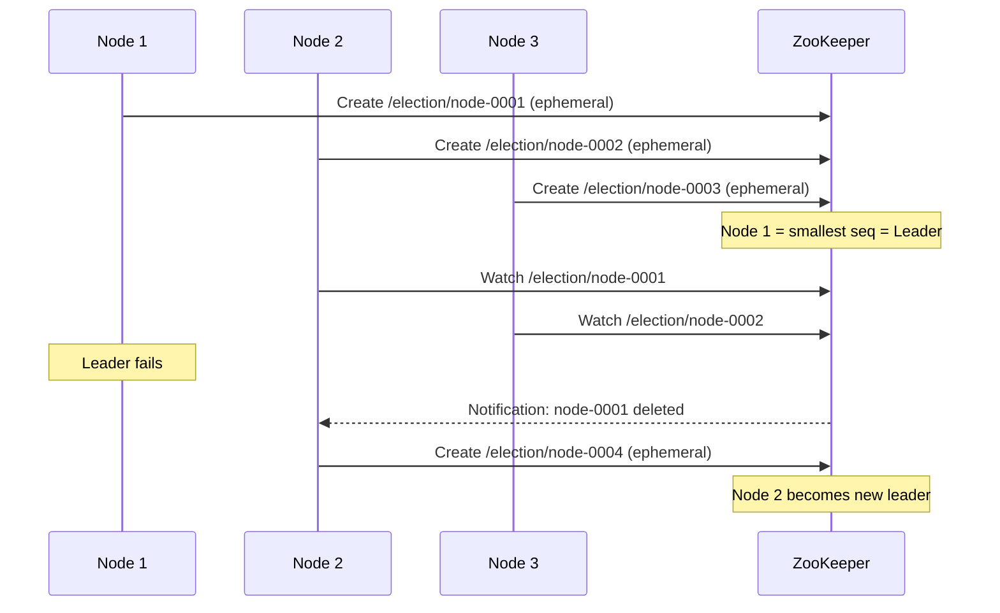

# Leader Election

## Definition
Leader election is the process of designating a single node as the coordinator of a distributed group. The leader is responsible for decisions, coordination, and writes.



## Algorithms

| Algorithm | Description | Use Case |
|-----------|-------------|----------|
| **Bully Algorithm** | Highest ID node becomes leader | Simple, small clusters |
| **Ring Algorithm** | Nodes pass election message in a ring | Ordered networks |
| **Raft Election** | Random timeout + majority vote | etcd, Consul |
| **Zab (ZooKeeper)** | Fast leader election (FLE) | ZooKeeper |

## ZooKeeper Leader Election

```
1. All participants create ephemeral sequential znode
   /election/node-0000000001
   /election/node-0000000002
   /election/node-0000000003

2. Smallest sequence number = Leader
3. Others watch the next smaller node
4. If leader fails, next in sequence takes over
```

## Interview Questions
1. How does leader election work in a ZooKeeper ensemble?
2. What happens during a Raft leader election?
3. How does the Bully algorithm elect a leader?
4. Why is leader election needed in distributed databases?
5. Design a leader election mechanism for a distributed system
