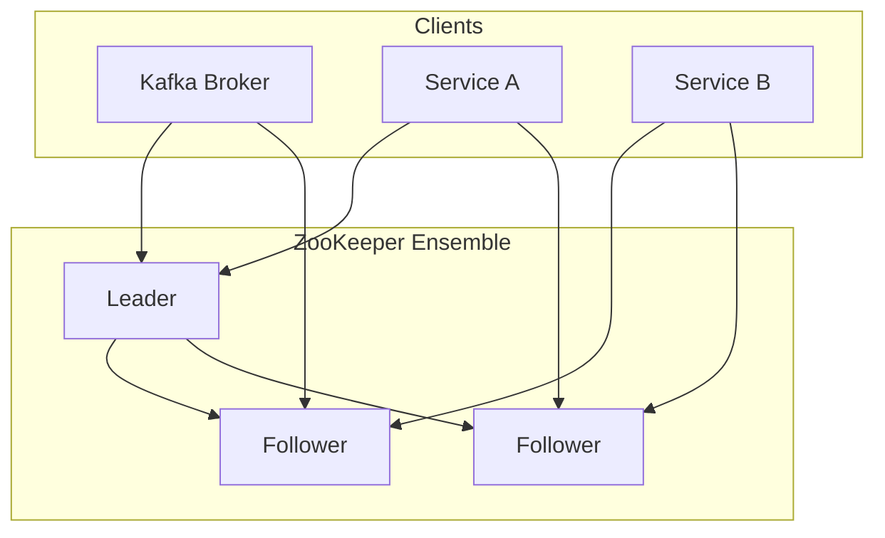

# ZooKeeper

## Definition
Apache ZooKeeper is a centralized service for maintaining configuration information, naming, providing distributed synchronization, and providing group services.



## Real-World Example
**Apache Kafka**: Uses ZooKeeper for cluster metadata, broker membership, topic configuration, and leader election for partitions (though newer versions are removing this dependency).

## Architecture

```
Client       Client       Client
  │            │            │
  └────────────┼────────────┘
               │
         ┌─────▼─────┐
         │  ZooKeeper │ (3 nodes)
         │  Ensemble  │
         │            │
         │   Leader   │
         │  Follower  │
         │  Follower  │
         └────────────┘
```

## Key Concepts

| Concept | Description |
|---------|-------------|
| **ZNode** | File-system-like data node |
| **Ephemeral ZNode** | Deleted when session ends |
| **Sequential ZNode** | Auto-incrementing suffix |
| **Watcher** | Notification on ZNode changes |
| **Ensemble** | ZooKeeper cluster |

## Znodes and Watches

```
/config
  /config/database
     value: "postgresql://localhost:5432"
  /config/cache
     value: "redis://localhost:6379"

/app
  /app/workers
     /workers/node-0000000001 (ephemeral sequential)
     /workers/node-0000000002 (ephemeral sequential)
```

## Interview Questions
1. What are the guarantees ZooKeeper provides?
2. How do ZooKeeper watches work?
3. What is the difference between ephemeral and persistent znodes?
4. How does ZooKeeper achieve high availability?
5. Why is Kafka moving away from ZooKeeper?
