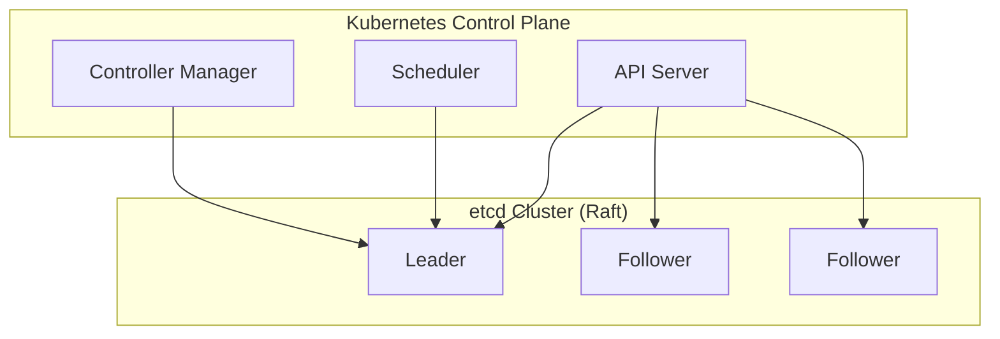

# etcd

## Definition
etcd is a strongly consistent, distributed key-value store that provides a reliable way to store data that needs to be accessed by a distributed system or cluster of machines.

## Real-World Example
**Kubernetes**: Uses etcd as its primary datastore for all cluster state — configurations, secrets, service discovery, and scheduling information.

## Key Features
- **Raft consensus**: Strong consistency
- **Key-value API**: Simple gRPC API
- **Watch**: Real-time change notifications
- **Leases**: Time-bound key leases (TTL)
- **Revision history**: Multi-version concurrency control

## etcd vs ZooKeeper

| Aspect | etcd | ZooKeeper |
|--------|------|-----------|
| Consensus | Raft | Zab |
| API | gRPC (key-value) | Tree-based (znodes) |
| Watches | Long-poll at revision | Ephemeral watches |
| Performance | Higher | Moderate |
| Cloud-native | CNCF graduated | Apache project |

## Interview Questions
1. How does etcd's watch mechanism work?
2. Compare etcd and ZooKeeper for service discovery
3. How does Kubernetes use etcd for cluster state?
4. What happens if etcd loses quorum?
5. Design a configuration management system using etcd
