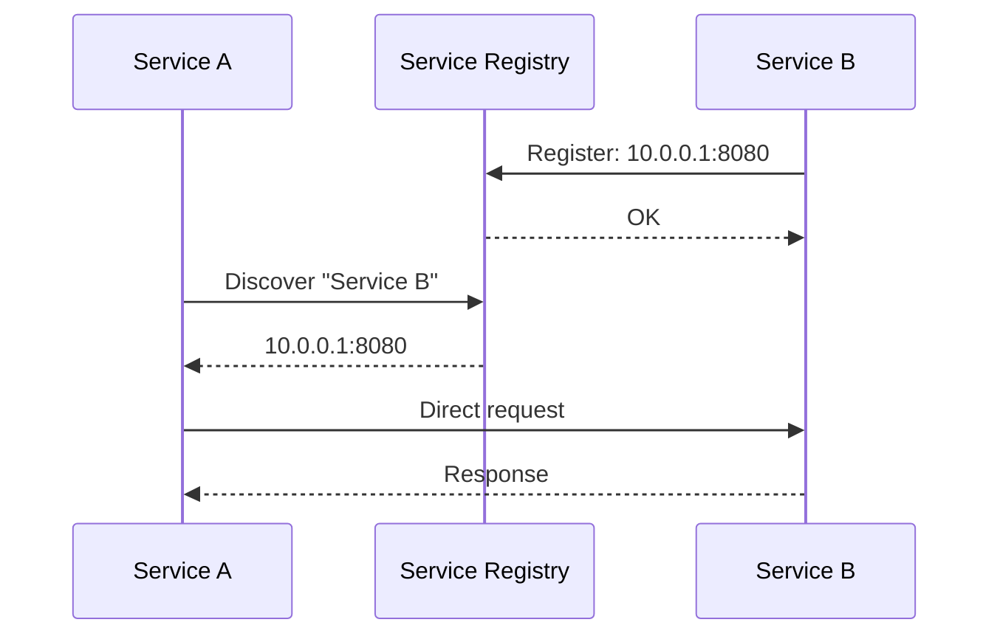

# Service Discovery

## Definition
Service discovery is the process of automatically detecting network locations of service instances. It enables services to find and communicate with each other without hard-coded addresses.



## Patterns

### Client-Side Discovery

```
Service A ──► Service Registry ──► Returns B's address
    │                                  │
    └──────► Service B (direct)
    
Pros: Simple, no proxy hop
Cons: Client must implement discovery
```

### Server-Side Discovery

```
Client ──► Load Balancer ──► Service A
                 │
            Registry monitors
            healthy instances
    
Pros: Client only knows LB
Cons: LB is infrastructure
```

## Service Registry

| Registry | Mechanism | Health Check |
|----------|-----------|--------------|
| **Consul** | DNS + HTTP | TTL or script |
| **etcd** | Key-value + watch | TTL lease |
| **ZooKeeper** | Ephemeral znode | Session |
| **Eureka** | REST | Heartbeat |

## Interview Questions
1. Compare client-side and server-side service discovery
2. How does Kubernetes service discovery work?
3. What happens during a service registry failure?
4. How does Consul differ from etcd for service discovery?
5. Design a service discovery system for a microservice architecture
