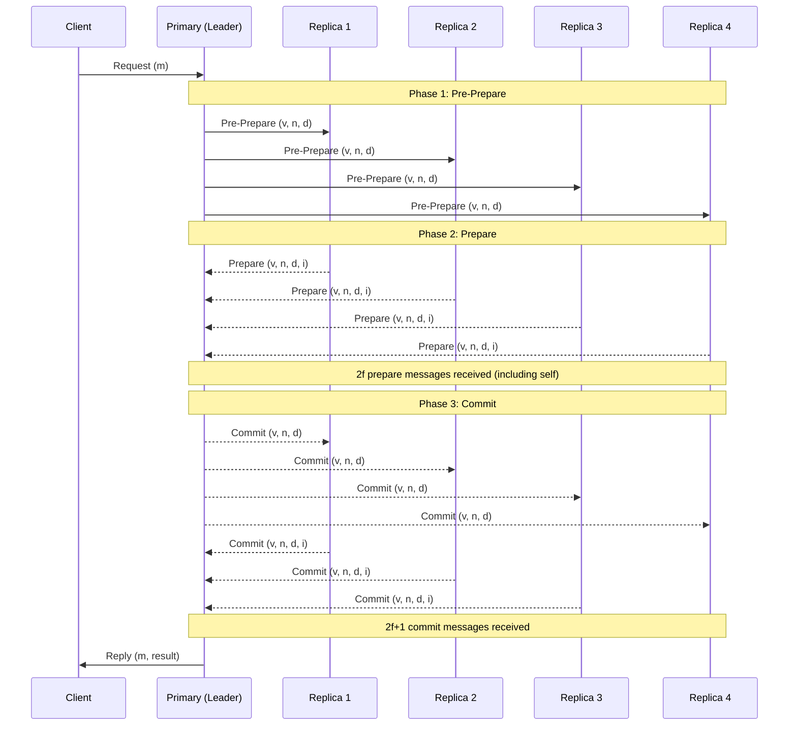
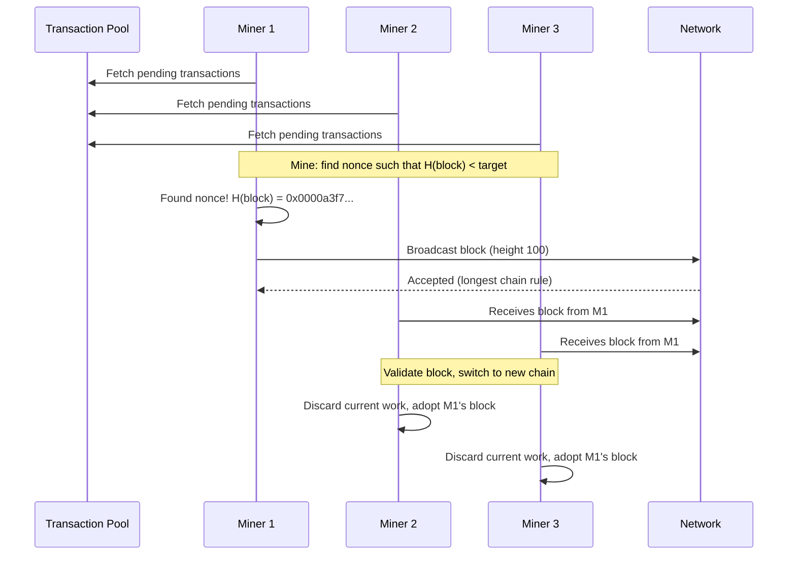

# Byzantine Fault Tolerance

## Definition
Byzantine Fault Tolerance (BFT) is the ability of a distributed system to reach consensus correctly even when some nodes behave arbitrarily maliciously, send conflicting information, or deliberately lie about their state. It represents the strongest form of fault tolerance in distributed computing.

## Byzantine Generals Problem

The classic analogy: Several divisions of the Byzantine army camp around an enemy city. Generals must agree on a unified plan (attack or retreat). Communication is via messengers who may be traitors. A traitorous general can send conflicting orders to different recipients, making agreement difficult.

**Conditions for a solution:**
- All loyal generals must decide on the same plan
- A small number of traitors cannot cause loyal generals to adopt a bad plan
- Communication is reliable (messengers deliver accurately)

## Failure Types

| Failure Type | Description | Example |
|-------------|-------------|---------|
| **Crash** | Node stops functioning | Power failure, OS crash |
| **Omission** | Node fails to send/receive messages | Network partition, dropped packets |
| **Timing** | Node responds too early or too late | Clock skew, slow GC pause |
| **Byzantine (Malicious)** | Node behaves arbitrarily | Sends conflicting votes, forges messages, colludes with attackers |

## PBFT (Practical Byzantine Fault Tolerance)

PBFT was the first practical BFT protocol, designed to work in asynchronous environments with cryptographic primitives.

### 3-Phase Protocol



### The N >= 3f + 1 Formula

BFT systems require at least `3f + 1` replicas to tolerate `f` Byzantine faulty nodes:

- **f faulty nodes**: nodes that may behave maliciously
- **2f+1 honest nodes**: needed to outvote faulty nodes
- **Total nodes N = 3f + 1**: the minimum to guarantee safety and liveness

**Why not 2f + 1?** With only 2f + 1 nodes, the honest nodes cannot distinguish between a faulty primary and a network partition. With 3f + 1, honest nodes can gather 2f + 1 matching messages (across all 3f + 1 nodes), ensuring at least f + 1 honest replicas agree, which guarantees correctness.

```
Total Nodes:    4     7     10     13     16
Faulty (f):     1     2      3      4      5
Honest Needed:  3     5      7      9     11
```

## BFT vs CFT (Crash Fault Tolerance)

| Aspect | CFT (Paxos/Raft) | BFT (PBFT) |
|--------|-------------------|------------|
| **Failure model** | Only crashes | Arbitrary/byzantine behavior |
| **Min nodes** | 2f + 1 | 3f + 1 |
| **Performance** | High (simple messages) | Lower (crypto overhead, 3-phase) |
| **Complexity** | Moderate | High |
| **Message complexity** | O(N) per round | O(N^2) per round |
| **Use case** | Trusted environments | Permissioned blockchains, adversarial settings |

## Practical BFT Limitations

1. **Scalability**: PBFT has O(N^2) message complexity. Each replica communicates with all others, limiting practical deployments to ~20-100 nodes.
2. **Crypto cost**: Digital signatures and verification at every phase add significant CPU overhead.
3. **View change cost**: When the primary fails, the view change protocol is expensive and complex.
4. **Synchronous assumptions**: Many BFT protocols assume partial synchrony for liveness.
5. **Membership static**: Traditional BFT assumes a fixed set of replicas.

## Modern BFT Protocols

| Protocol | Key Innovation | Use Case |
|----------|---------------|----------|
| **HotStuff** | Linear BFT (O(N) communication), pipelined 3-phase | Libra/Diem blockchain |
| **Tendermint** | BFT with proof-of-stake, validator rotation | Cosmos SDK |
| **HoneyBadgerBFT** | Asynchronous BFT, no timing assumptions | Cryptocurrencies |
| **SBFT** | Optimistic fast path, scalable BFT | Enterprise blockchains |
| **Algorand BA** | Cryptographic sortition, scalable BFT | Algorand blockchain |

### HotStuff Pipeline

HotStuff introduces a pipelined 3-phase protocol that achieves linear communication complexity:

```
Phase 1 (Prepare): Leader proposes → replicas vote
Phase 2 (Pre-Commit): Leader collects QC1 → replicas vote
Phase 3 (Commit): Leader collects QC2 → replicas vote
```

Each phase reduces to a leader-to-all broadcast, making it O(N) instead of O(N^2).

## Blockchain Consensus

| Consensus | Mechanism | Energy | Finality | BFT? |
|-----------|-----------|--------|----------|------|
| **Proof of Work (PoW)** | Solve cryptographic puzzle | High | Probabilistic (~6 blocks) | Yes |
| **Proof of Stake (PoS)** | Validators stake tokens | Low | Deterministic (checkpoint) | Yes |
| **Delegated PoS (DPoS)** | Elect delegates to produce blocks | Low | Near-instant | Partial |
| **Proof of Authority (PoA)** | Pre-approved validators | Low | Instant | Limited |

### Byzantine Faults in PoW

Bitcoin tolerates Byzantine faults through economic incentives: miners are rewarded for honest behavior and lose resources (electricity, hardware) if they cheat. The longest chain rule provides eventual consensus even with malicious miners controlling < 50% of hashrate.

### Proof of Work Consensus Flow



## Real-World Implementations

| System | BFT Protocol | Scale | Use Case |
|--------|-------------|-------|----------|
| **Hyperledger Fabric** | PBFT + Kafka/Raft consensus | ~100 peers | Enterprise blockchain |
| **Zilliqa** | PBFT + sharding + PoW | Thousands of TPS | High-throughput DeFi |
| **Diem (Libra)** | HotStuff (DiemBFT) | ~100 validators | Stablecoin payments |
| **Cosmos** | Tendermint BFT | ~150 validators | Interoperable blockchain |
| **Algorand** | Pure PoS + BA* | Thousands of nodes | Decentralized finance |

### Hyperledger Fabric Architecture

Fabric decouples execution from consensus:
1. **Endorsing peers**: Execute chaincode, produce RW sets
2. **Ordering service**: PBFT/Raft orders transactions
3. **Committing peers**: Validate and apply ordered blocks

## Best Practices

1. **Assume adversarial conditions**: Design for the worst-case network behavior, not the average case.
2. **Minimize trust assumptions**: Use cryptographic proofs (threshold signatures, zk-SNARKs) to reduce trust.
3. **Monitor view changes**: Frequent view changes indicate network problems or malicious behavior.
4. **Choose the right N**: For N nodes, tolerate f = (N-1)/3 failures. Use N = 3f + 1 + margin for upgrades.
5. **BFT for permissioned networks**: Use BFT in environments where participants are known but untrusted.
6. **Layer BFT with CFT**: Use BFT for ordering and CFT for storage replication to balance performance.

## Interview Questions

1. Explain the Byzantine Generals Problem. Why is it harder than crash fault tolerance?
2. Why does PBFT require N >= 3f + 1 replicas? Derive the formula.
3. Walk through the three phases of PBFT (pre-prepare, prepare, commit).
4. Compare BFT and CFT. When would you choose BFT over Raft?
5. How does HotStuff achieve O(N) communication complexity while PBFT is O(N^2)?
6. Explain how Proof of Work tolerates Byzantine faults without explicit node identity.
7. What are the practical scalability limitations of PBFT in production?
8. How does Tendermint combine BFT with Proof of Stake for blockchain consensus?
9. Describe the view change protocol in PBFT. What happens when the primary fails?
10. Compare HoneyBadgerBFT's asynchronous approach with PBFT's partially synchronous model.
