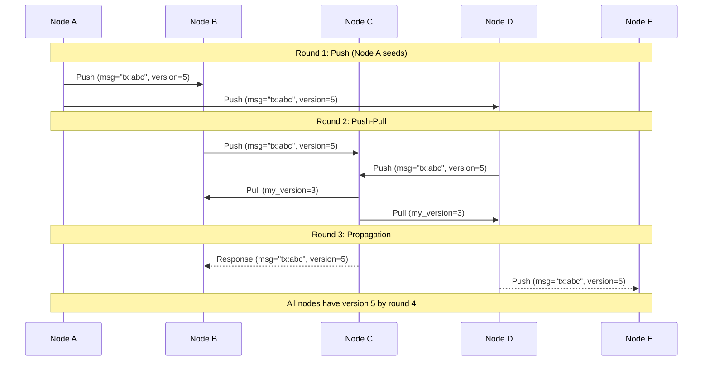
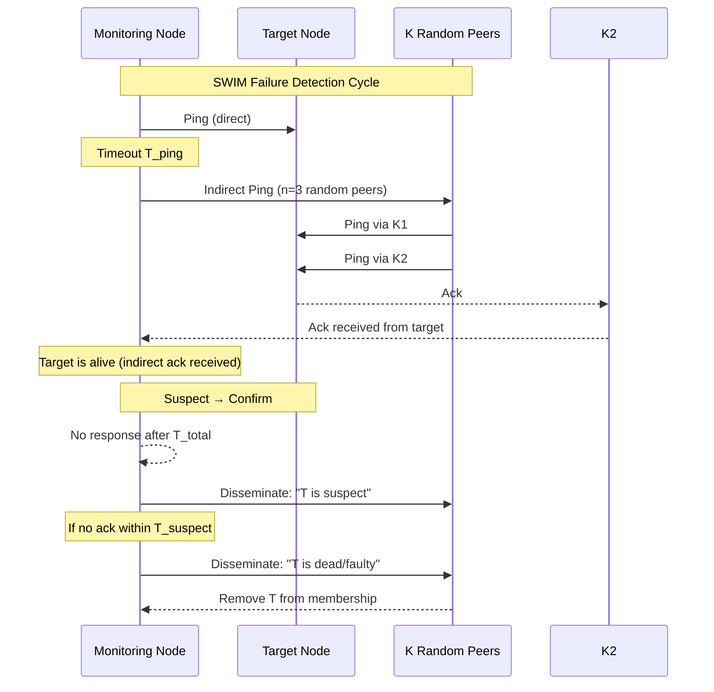
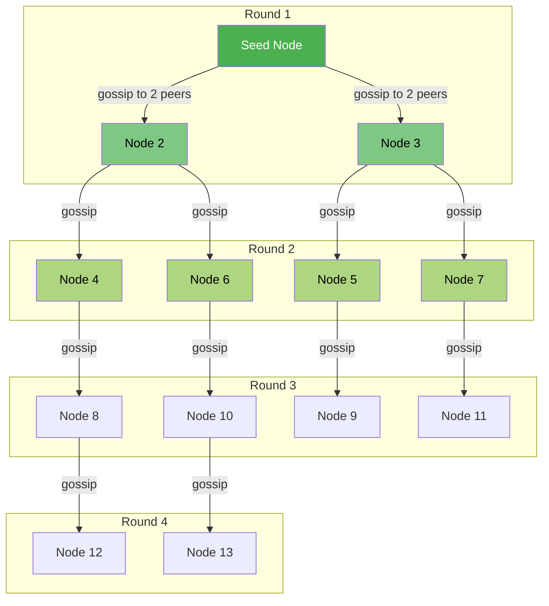

# Gossip Protocol

## Definition
Gossip protocol (also called epidemic protocol) is a communication mechanism where each node periodically exchanges information with a random subset of other nodes. Information spreads exponentially, similar to how a virus spreads through a population. It is used for failure detection, membership management, and data dissemination in large-scale distributed systems.

## Gossip Types

### Push Gossip
A node sends information to randomly selected peers.

```
Node A picks 3 random contacts
Node A sends (message, version) to each
Receiving nodes update if version > theirs
```

**Convergence**: O(log N) rounds for a message to reach all nodes.

### Pull Gossip
A node requests updates from randomly selected peers.

```
Node A picks 3 random contacts
Node A sends (current_version)
Peer responds with newer entries if any
```

**Convergence**: O(log N) rounds but requires bidirectional communication.

### Push-Pull Gossip
Both push and pull are combined. Nodes both send their own updates and request updates from peers. This is the most commonly used variant in production systems.



## Convergence Properties

| Property | Push | Pull | Push-Pull |
|----------|------|------|-----------|
| **Rounds to converge** | O(log N) | O(log N) | O(log N) |
| **Messages per round** | O(N) fanout | O(N) requests + O(N) responses | 2x O(N) |
| **Failure tolerance** | High | High | High |
| **Bandwidth per node** | Fixed fanout | Fixed fanout | Higher |
| **Speed** | Faster initial spread | Faster near convergence | Fastest overall |

### Mathematical Convergence

In a push-based gossip with fanout f, after round r, the fraction of infected nodes is approximately:

```
P[infected] ≈ N / (1 + (N-1) * e^(-f * r))
```

After O(log N) rounds, nearly all nodes (>= 99%) have received the message.

## Failure Detection

### SWIM Protocol (Scalable Weakly-consistent Infection-style Membership)

SWIM separates failure detection from membership dissemination, solving the scalability issues of all-to-all heartbeats.



### Phi-Accrual Failure Detector (Cassandra)

Instead of binary alive/dead, phi-accrual computes a continuous suspicion level based on historical heartbeat timing and current inter-arrival patterns.

```
phi(T_delta) = -log10(P[heartbeat interval > T_delta])

phi < 1:     Node is likely alive
1 < phi < 5: Node is suspicious
phi > 5:     Node is considered dead
```

**Advantages**: Adapts to network conditions, no hardcoded timeouts, provides confidence levels.

**Cassandra implementation**: Each node tracks heartbeat arrival times from peers. The failure detector calculates phi using the past ~1000 samples and compares against a configurable threshold (default phi = 8).

## Anti-Entropy with Merkle Trees

To efficiently reconcile differences without transferring entire datasets, systems use Merkle trees (hash trees).

```
Merkle Tree for key range [A-Z]:

            Root (hash01)
           /            \
     hash0              hash1
     /    \            /    \
 hash00  hash01    hash10  hash11
   /       \        /       \
 h(a)     h(b)    h(c)     h(d)
```

**Anti-entropy process:**
1. Compare root hashes. If equal, ranges are identical.
2. If different, descend to children and compare.
3. Recurse until leaf level, identifying exact differing keys.
4. Only transfer the delta (differing key-value pairs).

**Complexity**: O(log N) comparisons instead of O(N) for full data transfer.

## Practical Examples

| System | Gossip Usage | Protocol Details |
|--------|-------------|------------------|
| **Cassandra** | Failure detection, ring membership | Phi-accrual detector, seed nodes, gossip every 1s |
| **Consul** | Memberlist (SWIM-based), cluster health | SWIM + gossip for failure detection and node discovery |
| **DynamoDB** | Data replication, membership changes | Push-pull gossip, vector clocks for conflict resolution |
| **Redis Cluster** | Cluster bus (gossip port +10000) | PING/PONG messages, each node gossips with random nodes every 1s |
| **Kubernetes** | Cluster membership (memberlist) | SWIM protocol for node health tracking |
| **Bitcoin** | Node discovery, transaction propagation | Inventory vectors, getdata messages |

### Cassandra Gossip Details

```
Gossip Interval: 1000ms (configurable)
Seed Nodes: Initial contact points for bootstrap
Ring Membership: Each node knows all other nodes via gossip
Failure Detection: Phi-accrual with history window
```

**Seed node flow:**
```
New Node → Contact seed nodes → Receive full membership list
         → Start own gossip cycle → Propagate membership change
```

### Redis Cluster Bus

Each Redis node maintains a cluster bus (TCP port = client port + 10000). Every node sends PING messages to a random subset of peers at a configurable interval.

```
Cluster bus message types:
- PING: Health check + gossip data
- PONG: Response to PING
- MEET: Add node to cluster
- FAIL: Node is unreachable
- PUBLISH: Cross-node pub/sub messages
```

## Infection-Style Epidemic Algorithms

### SI Model (Susceptible-Infected)
Nodes are either susceptible (haven't received update) or infected (have received update). Once infected, they stay infected.

### SIR Model (Susceptible-Infected-Removed)
Adds "removed" state. After a node has gossiped enough times, it stops participating to reduce message overhead.

### SIRS Model (Susceptible-Infected-Removed-Susceptible)
Removed nodes eventually become susceptible again, enabling propagation of newer updates.

## Gossip Diagram Across Nodes



## Best Practices

1. **Fanout selection**: Use fanout of 2-4 for most deployments. Higher fanout converges faster but increases bandwidth.
2. **Gossip interval**: 500ms-2s for failure detection, longer for data dissemination. Balance between freshness and overhead.
3. **Seed nodes**: Deploy 2-3 well-known seed nodes per cluster. Never rely on a single seed (SPOF).
4. **Suspicion before death**: Implement a suspicion mechanism (like phi-accrual or SWIM suspect) before declaring a node dead to avoid flapping.
5. **Merkle tree depth**: Choose depth based on key space size. Cassandra uses 16 levels (2^16 ranges per keyspace).
6. **Throttle gossip**: Limit outbound gossip messages per second to avoid network saturation during partitions.
7. **Version vectors**: Pair gossip with vector clocks or version counters to handle conflicting updates correctly.
8. **Avoid all-to-all**: Never have every node gossip to every other node. Random peer selection ensures O(log N) convergence.

## Interview Questions

1. Explain how push-pull gossip achieves faster convergence than push-only or pull-only.
2. How does SWIM protocol improve on traditional all-to-all heartbeat failure detection?
3. Describe the phi-accrual failure detector used by Cassandra. Why is it better than fixed timeouts?
4. How do Merkle trees enable efficient anti-entropy in gossip-based systems?
5. Calculate the number of gossip rounds needed for a message to reach 99% of 10,000 nodes with fanout 3.
6. How does Consul use SWIM protocol for cluster membership? What happens during a network partition?
7. Compare Redis Cluster bus gossip with Cassandra's gossip protocol. What are the key differences?
8. What are seed nodes and why are they necessary in a gossip-based membership system?
9. How would you design a gossip protocol for a system spanning multiple datacenters?
10. Explain the SIR epidemic model. When would you remove nodes from gossip participation?
