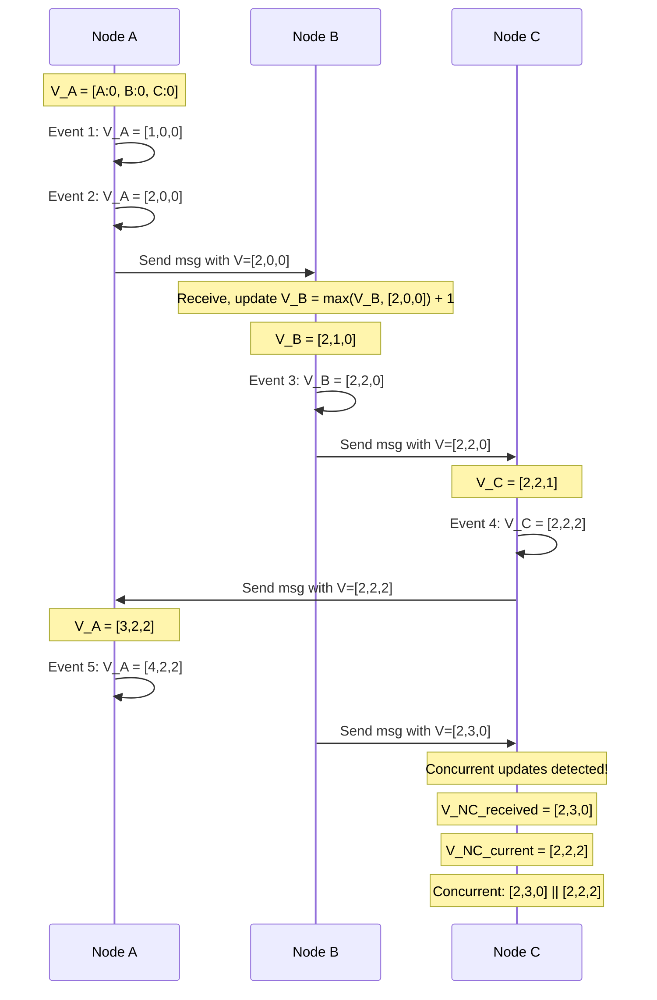

# Vector Clocks & CRDTs

## Definition
Vector clocks and Conflict-Free Replicated Data Types (CRDTs) are mechanisms for tracking causal relationships and resolving conflicts in distributed systems without requiring central coordination. Vector clocks provide causal ordering of events, while CRDTs are data structures that guarantee convergence when updated concurrently.

## Lamport Clocks

Lamport clocks are the simplest logical clock mechanism, providing a partial ordering of events in a distributed system.

### Happens-Before Relationship

The happens-before relation (->) defines causal ordering:
- If events a and b occur on the same node and a precedes b: a -> b
- If a is sending a message and b is receiving it: a -> b
- Transitivity: if a -> b and b -> c, then a -> c

### Lamport Clock Counter

Each node maintains a monotonically increasing counter:

```
Node A                     Node B
  |                          |
  |-- Local event: clock=1 --|
  |-- Local event: clock=2 --|
  |-- Send msg (clock=2) --->|--- Receive, set clock=max(2,0)+1=3
  |                          |-- Local event: clock=4
  |<--- Send msg (clock=4) --|---
  |-- Receive, set clock=5 --|
```

**Limitation**: Lamport clocks cannot determine if two events are concurrent. If C(a) < C(b), it's possible that a -> b but not guaranteed.

## Vector Clocks

Vector clocks overcome the limitation of Lamport clocks by maintaining a vector of counters, one per node.

### Structure

Each node i maintains vector V[i] where V[j] is the latest known event from node j:

```
V_A = [A: 3, B: 2, C: 5]   (Node A's knowledge)
V_B = [A: 2, B: 4, C: 3]   (Node B's knowledge)
```

### Causal Ordering Rules

- **V1 <= V2** if for all i: V1[i] <= V2[i]
- **V1 < V2** if V1 <= V2 and V1 != V2 (causally ordered)
- **V1 || V2** if neither V1 <= V2 nor V2 <= V1 (concurrent)



### Version Vectors

Vector clocks are often called version vectors in storage systems. Each replica maintains a version vector representing the most recent write it has seen from each node.

**Conflict detection**: When a read returns multiple version vectors that are not causally related (concurrent), a conflict exists that must be resolved.

## Multi-Master Conflict Resolution

### Last-Writer-Wins (LWW)
Assign a timestamp to each write. The write with the highest timestamp wins. Simple but loses data.

### Causal History
Use vector clocks to track causal relationships. Allow concurrent updates and resolve via application-specific merge functions.

### Conflict Detection Flow

```mermaid
flowchart TD
    A[Client Write Replica 1] --> B[Version: V1=[1,0,0]]
    C[Client Write Replica 2] --> D[Version: V2=[0,1,0]]
    B --> E{Compare V1 and V2}
    D --> E
    E -->|V1 < V2| F[V2 is causally newer: accept V2]
    E -->|V2 < V1| G[V1 is causally newer: accept V1]
    E -->|V1 || V2| H[Concurrent: raise conflict]
    H --> I[Application merges or user resolves]
```

## CRDTs (Conflict-Free Replicated Data Types)

CRDTs are data structures that can be updated concurrently at different replicas and always converge to the same state. No coordination is needed between replicas.

### CRDT Types

#### G-Counter (Grow-Only Counter)

Only supports increment. Each node maintains its own count. The value is the sum of all per-node counts.

```
G-Counter state: {node_id: count}

Operation: increment(node_i) => count_i += 1
Merge:     take max of each entry across replicas
Value:     sum of all entries
```

```python
class GCounter:
    def __init__(self, node_id):
        self.node_id = node_id
        self.counts = {}  # {node_id: count}

    def increment(self):
        self.counts[self.node_id] = self.counts.get(self.node_id, 0) + 1

    def merge(self, other):
        for node, count in other.counts.items():
            self.counts[node] = max(self.counts.get(node, 0), count)

    def value(self):
        return sum(self.counts.values())
```

#### PN-Counter (Positive-Negative Counter)

Combines two G-Counters: one for increments (P) and one for decrements (N). Value = P - N.

```
PN-Counter state: {P: G-Counter, N: G-Counter}

Operation: increment => P.inc(), decrement => N.inc()
Merge:     P.merge(other.P), N.merge(other.N)
Value:     P.value() - N.value()
```

#### G-Set (Grow-Only Set)

Elements can only be added, never removed. Merge is set union.

```
G-Set state: set of elements

Operation: add(element) => set.add(element)
Merge:     set.union(other.set)
Value:     set (always grows)
```

#### 2P-Set (Two-Phase Set)

Supports both add and remove by maintaining two G-Sets: added set and removed set. An element in the removed set is considered deleted.

```
2P-Set state: {A: G-Set (added), R: G-Set (removed)}

Operation: add(e) => A.add(e)
Operation: remove(e) => if e in A: R.add(e)
Query:     e in A and e not in R
Merge:     A.merge(other.A), R.merge(other.R)
```

**Limitation**: Once removed, an element can never be re-added (because R.set persists).

#### LWW-Register (Last-Writer-Wins Register)

Each write is paired with a timestamp. The latest timestamp wins. Uses a wall clock or logical clock.

```
LWW-Register state: {value, timestamp}

Operation: assign(value, ts) => state = {value, ts}
Merge:     pick the value with higher timestamp
```

#### OR-Set (Observed-Remove Set)

The most practical CRDT set. Supports add and remove without the 2P-Set limitation. Uses unique tags per element.

```
OR-Set state: {element: {tag1, tag2, ...}}  (set of active tags)

Operation: add(element) => generate unique tag, add to element's tags
Operation: remove(element) => remove all tags for element
Merge:     union of tag sets per element
Query:     element is present if it has at least one tag
```

**Key insight**: A remove only removes the tags that have been observed (seen) by the remover. If another replica added the element after the remove, that new add has a different tag and survives.

## State-Based vs Operation-Based CRDTs

| Aspect | State-Based (CvRDT) | Operation-Based (CmRDT) |
|--------|---------------------|-------------------------|
| **Merge** | Merge entire state | Apply operations |
| **Requirements** | Monotonic join-semilattice | Exactly-once delivery |
| **Bandwidth** | Higher (full state transfer) | Lower (just operations) |
| **Fault tolerance** | High (any message delivery) | Requires reliable broadcast |
| **Complexity** | Simpler to implement | More complex (delivery guarantees) |

### CvRDT Convergence Condition

A state-based CRDT converges if the merge function forms a **join-semilattice**:
- Commutative: merge(a, b) = merge(b, a)
- Associative: merge(a, merge(b, c)) = merge(merge(a, b), c)
- Idempotent: merge(a, a) = a

## CRDT vs Operational Transformation (OT)

| Aspect | CRDT | OT |
|--------|------|-----|
| **Approach** | State convergence | Operation transformation |
| **Conflict model** | Automatic merge via semilattice | Transform concurrent operations |
| **Latency** | No coordination needed | Server often required for ordering |
| **Use case** | Peer-to-peer, offline-first | Collaborative editing (Google Docs) |
| **Complexity** | Moderate | High (transform functions are hard) |
| **Network model** | Any (including gossip) | Usually requires central ordering |

### When to Use Which

**Use CRDTs when:**
- Building peer-to-peer or offline-first applications
- You can tolerate eventual consistency
- Conflict resolution can be automatic or application-driven
- Example: SoundCloud like counters, Redis CRDT-based replication

**Use OT when:**
- Building real-time collaborative editing
- Users expect sequential undo/redo
- You have a central server for ordering
- Example: Google Docs, Etherpad

## Real-World Implementations

| System | Technology | Use Case |
|--------|-----------|----------|
| **Riak** | Vector clocks + CRDTs (counters, sets, maps) | Distributed key-value store |
| **Redis (CRDT replication)** | Operation-based CRDTs | Active-active geo-distribution |
| **Google Docs** | OT (Operational Transformation) | Real-time collaborative editing |
| **SoundCloud** | CRDT counters | Play count, like counts |
| **Atom (GitHub)** | CRDT (teletype) | Collaborative code editing |
| **Automerge** | State-based CRDT (JSON-like) | Offline-first apps |
| **Nimbus Notes** | CRDT + OT hybrid | Collaborative note-taking |
| **DynamoDB** | Vector clocks (versioning) | Multi-master conflict resolution |

### Riak Vector Clock Example

```
Read response includes vector clock:
  Value: "user:123:profile"
  Clock: [client1:5, client2:3, client3:7]

  If client receives:
    Clock: [client1:5, client2:3, client3:7]
  And prior saved clock was:
    Clock: [client1:4, client2:3, client3:6]
  Then new clock dominates → safe update (no conflict)

  If prior saved clock was:
    Clock: [client1:6, client2:3, client3:6]
  Then clocks are concurrent → conflict! Return siblings.
```

## Best Practices

1. **Prefer CRDTs for high-availability systems**: Eliminate coordination to achieve maximum uptime during partitions.
2. **Use vector clocks sparingly**: They grow linearly with the number of writers. Prune or tombstone old entries.
3. **Combine LWW with CRDTs**: For many applications, LWW-register semantics are sufficient. Use CRDT sets/counters only when needed.
4. **Handle clock skew**: In LWW systems, monotonic logical clocks are safer than wall clocks. NTP synchronization helps but does not guarantee against skew.
5. **Tombstone cleanup**: CRDTs that support deletion (2P-Set, OR-Set) accumulate tombstones. Implement periodic compaction.
6. **Read-repair**: In eventually consistent systems, use vector clocks during read to detect and repair stale replicas.
7. **Sibling explosion**: In Dynamo-style systems, siblings can accumulate. Implement a sibling limit (default: 10 in Riak) and fall back to LWW.

## Interview Questions

1. Explain the difference between Lamport clocks and vector clocks. What can vector clocks do that Lamport clocks cannot?
2. How do you detect concurrent updates using vector clocks? What does concurrent mean in terms of causal ordering?
3. Walk through the implementation of an OR-Set. How does it allow re-adding elements that were removed?
4. Compare state-based CRDTs (CvRDTs) and operation-based CRDTs (CmRDTs). When would you choose one over the other?
5. How does Riak use vector clocks for conflict resolution? What happens when a read returns sibling values?
6. Explain why PN-Counter is composed of two G-Counters. Why can't a single counter with both increment and decrement operations be a valid CRDT?
7. Compare CRDTs with Operational Transformation. Why does Google Docs use OT instead of CRDTs?
8. What is the tombstone problem in CRDTs? How do systems like Redis CRDT replication handle it?
9. How would you implement a collaborative shopping list application using CRDTs?
10. Explain the join-semilattice property required for state-based CRDT convergence.
