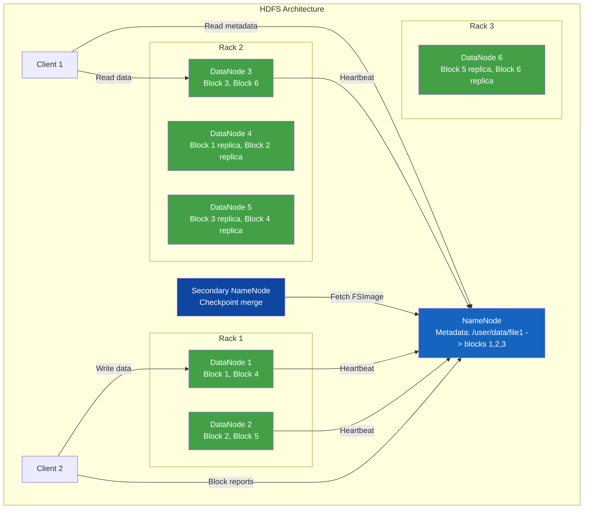
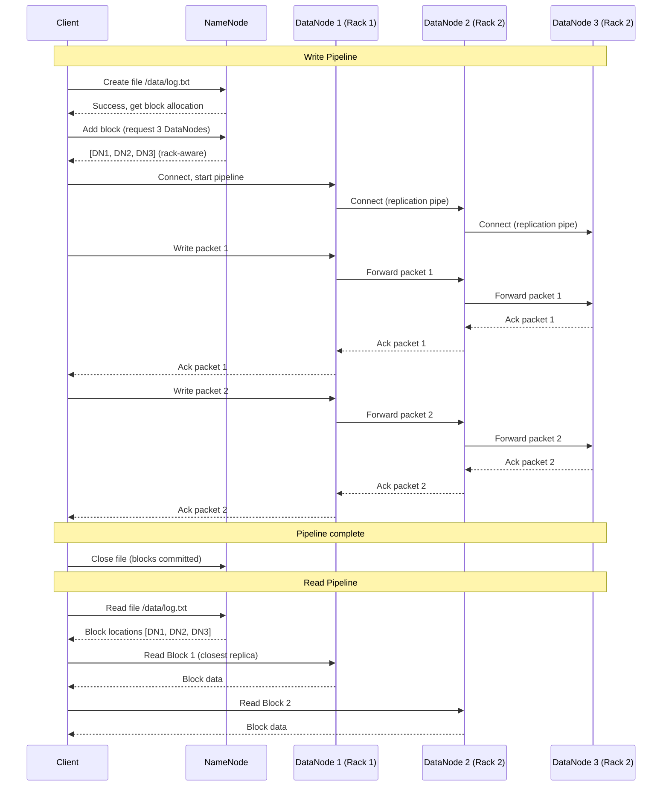
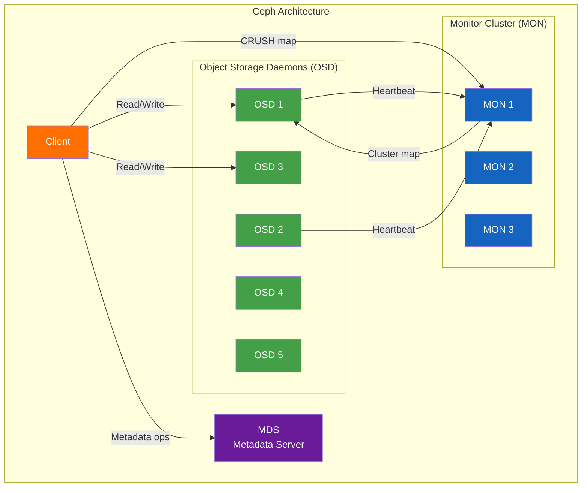
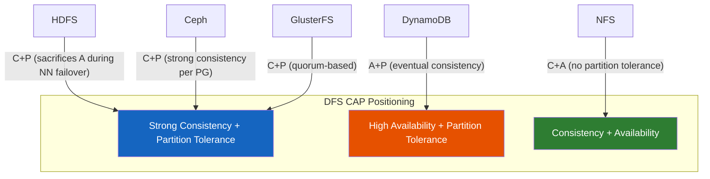

# Distributed File Systems

## Definition
A distributed file system (DFS) is a storage system that enables multiple clients to access and share files across a network of machines as if they were local files. It provides a unified namespace, fault tolerance, high availability, and scalable storage by distributing data across multiple servers.

## HDFS (Hadoop Distributed File System)

### Architecture



### Components

| Component | Role | State |
|-----------|------|-------|
| **NameNode** | Stores metadata (file -> block mapping, permissions) | In-memory + FSImage + EditLog |
| **DataNode** | Stores actual data blocks | Block files on local disk |
| **Secondary NameNode** | Merge FSImage + EditLog (checkpoint) | Not a hot standby |

### Block Replication (Default 3x)

```
Block placement strategy:
  - Replica 1: On a DataNode in the writer's rack
  - Replica 2: On a DataNode in a different rack
  - Replica 3: On a different DataNode in the same rack as replica 2

Rack awareness minimizes inter-rack traffic while surviving rack failures.
```

### HDFS Read/Write Pipeline



## Ceph Architecture

Ceph separates data from metadata entirely and uses a distributed hash table (CRUSH) for data placement.



### Key Concepts

- **RADOS**: Reliable Autonomic Distributed Object Store (core layer)
- **CRUSH**: Controlled Replication Under Scalable Hashing (no central metadata lookup)
- **OSD**: Object Storage Daemon (stores data, handles replication)
- **MON**: Monitor (maintains cluster map, consensus via Paxos)
- **MDS**: Metadata Server (only needed for CephFS)

### CRUSH Algorithm

CRUSH eliminates the metadata bottleneck by computing data locations deterministically:

```
CRUSH map hierarchy:
  root → datacenter → room → row → rack → chassis → OSD

Placement Group (PG): logical partition of data
PG → OSD: mapped via CRUSH hash
Client computes location: no metadata server needed for data placement
```

## GlusterFS

GlusterFS is a POSIX-compatible distributed file system that aggregates storage from multiple servers into a single namespace. No metadata server is required.

### Volume Types

| Volume Type | Behavior | Fault Tolerance | Use Case |
|-------------|----------|-----------------|----------|
| **Distributed** | Files spread across bricks | None | Capacity scaling |
| **Replicated** | Files copied to N bricks | N-1 failures | High availability |
| **Striped** | Files split across bricks | None | Large file performance |
| **Dispersed** | Erasure-coded across bricks | Configurable failures | Efficient redundancy |

### GlusterFS Translators

GlusterFS uses a stackable translator architecture:

```
Client → [Network] → [Performance xlators] → [Cluster xlators] → [Storage xlators] → Brick
```

- **Cluster/DHT**: Distributed Hash Table (file placement)
- **Cluster/AFR**: Automatic File Replication (self-heal)
- **Cluster/Disperse**: Erasure coding

## Comparison Table

| Aspect | HDFS | Ceph | GlusterFS | NFS |
|--------|------|------|-----------|-----|
| **Architecture** | Master-slave (NameNode) | Decentralized (CRUSH) | Symmetric (no metadata) | Client-server |
| **Metadata** | Single NameNode (SPOF) | Distributed via CRUSH | None (hash-based) | Single server |
| **Consistency** | Strong (single writer) | Strong (per-PG) | Strong (replicated) | Strong |
| **POSIX compliance** | No (append-only) | Yes (via CephFS) | Yes (FUSE) | Full POSIX |
| **Default replication** | 3x (block-level) | 3x (PG-level) | 2x (brick-level) | None |
| **Erasure coding** | Yes (since HDFS 3.x) | Yes | Yes (dispersed) | No |
| **Scalability** | Thousands of nodes | Thousands of nodes | Hundreds of nodes | Limited (single server) |
| **Best for** | Batch analytics | Unified storage (block/object/fs) | Media, HPC, home dirs | Simple sharing |
| **Failure handling** | Rack-aware re-replication | Self-managing, auto-rebalance | Self-heal | Server failover |
| **Geo-replication** | Yes (distcp) | Yes (RBD mirroring) | Yes (geo-rep) | Limited |

## Use Cases

| System | Use Case | Key Advantage |
|--------|----------|---------------|
| **HDFS** | Hadoop/Spark data lake | Data locality for MapReduce |
| **Ceph (RADOS)** | OpenStack block storage (Cinder) | Unified block, file, object |
| **Ceph (RGW)** | S3-compatible object storage | Multi-region, multi-site |
| **GlusterFS** | Media serving, home directories | POSIX compliance, simple deployment |
| **NFS** | Network-attached storage | Ubiquity, simplicity |

### CAP Tradeoffs



## Real-World Deployments

| Organization | System | Scale | Details |
|-------------|--------|-------|---------|
| **Facebook** | HDFS | ~300 PB, tens of thousands of nodes | World's largest HDFS deployment, used for warehouse analytics |
| **Yahoo** | HDFS | ~600 PB across clusters | Original Hadoop adopter, massive batch processing |
| **OVH** | Ceph | ~300 PB (public cloud) | OpenStack-based public cloud with Ceph block/object storage |
| **Red Hat** | GlusterFS | Data centers, OpenShift | Container storage, hyper-converged infrastructure |
| **DreamHost** | Ceph | ~150 PB (object storage) | S3-compatible object storage for web hosting |
| **CERN** | EOS (custom DFS) | ~1 EB (scientific data) | High-energy physics data storage |

### Facebook HDFS Architecture

Facebook's HDFS deployment pioneered several improvements:
- **NameNode federation**: Multiple independent NameNodes for namespace scalability
- **HDFS RAID**: Erasure coding for cold data (saves ~50% storage)
- **DataNode co-location**: Compute and storage on same nodes for data locality
- **SLA-aware replication**: Tiered storage (hot/warm/cold)

## Design Tradeoffs

### Consistency vs Performance

| Approach | Consistency | Write Latency | Read Latency | Use Case |
|----------|-------------|---------------|--------------|----------|
| **Synchronous replication** | Strong | Higher (wait for all replicas) | Low | Financial data, metadata |
| **Quorum-based (N/2+1)** | Strong | Moderate | Low | General purpose |
| **Asynchronous replication** | Eventual | Low | Low | Geo-distribution |
| **Chain replication** | Strong | Moderate | Low (tail reads) | Key-value stores |

### When to Choose Each System

**Choose HDFS when:**
- Running Hadoop/Spark batch processing jobs
- Data locality is critical for compute performance
- Append-only workloads (no random writes)

**Choose Ceph when:**
- Need unified block, file, and object storage
- Building OpenStack or S3-compatible object storage
- Expect self-healing and auto-rebalancing

**Choose GlusterFS when:**
- Need POSIX-compliant shared file system
- No metadata server overhead desired
- Media streaming or home directory workloads

**Choose NFS when:**
- Simple file sharing on a local network
- Full POSIX semantics required
- Small scale (few servers)

## Best Practices

1. **HDFS block size**: Use 128 MB or 256 MB blocks to reduce NameNode memory pressure and improve sequential I/O.
2. **Rack awareness**: Always configure rack topology to avoid data loss from rack failure and minimize inter-rack traffic.
3. **NameNode HA**: Deploy Active/Standby NameNodes with shared edits (NFS or QJM) to eliminate single point of failure.
4. **Ceph PG count**: Number of Placement Groups = (OSDs * 100) / replica_size. Too few PGs cause imbalance, too many increase memory.
5. **Monitor partitions**: In Ceph, always deploy an odd number of monitors (1, 3, or 5) with consensus over Paxos.
6. **GlusterFS bricks**: Use XFS filesystem for bricks. Avoid rebalance-heavy operations during peak traffic.
7. **Network separation**: Dedicate cluster network for replication traffic to avoid interfering with client traffic.
8. **Capacity planning**: Keep HDFS at < 70% capacity. Ceph < 85%. High utilization degrades rebalance and performance.

## Interview Questions

1. Describe the HDFS write pipeline. What happens if a DataNode fails during a write?
2. Explain how the CRUSH algorithm in Ceph eliminates the metadata bottleneck present in HDFS.
3. Compare HDFS, Ceph, and GlusterFS. When would you choose each?
4. What is rack awareness in HDFS? How does it affect replica placement?
5. How does Ceph handle failure recovery when an OSD fails?
6. Explain the difference between replicated, distributed, and dispersed volumes in GlusterFS.
7. What are the tradeoffs between synchronous and asynchronous replication in distributed file systems?
8. Describe the role of the Secondary NameNode in HDFS. Is it a hot standby?
9. How does erasure coding differ from replication in HDFS? When would you use each?
10. Design a distributed file system for a multi-datacenter media serving platform. What system would you choose and why?
