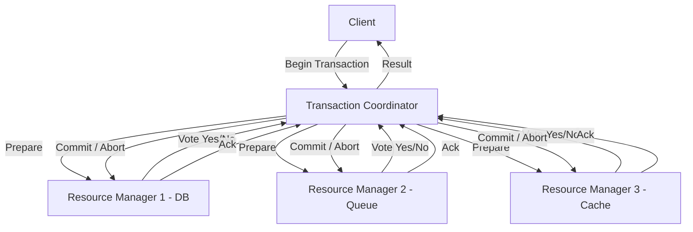

# Distributed Transactions

## Architecture at a Glance



## What is it?

A distributed transaction is a set of operations on data across two or more network hosts that must all succeed or all fail (ACID). Protocols like **2PC (Two-Phase Commit)**, **3PC (Three-Phase Commit)**, **SAGA**, and **TCC (Try-Confirm/Cancel)** coordinate participants to reach agreement on the final outcome despite network failures, node crashes, and concurrency.

## Why it was created

Monolithic databases handle ACID within a single node. As systems decomposed into microservices and sharded databases, a single business operation (e.g., placing an order) now touches multiple independently-owned data stores. Without a distributed transaction protocol, partial failures leave the system in an inconsistent state — money deducted but inventory not reserved, or an order placed but payment never captured.

## When to use it

| Protocol | Use Case | Tolerance |
|----------|----------|-----------|
| **2PC** | Short-lived, critical operations within a trust boundary | Strong consistency, blocks on failure |
| **3PC** | Long-running 2PC where timeout reduces blocking | Non-blocking, but more complex |
| **SAGA** | Long-lived business processes across microservices | Eventual consistency, compensations |
| **TCC** | Resource reservation (booking, inventory) | Requires business-level cancel logic |
| **XA** | Heterogeneous resource managers (DB + MQ) | Vendor-standard, heavyweight |

## Hands-on Example

### 2PC Coordinator in Python (pseudo)

```python
class TwoPhaseCoordinator:
    def __init__(self, participants):
        self.participants = participants
        self.state = "INIT"

    def execute(self, transaction_fn):
        # Phase 1: Prepare
        votes = []
        for p in self.participants:
            try:
                p.prepare(transaction_fn)
                votes.append("YES")
            except Exception:
                votes.append("NO")

        # Phase 2: Commit or Abort
        if all(v == "YES" for v in votes):
            self.state = "COMMIT"
            for p in self.participants:
                p.commit()
        else:
            self.state = "ABORT"
            for p in self.participants:
                p.rollback()
        return self.state
```

### SAGA Orchestrator

```yaml
# saga-definition.yaml
saga:
  name: "order-fulfillment"
  steps:
    - action: reserve_inventory
      compensation: release_inventory
    - action: charge_payment
      compensation: refund_payment
    - action: ship_order
      compensation: cancel_shipment
```

### TCC Example (Try-Confirm/Cancel)

```python
# Booking service TCC implementation
class BookingTCC:
    def try_reserve(self, seat_id, user_id):
        # Lock the seat — provisional hold
        redis.set(f"hold:{seat_id}", user_id, ex=300)
        return f"hold_token_{seat_id}"

    def confirm(self, hold_token):
        # Convert hold to confirmed booking
        seat_id = hold_token.split("_")[-1]
        db.execute("INSERT INTO bookings ...")

    def cancel(self, hold_token):
        # Release the hold
        seat_id = hold_token.split("_")[-1]
        redis.delete(f"hold:{seat_id}")
```

## Best Practices

- **Avoid distributed transactions** where possible — prefer idempotent operations and event-driven eventual consistency
- **Set timeouts** on every phase of 2PC/3PC to prevent indefinite blocking
- **Use idempotency keys** so participants can safely retry commits
- **Implement a recovery daemon** that polls in-doubt transactions and replays the decision log
- **Prefer SAGA** for long-running workflows; use 2PC only for short, critical, low-latency ops
- **Persist coordinator state** to disk before sending prepare to survive crashes

## Interview Questions

1. **What happens if the coordinator crashes after sending "prepare" but before "commit"?**  
   The participants remain in a prepared (blocked) state, holding locks. A recovery coordinator must read the transaction log after restart and either commit or rollback based on the logged decision. Without a persisted decision, participants must be admin-healed.

2. **Why does 2PC not scale well for microservices?**  
   It introduces a synchronous blocking protocol across services — locks are held during phase 1, reducing concurrency. It also creates a single point of failure (the coordinator) and couples all participants to the same lifecycle, which violates microservice autonomy. SAGA patterns are preferred.

3. **How does TCC differ from 2PC?**  
   TCC pushes coordination logic into the application layer — each service implements `try`, `confirm`, and `cancel` business operations. Unlike 2PC, TCC releases resources after `try` (via timeout) so it is non-blocking. The trade-off is that the application must handle compensation logic explicitly.

## Real Company Usage

| Company | Protocol | Scenario |
|---------|----------|----------|
| **eBay** | SAGA | Order lifecycle across inventory, payment, shipping |
| **Airbnb** | TCC | Property booking and payment reservation |
| **Amazon** | SAGA (AWS Step Functions) | Orchestrating serverless workflows |
| **Alibaba** | TCC (Seata framework) | Distributed transaction coordination |
| **Banking (SWIFT)** | 2PC / XA | Inter-bank fund transfers with ACID guarantees |
| **Uber** | SAGA | Trip lifecycle: dispatch, pricing, payment, rating |
