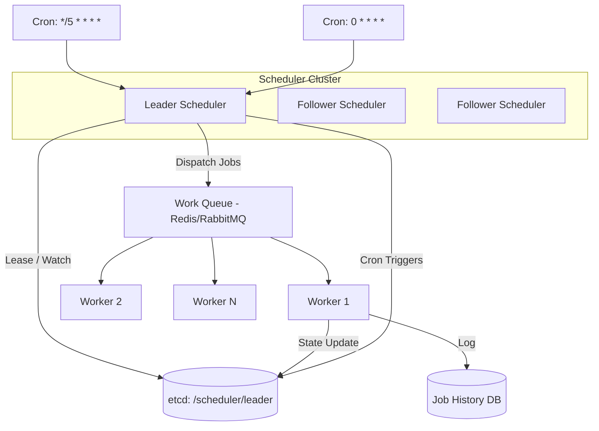

# Distributed Scheduling

## Architecture at a Glance



## What is it?

Distributed scheduling coordinates job execution across multiple machines — ensuring a job runs exactly once (or at most once) at the right time, even when nodes fail, network partitions occur, or clocks drift. It combines leader election, distributed locking, work queues, and persistent cron triggers to replace single-node `cron` with a fault-tolerant cluster.

## Why it was created

Single-node cron fails when the machine goes down. Teams writing one-off cron scripts across dozens of servers causes duplication, missed jobs, and no observability. Distributed scheduling centralizes job definitions, handles failover, provides backpressure, and gives a single pane of glass for all scheduled work in the organization.

## When to use it

| Tool | Best For | Key Feature |
|------|----------|-------------|
| **Kubernetes CronJob** | Containerized jobs on K8s | Native K8s resource, pod-level isolation |
| **Celery Beat** | Python task queues | Integrates with Celery workers, multi-beat with locks |
| **Apache Airflow** | DAG-based data pipelines | Complex dependencies, backfill, retries |
| **Quartz** (Java) | Enterprise Java apps | Clustered via JDBC, persistent triggers |
| **etcd + custom** | High-control environments | Lease-based scheduling, strong consistency |

## Hands-on Example

### etcd-based Leader Election for Scheduler

```python
import etcd3

def elect_leader(service_name, ttl=10):
    client = etcd3.client()
    key = f"/scheduler/{service_name}/leader"
    # Try to become leader with a lease
    lease = client.lease(ttl)
    inserted = client.insert(key, "node-1", lease=lease)
    if inserted:
        # I am the leader — schedule jobs
        return lease
    else:
        # Watch the leader key for failover
        return None
```

### Celery Multi-Beat with Redis Lock

```python
from celery import Celery
from redis import Redis

app = Celery("scheduler", broker="redis://localhost:6379")
lock_client = Redis()

@app.on_after_configure.connect
def setup_periodic_tasks(sender, **kwargs):
    # Only the node holding the lock adds schedules
    if lock_client.setnx("celerybeat:lock", "1"):
        lock_client.expire("celerybeat:lock", 60)
        sender.add_periodic_task(300, cleanup_old_records.s())

@app.task
def cleanup_old_records():
    print("Cleaning up old records...")
```

### Kubernetes CronJob Spec

```yaml
apiVersion: batch/v1
kind: CronJob
metadata:
  name: data-export
spec:
  schedule: "0 2 * * *"
  concurrencyPolicy: Forbid
  jobTemplate:
    spec:
      template:
        spec:
          containers:
          - name: exporter
            image: myapp/exporter:latest
            env:
            - name: JOB_ID
              valueFrom:
                fieldRef:
                  fieldPath: metadata.labels['batch.kubernetes.io/job-name']
          restartPolicy: OnFailure
```

### Custom Scheduler with etcd Lease

```go
package main

import (
    "context"
    clientv3 "go.etcd.io/etcd/client/v3"
    "log"
    "time"
)

func main() {
    cli, _ := clientv3.New(clientv3.Config{Endpoints: []string{"localhost:2379"}})
    defer cli.Close()

    lease, _ := cli.Grant(context.TODO(), 10)
    key := "/scheduler/jobs/leader"

    // Leader election via etcd
    for {
        _, err := cli.Put(context.TODO(), key, "coordinator-1",
            clientv3.WithLease(lease.ID))
        if err != nil {
            log.Println("Standby...")
            time.Sleep(5 * time.Second)
            continue
        }
        log.Println("I am the scheduler leader — dispatching jobs")
        time.Sleep(8 * time.Second) // Work loop
    }
}
```

## Best Practices

- **Idempotent jobs** — design every job to be safely re-run; use deduplication IDs
- **Lease-based leadership** — use etcd/Redis leases instead of static config so failover is automatic
- **Concurrency control** — set `concurrencyPolicy: Forbid` in CronJob or use distributed locks for non-K8s systems
- **Observability** — emit metrics for scheduling delay, execution duration, failures, and queue depth
- **Clock skew tolerance** — use monotonic clocks internally; don't rely on `system.time` for offset calculations
- **Dead letter queue** — jobs that exceed retry limits go to DLQ for manual inspection instead of being dropped

## Interview Questions

1. **How does leader election prevent duplicate job execution in a distributed scheduler?**  
   Only the elected leader schedules jobs. Workers that detect leader failure vie for leadership via etcd (using atomic `put` with a lease). The new leader reads the full job roster from etcd and resumes scheduling. Since only one node runs the scheduling loop, duplicate triggers are prevented. Workers still need idempotency in case a job runs partially before a crash.

2. **How would you implement a "run exactly once per hour across the cluster" guarantee?**  
   Use a distributed lock keyed on the job name + hour timestamp. Each node attempts `acquire("/jobs/data-export/2026-06-04T14", ttl=3700)`. The node that acquires the lock runs the job. On completion, release the lock or let the lease expire. This ensures only one execution per time window even with multiple schedulers.

3. **What happens when a scheduled job takes longer than its scheduling interval?**  
   Three strategies: (a) **Forbid** — skip if previous run is still active (K8s default), (b) **Allow** — let concurrent runs pile up (risk of resource exhaustion), (c) **Replace** — kill the previous run and restart. The right choice depends on job semantics. Database migration jobs should forbid; monitoring checks might allow.

## Real Company Usage

| Company | Tool | Use Case |
|---------|------|----------|
| **Spotify** | Airflow | Data pipeline scheduling for analytics |
| **Netflix** | Custom (etcd + Mesos) | Distributed job scheduling for media processing |
| **Slack** | Custom cron + ZooKeeper | Exactly-once scheduled message delivery |
| **Uber** | Cadence / Temporal | Long-running workflow scheduling |
| **GitHub** | Celery + Redis | Background job queues with periodic tasks |
| **Airbnb** | Airflow | Batch data pipeline orchestration |
