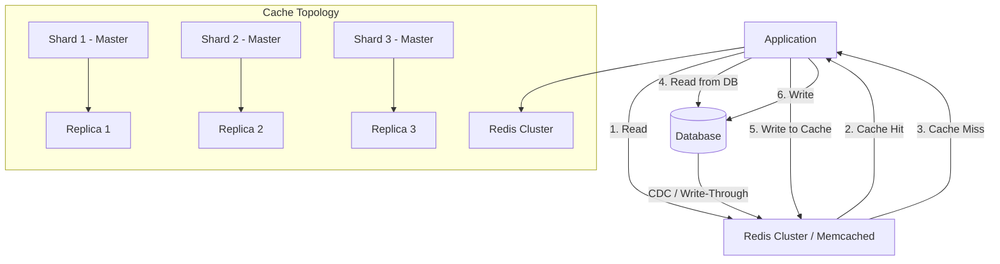

# Distributed Caching Patterns

## Architecture at a Glance



## What is it?

Distributed caching strategies govern how data flows between application nodes, cache tiers, and the authoritative database across a cluster. Beyond basic key-value lookup, patterns like **cache-aside**, **read/write-through**, **write-behind**, **cache coherency protocols** (distributed MESI variants), and **geo-distributed caching** address consistency, latency, staleness, and invalidation at scale.

## Why it was created

Single-node caches hit memory limits and create a single point of failure. As applications scaled horizontally, they needed a cache layer that could span machines, survive node failures, and keep data coherent across regions. Without structured patterns, teams either cache everything naively (stale data everywhere) or cache nothing (database thundering herds).

## When to use it

| Pattern | Latency | Consistency | Write Volume |
|---------|---------|-------------|-------------|
| **Cache-Aside** | Low read | Stale until TTL | Low-Medium |
| **Read-Through** | Medium read | DB-authoritative | Low |
| **Write-Through** | High write | Strong | Medium |
| **Write-Behind** | Low write | Eventual | High |
| **Geo-Distributed** | Region-local | Eventual (CRDT/lease) | Global |

## Hands-on Example

### Cache-Aside with Redis Cluster

```python
import redis
from redis.cluster import RedisCluster

rc = RedisCluster(host="redis-cluster.example.com", port=6379)

def get_user(user_id):
    key = f"user:{user_id}"
    # 1. Try cache
    data = rc.get(key)
    if data:
        return data

    # 2. Cache miss — load from DB
    data = db.query("SELECT * FROM users WHERE id = ?", user_id)

    # 3. Populate cache with TTL
    rc.setex(key, 300, data)
    return data
```

### Write-Through Cache Proxy

```python
def write_user(user_id, user_data):
    key = f"user:{user_id}"
    # Write to DB first
    db.execute("UPDATE users SET data = ? WHERE id = ?", user_data, user_id)
    # Synchronously update cache
    rc.setex(key, 300, user_data)
```

### Write-Behind (Write-Back) with Async Queue

```python
import asyncio
import aioredis

async def write_behind(user_id, user_data):
    key = f"user:{user_id}"
    # 1. Write to cache immediately
    await rc.set(key, user_data)
    # 2. Enqueue DB write for batching
    await queue.enqueue("db_write", {"key": key, "data": user_data})
    # Consumer flushes to DB every 5s or 1000 records
```

### Geo-Distributed Cache (Multi-Region Redis)

```yaml
# Configuration for cross-region cache
regions:
  us-east-1:
    redis_endpoint: "redis-us-east.example.com:6379"
    local_ttl: 60
    cross_region_replication: async
  eu-west-1:
    redis_endpoint: "redis-eu-west.example.com:6379"
    local_ttl: 60
    cross_region_replication: async

# Write strategy: Primary region writes, other regions invalidate
on_write:
  - write to local redis
  - publish invalidation event to cross-region bus (Kafka)
  - other regions subscribe and evict stale key
```

### Cache Warming Strategy

```python
def warm_cache(query_template, date_range):
    """Pre-populate cache with frequently-accessed data before peak load."""
    for date in date_range:
        results = db.query(query_template, date)
        key = f"analytics:daily:{date}"
        rc.setex(key, 3600, results)
    logger.info(f"Warmed {len(date_range)} keys into cache")
```

## Best Practices

- **Use consistent hashing** with virtual nodes to minimize reshuffling when a cache node joins/leaves (what Redis Cluster does natively)
- **Set TTLs** on everything — never insert without expiration to avoid memory leaks
- **Implement circuit breakers** for cache misses — if the cache cluster is down, fall through to the DB
- **Cache stampede prevention** — use "probabilistic early expiration" or mutex locks around cache-miss recomputation
- **Monitor hit ratio** per shard and per key pattern — sudden drops signal invalidation storms or misconfigured TTLs
- **Penalty-box pattern** — if a cache node is slow, mark it temporarily unavailable and reroute to replicas

## Interview Questions

1. **How do you handle cache invalidation across a distributed cluster?**  
   Approaches include (a) **TTL-based expiration** — simplest, acceptable staleness, (b) **publish-subscribe invalidation** — emit an invalidation event (via Redis Pub/Sub or Kafka) that all cache nodes consume to evict the key, (c) **write-through** — the writer updates cache and DB in a single transaction, (d) **active-active with CRDTs** — conflict-free replicated data types converge without explicit invalidation. The choice depends on consistency requirements and write volume.

2. **What is the "thundering herd" problem in caching and how do you solve it?**  
   When a popular cache key expires and thousands of requests hit the DB simultaneously. Solutions: (a) **Mutex** — only one request recomputes the value, others wait, (b) **Early recomputation** — refresh the cache before TTL expires when the value is nearing expiry, (c) **Stale-while-revalidate** — serve stale data immediately while asynchronously refreshing the cache.

3. **How would you design a globally distributed cache with <10ms read latency in every region?**  
   Deploy a Redis Cluster per region with local replicas. Write to the "primary" region (or all regions asynchronously). Use a global DNS with latency-based routing to direct reads to the nearest region. For staleness, serve local cached data with a bounded staleness window (<5s). Use cross-region invalidation via a Kafka bus — other regions evict stale keys within seconds. For critical data, implement read-from-leader (nearest replica of the primary region) at the cost of cross-region latency.

## Real Company Usage

| Company | Pattern | Infrastructure |
|---------|---------|---------------|
| **Twitter** | Cache-aside + write-behind | Twemproxy + Redis clusters, timeline caching |
| **Meta** | Read-through (TAO) | Memcached across regions, graph data |
| **Amazon** | Write-through (DynamoDB DAX) | DAX cache for DynamoDB with microsecond reads |
| **Netflix** | Cache-aside + EVCache | Memcached-based, cross-region replication |
| **YouTube** | Write-behind with CDN | Edge cache + global CDN for video metadata |
| **Slack** | Cache-aside + local LRU | Redis Cluster per shard, local process cache as L1 |
