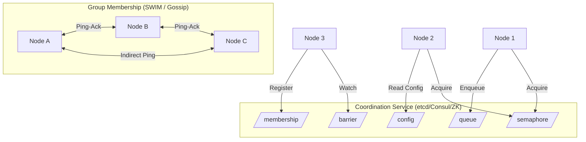

# Distributed Coordination

## Architecture at a Glance



## What is it?

Distributed coordination provides primitives that multiple nodes use to synchronize, organize, and agree on shared state. These include **barriers** (wait until N nodes arrive), **distributed semaphores** (limit concurrent access to a resource), **configuration management** (live config push), **group membership** (detect joins/leaves/failures via SWIM or gossip), and **distributed priority queues** (ordered task dispatch). Services like etcd, ZooKeeper, and Consul implement these on top of consensus protocols.

## Why it was created

Without coordination primitives, each distributed system reinvents the same wheel: detecting dead nodes, pushing config changes, throttling concurrent access to a shared resource. Centralizing these into a coordination service — backed by a proven consensus protocol — lets application developers focus on business logic instead of distributed systems edge cases.

## When to use it

| Primitive | Use Case | Coordination Service |
|-----------|----------|---------------------|
| **Barrier** | Synchronize N nodes before proceeding (e.g., start a batch job) | ZooKeeper, etcd |
| **Semaphore** | Rate-limit access to a shared resource (e.g., max 3 concurrent DB migrations) | ZooKeeper |
| **Config Mgmt** | Live config push without restart (feature flags, DB URLs) | etcd, Consul |
| **Group Membership** | Service discovery + health monitoring (SWIM for large clusters) | Consul, Serf |
| **Priority Queue** | Order tasks by priority across workers | etcd (sequential keys) |
| **Distributed Lock** | Mutual exclusion for critical sections | etcd, ZooKeeper, Redis |

## Hands-on Example

### Distributed Barrier with etcd

```python
import etcd3

class DistributedBarrier:
    def __init__(self, client, name, size):
        self.client = client
        self.path = f"/barrier/{name}"
        self.size = size

    def wait(self, node_id):
        # Register at the barrier
        self.client.put(f"{self.path}/nodes/{node_id}", "ready")
        # Watch until N nodes are registered
        while True:
            nodes = self.client.get_prefix(f"{self.path}/nodes/")
            if len(nodes) >= self.size:
                break
        # All nodes arrived — proceed
        return True
```

### Distributed Semaphore with ZooKeeper

```python
from kazoo.client import KazooClient

class DistributedSemaphore:
    def __init__(self, zk, path, max_leases=3):
        self.semaphore = zk.Semaphore(path, max_leases)

    def acquire(self, timeout=30):
        return self.semaphore.acquire(blocking=True, timeout=timeout)

    def release(self):
        self.semaphore.release()

# Usage
zk = KazooClient(hosts="127.0.0.1:2181")
zk.start()
sem = DistributedSemaphore(zk, "/semaphore/db-migration", max_leases=3)
sem.acquire()
# Run migration...
sem.release()
```

### Group Membership via SWIM (Pseudocode)

```python
class SwimNode:
    def __init__(self, addr):
        self.addr = addr
        self.members = {addr: MemberState(addr)}
        self.suspected = set()

    def protocol_loop(self):
        while True:
            # 1. Pick a random member to ping
            target = random.choice(list(self.members.keys() - {self.addr}))
            acked = self.ping(target)

            if not acked:
                # 2. Indirect ping via K random nodes
                indirect_nodes = random.sample(self.members.keys(), 3)
                acked = self.indirect_ping(target, indirect_nodes)

            if not acked:
                # 3. Mark suspected, disseminate via gossip
                self.suspected.add(target)
                self.gossip_suspicion(target)

            # 4. Periodically disseminate membership list
            self.gossip_membership()
            time.sleep(1)
```

### Configuration Management with etcd (Watch)

```python
import etcd3

def watch_config():
    client = etcd3.client()
    watch_key = "/config/myapp/feature_flags"

    def on_change(event):
        print(f"Config updated: {event.value}")
        # Apply config to running application
        apply_config(json.loads(event.value))

    watch_id = client.add_watch_callback(watch_key, on_change)
    print(f"Watching {watch_key} for changes...")
    # Block forever
    while True:
        time.sleep(1)
```

### Distributed Priority Queue with etcd

```python
import json
import etcd3

class PriorityQueue:
    def __init__(self, client, queue_name):
        self.client = client
        self.prefix = f"/queue/{queue_name}/"

    def enqueue(self, item, priority=10):
        # etcd sequential keys act as ordered queue
        key = f"{self.prefix}{priority:05d}-"
        self.client.put(key, json.dumps(item))

    def dequeue(self):
        # Get items sorted by prefix (i.e., priority order)
        items = self.client.get_prefix(self.prefix, sort_order="asc")
        for key, value in items:
            # Atomic delete
            deleted = self.client.delete(key)
            if deleted:
                return json.loads(value)
        return None
```

## Best Practices

- **Use leases for ephemeral state** — if a node crashes, its lock/semaphore/barrier registration auto-expires
- **Keep coordination operations fast** — never run business logic inside coordination service transactions
- **Design for split-brain** — when the coordination service experiences a network partition, ensure nodes can detect stale leadership and refuse to proceed
- **Use watch-based notification** (etcd watch, ZK watchers) instead of polling to reduce coordination service load
- **Prefer etcd for Kubernetes-native stacks**, ZooKeeper for JVM-heavy environments, and Consul for multi-datacenter service mesh
- **Version all config keys** — readers compare versions to detect concurrent updates and implement compare-and-swap writes

## Interview Questions

1. **How does a distributed barrier differ from a distributed semaphore?**  
   A **barrier** blocks N nodes until all have arrived, then releases all simultaneously — used to synchronize parallel computations (e.g., "don't start the reduce phase until all mappers finish"). A **semaphore** maintains a fixed count of permits — nodes acquire one permit at a time, process, then release — used to limit concurrency to a shared resource (e.g., "max 3 daemons hitting the API gateway at once").

2. **How does SWIM (Scalable Weakly-consistent Infection-style Process Group Membership) detect failures?**  
   Each member periodically pings a random target. If no ack within timeout, it asks K random peers to indirectly ping the target. If none succeed, the target is marked "suspected" and this suspicion is gossiped. If the suspicion is confirmed by a configurable timeout, the member is declared dead. SWIM is scalable (O(log N) messages per failure detection round) and avoids the centralized heartbeat bottleneck.

3. **How would you implement distributed leader election using just etcd's primitives?**  
   Each candidate creates an ephemeral sequential key under `/election/` (e.g. `/election/candidate-000001`). The candidate with the smallest sequence number is the leader. Others watch the next-smaller key. When the leader disappears (lease expires or deletes its key), the next in line receives a watch event and becomes the leader. This is the same sequential-znode pattern ZooKeeper uses, but implemented with etcd's lease + revision ordering.

## Real Company Usage

| Company | Coordination Primitive | Service |
|---------|----------------------|---------|
| **Kubernetes** | Leader election + Config management | etcd for cluster state |
| **Consul (HashiCorp)** | Service discovery + Health checks + KV config | SWIM-based gossip (Serf) |
| **Apache Kafka** | Group membership + Leader election | ZooKeeper (traditionally) / KRaft |
| **HBase** | Distributed barriers + Semaphores | ZooKeeper for region coordination |
| **HashiCorp Nomad** | Distributed lock + Priority queue | Consul for scheduling coordination |
| **Microsoft Orleans** | Distributed semaphore + Gossip | Custom (Azure Fabric) for grain placement |
