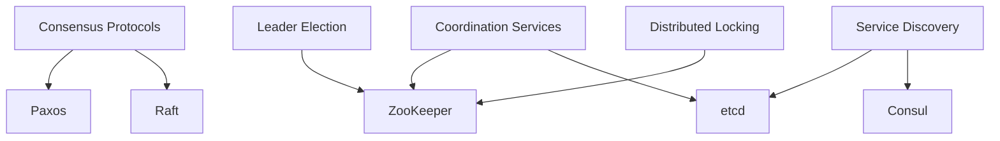

# 06 — Distributed Systems

> Advanced concepts for building systems that span multiple machines.

## Topics

| # | Topic | Description |
|---|-------|-------------|
| 01 | [Consensus](01-consensus.md) | Agreement in distributed systems |
| 02 | [Paxos](02-paxos.md) | Classic consensus protocol |
| 03 | [Raft](03-raft.md) | Understandable consensus protocol |
| 04 | [Leader Election](04-leader-election.md) | Choosing a coordinator |
| 05 | [Distributed Locking](05-distributed-locking.md) | Mutual exclusion across nodes |
| 06 | [ZooKeeper](06-zookeeper.md) | Distributed coordination service |
| 07 | [etcd](07-etcd.md) | Key-value store for coordination |
| 08 | [Service Discovery](08-service-discovery.md) | Finding services dynamically |
| 09 | [Byzantine Fault Tolerance](09-byzantine-fault-tolerance.md) | Consensus with malicious nodes |
| 10 | [Gossip Protocol](10-gossip-protocol.md) | Epidemic broadcast and failure detection |
| 11 | [Vector Clocks & CRDTs](11-vector-clocks-crdt.md) | Conflict-free replicated data types |
| 12 | [Distributed File Systems](12-distributed-file-systems.md) | HDFS, Ceph, GFS architecture |
| 13 | [Distributed Transactions](13-distributed-transactions.md) | 2PC, 3PC, SAGA, TCC, XA protocols |
| 14 | [Distributed Scheduling](14-distributed-scheduling.md) | Cron jobs, work queues, leader scheduling |
| 15 | [Distributed Caching Patterns](15-distributed-caching-patterns.md) | Cache aside, write behind, geo-distributed |
| 16 | [Distributed Coordination](16-distributed-coordination.md) | Barriers, semaphores, group membership |

---

Previous: [05 — System Design](../05-System-Design/README.md)
Next: [07 — Microservices](../07-Microservices/README.md)
