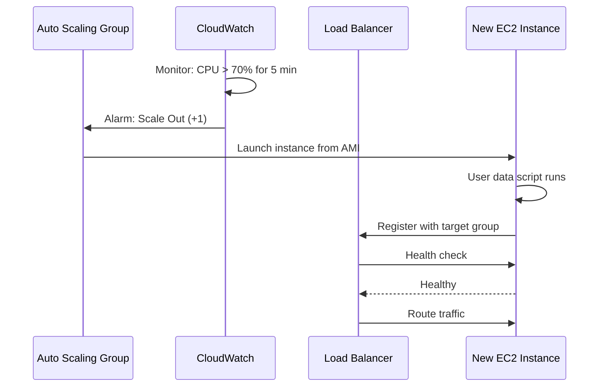

# EC2 & Compute

## Definition
Amazon EC2 (Elastic Compute Cloud) provides resizable virtual machines in the cloud. It's the foundational compute service in AWS, offering full control over the operating system, network, and storage.

## Instance Types

| Family | CPU:RAM | Use Case | Example Types |
|--------|---------|----------|---------------|
| **General Purpose** | 1:4 | Balanced workloads, web servers | t3, m5, m6g |
| **Compute Optimized** | 1:2 | CPU-intensive, batch processing | c5, c6g, c7g |
| **Memory Optimized** | 1:8+ | In-memory databases, caching | r5, r6g, x2iedn |
| **Storage Optimized** | High I/O | Databases, analytics | i3, i4i, d2 |
| **GPU/ML** | GPU-attached | ML training, rendering, HPC | p3, p4d, g5 |
| **Arm/Graviton** | Custom AWS chips | 40% better price/performance | m6g, c6g, r6g |

## Auto Scaling Architecture



## EC2 vs ECS vs Lambda

| Aspect | EC2 (VMs) | ECS/Fargate (Containers) | Lambda (Serverless) |
|--------|-----------|--------------------------|---------------------|
| **Unit** | Virtual machine | Container (Docker) | Function |
| **Scaling** | Minutes | Seconds | Milliseconds |
| **Duration** | Unlimited | Unlimited | 15 min max |
| **Cold start** | None (always on) | ~1s (pull image) | ~100ms-1s |
| **Cost** | Per hour (even idle) | Per hour (reserved) | Per request + duration |
| **Persistence** | Full control | Ephemeral disk | /tmp only (512MB) |
| **Best for** | Stateful, legacy, full control | Microservices, batch | Event-driven, APIs |

## Cost Optimization Strategies

```
1. Spot instances: 60-90% discount, interruptible
   - Use for: batch processing, stateless workers, CI/CD
   - Avoid for: stateful workloads, databases, critical services

2. Reserved Instances: 40-60% discount for 1/3 year commit
   - Use for: steady-state, predictable workloads
   - Standard vs Convertible (flexible instance family)

3. Savings Plans: 30-60% discount (flexible)
   - Compute SP: applies to any EC2, Fargate, Lambda
   - EC2 SP: instance family-specific

4. Right-sizing:
   - Monitor CPU/RAM utilization (CloudWatch)
   - Downsize if average utilization < 40%
   - Use Compute Optimizer recommendations

5. Auto Scaling:
   - Scale in during low traffic
   - Use scheduled scaling for predictable patterns
   - Consider predictive scaling for ML-based forecasting
```

## Interview Questions

1. How do you choose between EC2, ECS, and Lambda?
2. What are spot instances and when should you use them?
3. How does Auto Scaling work with load balancers?
4. Design a cost-optimized compute strategy for a batch processing workload
5. How do you handle EC2 instance failures in production?
6. What is the difference between vertical and horizontal scaling on EC2?
