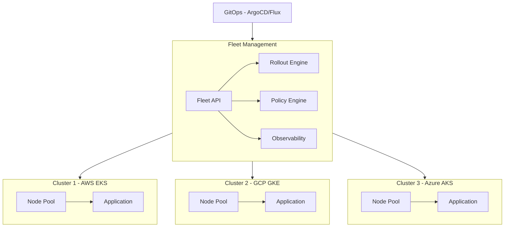

# EKS, GKE, AKS — Managed Kubernetes

## Managed Kubernetes Comparison

| Feature | EKS (AWS) | GKE (GCP) | AKS (Azure) |
|---------|-----------|-----------|-------------|
| **Control plane cost** | $0.10/hr ($73/mo) | Free | Free |
| **Node auto-repair** | No (manual or custom) | Yes | Yes |
| **Auto-scaling** | CA only | CA + VPA | CA only |
| **Windows nodes** | Yes | No | Yes |
| **Istio integration** | App Mesh (limited) | Native Anthos | Add-on |
| **Container registry** | ECR | Artifact Registry | ACR |
| **Network model** | VPC CNI (AWS-native) | Native K8s + GKE Dataplane | Azure CNI |
| **Serverless option** | Fargate for EKS | Autopilot | Virtual Nodes (ACI) |
| **Multi-cluster** | EKS Anywhere + Distro | Anthos (GKE Enterprise) | Azure Arc |
| **K8s version support** | ~12 months | ~14 months | ~12 months |

## GKE Autopilot vs EKS Fargate

```
GKE Autopilot:
  - Full managed: No node management at all
  - Pay per pod (vCPU + memory)
  - Maximum security (node isolation)
  - Limited: no DaemonSets, privileged containers, hostNetwork

EKS Fargate:
  - Run pods without managing nodes
  - Each pod gets its own dedicated node (micro VM)
  - Limited: no DaemonSets, limited networking
  - Expensive for high-throughput workloads

When to use:
  - Autopilot/Fargate: Dev environments, batch jobs, cost-sensitive
  - Standard EKS/GKE: Production, performance-sensitive, custom networking
```

## Multi-Cluster Management (Across Clouds)



## Interview Questions

1. Compare managed Kubernetes offerings across cloud providers
2. How does GKE's cluster autoscaler differ from EKS?
3. How do you handle multi-cluster Kubernetes across clouds?
4. What's the cost difference between EKS, GKE, and AKS?
5. Design a Kubernetes migration strategy for a monolith
6. Compare GKE Autopilot vs EKS Fargate vs standard node pools
