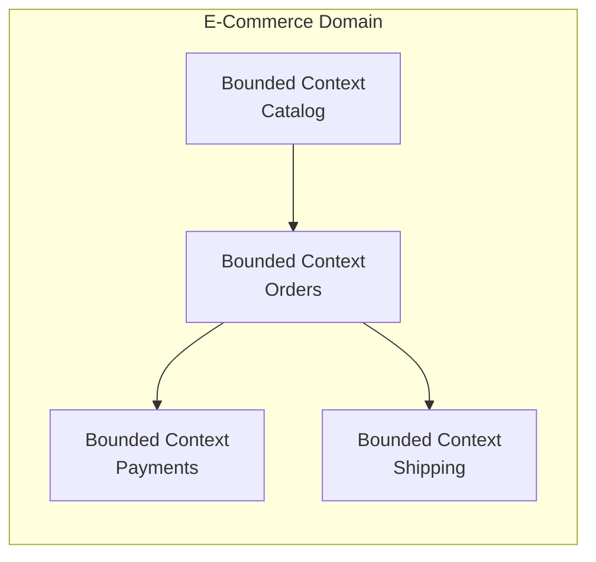
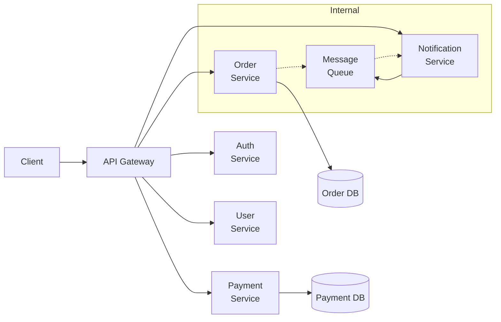

# Microservices Basics

## What is it?

Microservices is an architectural style that structures an application as a collection of **loosely coupled**, **independently deployable** services. Each service owns its own domain logic, data store, and can be developed, deployed, and scaled independently.

| Aspect | Monolith | Microservices |
|--------|----------|---------------|
| Deployment | One deployable unit | Multiple independent deployables |
| Scalability | Scale entire app | Scale individual services |
| Team structure | Feature teams sharing code | Cross-functional per-service teams |
| Data | Single database | Database-per-service |
| Communication | In-process calls | Network calls (REST, gRPC, events) |
| CI/CD | Single pipeline | Per-service pipelines |

## What is it? — SOA vs Microservices

Microservices evolved from **Service-Oriented Architecture (SOA)**.

| Dimension | SOA | Microservices |
|-----------|-----|---------------|
| Scope | Enterprise-wide reuse | Bounded context ownership |
| Communication | ESB (Enterprise Service Bus) | Lightweight (HTTP/gRPC/events) |
| Data | Canonical data model | Per-service database |
| Governance | Centralized standards | Decentralized per team |
| Size | Coarse-grained services | Fine-grained services |

## Domain-Driven Design & Bounded Contexts

**Domain-Driven Design (DDD)** by Eric Evans provides the mental model for microservices boundaries:

- **Domain**: The problem space your system addresses
- **Subdomain**: A distinct part of the domain (e.g., Payments, Inventory, Shipping)
- **Bounded Context**: A logical boundary where a particular domain model applies
- **Ubiquitous Language**: Shared language within a bounded context
- **Aggregate**: A cluster of domain objects treated as a unit

Each microservice typically maps to one **bounded context**.

## Why it matters

- **Independent deployability** — teams ship without coordinating
- **Technology heterogeneity** — choose the right language/database per service
- **Resilience** — failure in one service doesn't cascade
- **Scalability** — scale only what needs scaling
- **Team autonomy** — small teams own services end-to-end

## 当什么时候使用微服务 (When to Use Microservices)

**Use microservices when:**
- The team is large enough (> 2 pizza teams) to split into independent squads
- The domain has clear bounded contexts with minimal cross-context coupling
- You need to scale different parts of the system independently
- You need polyglot persistence (different DBs for different workloads)
- Deployment frequency varies across components

**Don't use microservices when:**
- The team is small (< 10 developers)
- The domain is simple with tightly coupled logic
- Network latency is unacceptable (real-time control systems)
- Operational maturity for distributed systems is lacking
- You haven't proven the monolith works first ("premature decomposition")

## Best Practices

1. **Start with a monolith** — extract services only when clear boundaries emerge
2. **Each service owns its data** — never share databases across services
3. **Design for failure** — assume networks, services, and disks will fail
4. **Automate everything** — CI/CD, provisioning, testing, monitoring
5. **Standardize communication** — define APIs (OpenAPI/gRPC proto) before implementation
6. **Keep services loosely coupled** — asynchronous communication where possible
7. **Enforce bounded contexts** — don't let domain logic leak across service boundaries
8. **Implement observability from day one** — logging, metrics, tracing

## Architecture

## Interview Questions

1. What are the trade-offs between monolith and microservices?
2. How do you define a bounded context? Give a real-world example.
3. Explain the difference between SOA and microservices.
4. When would you NOT use microservices?
5. What is the strangler fig pattern and when would you use it?
6. How does domain-driven design help with microservice boundaries?

## Cross-Links

- [05-System-Design/API Gateway](../05-System-Design/README.md)
- [06-Distributed-Systems/Consensus](../06-Distributed-Systems/01-consensus.md)
- [09-Kubernetes/README.md](../09-Kubernetes/README.md)
