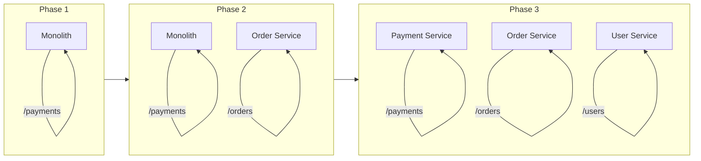

# Service Decomposition

## What is it?

Service decomposition is the process of breaking a large system into smaller, independently deployable microservices. It is the most critical design decision — get the boundaries wrong, and you end up with a distributed monolith.

## Decomposition Strategies

### 1. Business Capability Decomposition

Map each business capability to a service. Business capabilities are what the business does to create value.

```
E-Commerce Business Capabilities → Services
├── Product Management    → Catalog Service
├── Order Management      → Order Service
├── Payment Processing    → Payment Service
├── Shipping & Logistics  → Shipping Service
├── Customer Management   → User Service
└── Notifications         → Notification Service
```

### 2. Subdomain Decomposition (DDD)

Use DDD subdomains identified during domain modeling:

- **Core Domain** — key competitive advantage (customize heavily)
- **Supporting Subdomain** — needed but not core (consider buying/SaaS)
- **Generic Subdomain** — generic functionality (use off-the-shelf)

### 3. Strangler Fig Pattern

Gradually replace monolith functionality with microservices without a big-bang rewrite.



## Service Boundaries

### How to Identify Boundaries

| Technique | Description |
|-----------|-------------|
| **Change analysis** | Identify modules that change together |
| **Data cohesion** | Entities that are frequently accessed together |
| **Team structure** | Conway's Law: services mirror team boundaries |
| **Transaction boundaries** | Minimize distributed transactions |
| **Communication patterns** | Chatty communication suggests same service |

## Size Considerations

**Q: How big should a microservice be?**

There is no lines-of-code rule. A service is the right size when:

- A single team (6-8 people) can own it
- It can be rewritten in < 2 weeks
- It maps to a single bounded context
- It can be deployed independently without coordinating with other teams
- Its data fits in a single database

**Signs a service is too small (nanoservice):**
- You need 20 services for a simple CRUD app
- Most operations require multi-service coordination
- Overhead of CI/CD, monitoring, and ops exceeds value

**Signs a service is too big:**
- Multiple teams touch the same service
- Deployment requires extensive regression testing across modules
- Service contains multiple bounded contexts sharing a database

## Best Practices

1. **Start coarse, split when needed** — don't micro-optimize boundaries upfront
2. **Use the Strangler Fig pattern** for incremental migration from monoliths
3. **Align services to team structure** (Conway's Law)
4. **Define service contracts first** (OpenAPI/gRPC) before implementation
5. **Avoid shared libraries containing business logic** — they create hidden coupling
6. **Aim for loose coupling and high cohesion** — a service should be changeable without changing others
7. **Validate boundaries with event storming** workshops

## Interview Questions

1. How do you decide where to split a monolith into microservices?
2. Explain the Strangler Fig pattern with a real example.
3. What is a "distributed monolith" and how do you avoid it?
4. How does Conway's Law affect microservice boundaries?
5. What are the pros and cons of decomposing by business capability vs technical capability?

## Cross-Links

- [01-microservices-basics.md](01-microservices-basics.md) — bounded contexts, DDD
- [08-database-per-service.md](08-database-per-service.md) — data ownership per service
- [14-DevOps/CI-CD](../14-DevOps/README.md)
