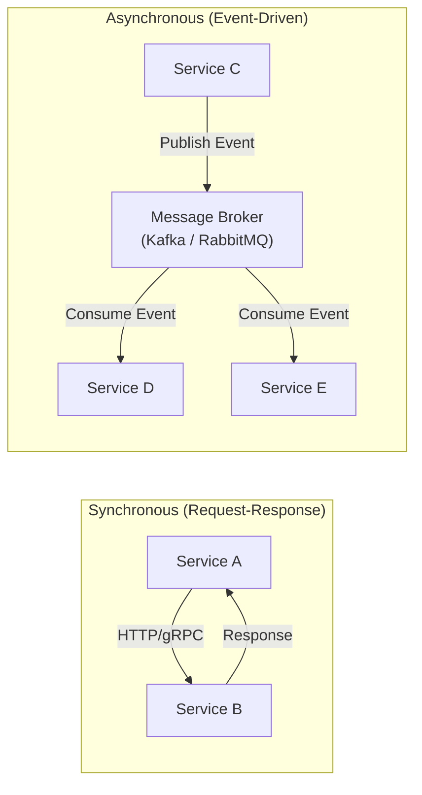
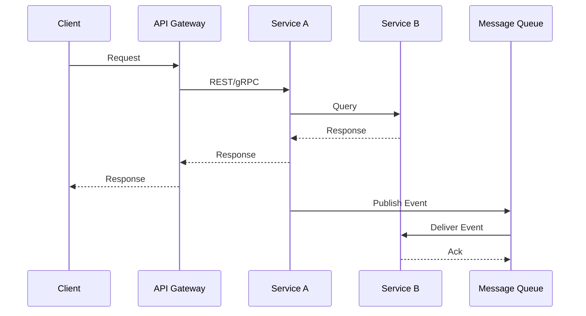
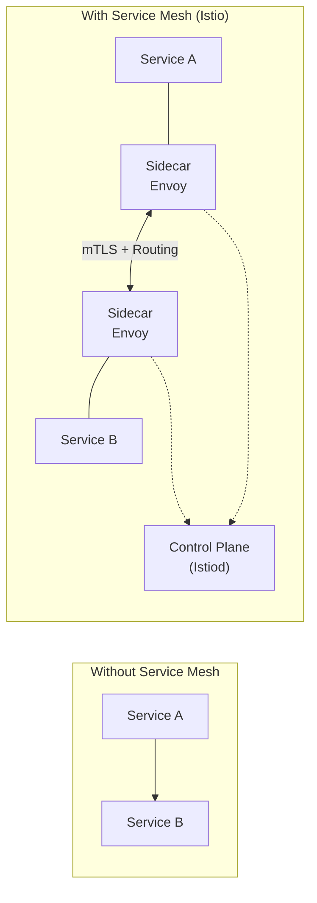

# Inter-Service Communication

## What is it?

Microservices must communicate over the network. The choice of communication mechanism directly affects coupling, latency, reliability, and complexity. Two fundamental approaches exist: **synchronous** (request-response) and **asynchronous** (event-driven).

## Synchronous Communication

### REST (HTTP/JSON)
- **Pros**: Simple, ubiquitous, human-readable
- **Cons**: Slow serialization, no built-in async support, chatty
- **Best for**: CRUD APIs, external-facing services

### gRPC (HTTP/2 + Protocol Buffers)
- **Pros**: Fast binary serialization, streaming, strongly typed contracts
- **Cons**: Less tooling maturity, harder to debug, limited browser support
- **Best for**: Internal service-to-service, real-time streaming, polyglot environments

| Feature | REST | gRPC |
|---------|------|------|
| Transport | HTTP/1.1, HTTP/2 | HTTP/2 (mandatory) |
| Payload | JSON/XML | Protocol Buffers (binary) |
| Contract | OpenAPI/Swagger | .proto files |
| Streaming | Limited | Bidirectional streaming |
| Code gen | Optional | Built-in |
| Performance | Moderate | High (10x faster) |

## Asynchronous Communication

### Message Brokers
- **Patterns**: Pub/Sub, competing consumers, request/reply
- **Tools**: Kafka, RabbitMQ, AWS SQS/SNS, Pulsar
- **Benefits**: Decoupling, buffering, load leveling, fault tolerance

### Event-Driven
- Services emit events when something happens
- Other services subscribe to relevant events
- Enables eventual consistency and CQRS

## Communication Patterns

## API Gateway Pattern

An API Gateway acts as a single entry point, routing requests to appropriate services, handling cross-cutting concerns (auth, rate limiting), and transforming protocols.

## Service Mesh

A **service mesh** manages service-to-service communication at the infrastructure layer using sidecar proxies.

| Feature | Istio | Linkerd |
|---------|-------|---------|
| Proxy | Envoy | Linkerd-proxy |
| mTLS | Yes | Yes |
| Traffic splitting | Yes | Yes |
| Observability | Prometheus, Grafana, Jaeger | Built-in metrics |
| Resource usage | Higher | Lower |
| Complexity | High | Moderate |

## Best Practices

1. **Prefer async messaging** for loose coupling between bounded contexts
2. **Use gRPC for internal high-throughput** communication
3. **Retry with exponential backoff** + jitter for transient failures
4. **Use circuit breakers** to prevent cascading failures
5. **Implement idempotency** in sync endpoints for safe retries
6. **Version your APIs** (URL, header, or contract-based)
7. **Use a service mesh** (Istio/Linkerd) when you have 50+ services
8. **Avoid synchronous chains** — A → B → C → D creates fragility

## Interview Questions

1. Compare REST, gRPC, and messaging for inter-service communication.
2. What problems does a service mesh solve?
3. How do you handle partial failures in synchronous calls?
4. When would you use events vs commands vs queries?
5. Explain the sidecar proxy pattern.

## Cross-Links

- [05-System-Design/Messaging](../05-System-Design/README.md)
- [09-Kubernetes/Service-Mesh](../09-Kubernetes/README.md)
- [06-circuit-breaker.md](06-circuit-breaker.md)
