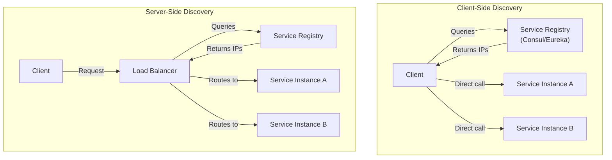
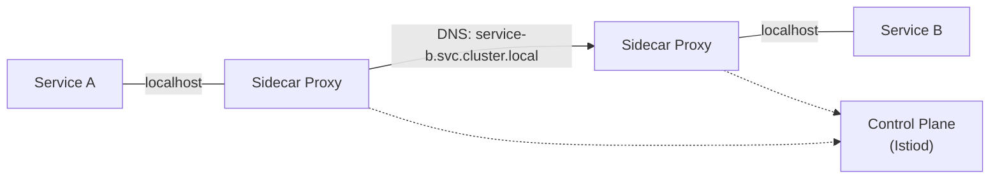

# Service Discovery

## What is it?

In a microservices architecture, service instances have dynamically assigned IP addresses and ports (due to auto-scaling, failures, or rolling updates). Service discovery is the mechanism that allows services to find each other without hardcoded addresses.

## Client-Side vs Server-Side Discovery

| Approach | Pros | Cons |
|----------|------|------|
| **Client-Side** | Simple, no extra hop | Client must implement discovery logic |
| **Server-Side** | Client unaware, centralized | Extra network hop, LB is SPOF |

## DNS-Based Discovery

- **Round-robin DNS**: Multiple A records returned, client picks one
- **SRV records**: Includes port information
- **Pros**: Simple, no extra infrastructure
- **Cons**: Slow DNS propagation, no health awareness

## Registry-Based Discovery

Services register themselves on startup and heartbeat periodically. Clients or load balancers query the registry.

### Consul

- **KV store** + DNS + HTTP API
- Built-in health checking (script, HTTP, TCP, gRPC)
- Supports multi-datacenter
- **Ownership**: HashiCorp

### Eureka (Netflix OSS)

- **REST-based** service registry
- Client-side caching (no SPOF)
- **ASG integration** for AWS
- **Self-preservation mode** — doesn't evict instances during network partitions

### ZooKeeper

- **Consistent** (Zab protocol) — strong consistency guarantees
- Used by Kafka, HBase, etc.
- **Not designed for service discovery** — ephemeral znodes work but high churn can cause issues
- **Ownership**: Apache

| Feature | Consul | Eureka | ZooKeeper |
|---------|--------|--------|-----------|
| Consistency | AP (eventual) | AP (eventual) | CP (strong) |
| Health checks | Yes (built-in) | Yes (client heartbeat) | Yes (ephemeral nodes) |
| Multi-DC | Native | Requires config | Manual |
| KV store | Yes | No | Yes |
| DNS support | Native | No | No |
| Adopted by | HashiCorp stack | Spring Cloud Netflix | Kafka, Hadoop |

## Service Mesh Discovery

With a service mesh (Istio, Linkerd), service discovery is handled transparently by the sidecar proxies:

The sidecar watches the control plane for endpoint changes — the application code never knows about discovery.

## Best Practices

1. **Use DNS-based discovery** for simple deployments (< 10 services)
2. **Prefer AP over CP** for service registries — a stale address is better than "no address"
3. **Implement client-side caching** — the registry can go down without impacting traffic
4. **Include health checks** — unhealthy instances should be removed
5. **Use gradual registration** — ensure service is truly ready before routing traffic
6. **Set appropriate TTLs** — balance freshness against registry load
7. **Use service mesh discovery** for large deployments (50+ services)

## Interview Questions

1. What's the difference between client-side and server-side service discovery?
2. How does Consul handle health checking?
3. Why is Eureka AP and ZooKeeper CP? Which is better for service discovery?
4. How does Kubernetes service discovery work without an external registry?
5. How does a service mesh provide transparent service discovery?

## Cross-Links

- [06-Distributed-Systems/08-service-discovery.md](../06-Distributed-Systems/08-service-discovery.md)
- [06-Distributed-Systems/06-zookeeper.md](../06-Distributed-Systems/06-zookeeper.md)
- [09-Kubernetes/Services](../09-Kubernetes/README.md)
- [05-api-gateway.md](05-api-gateway.md)
