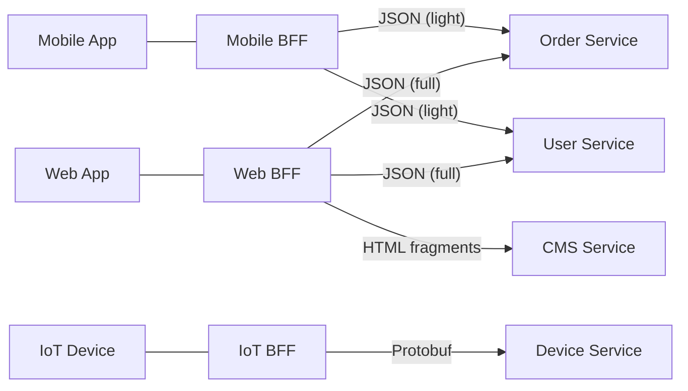
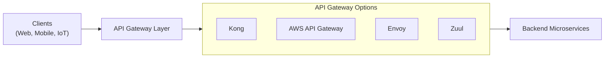
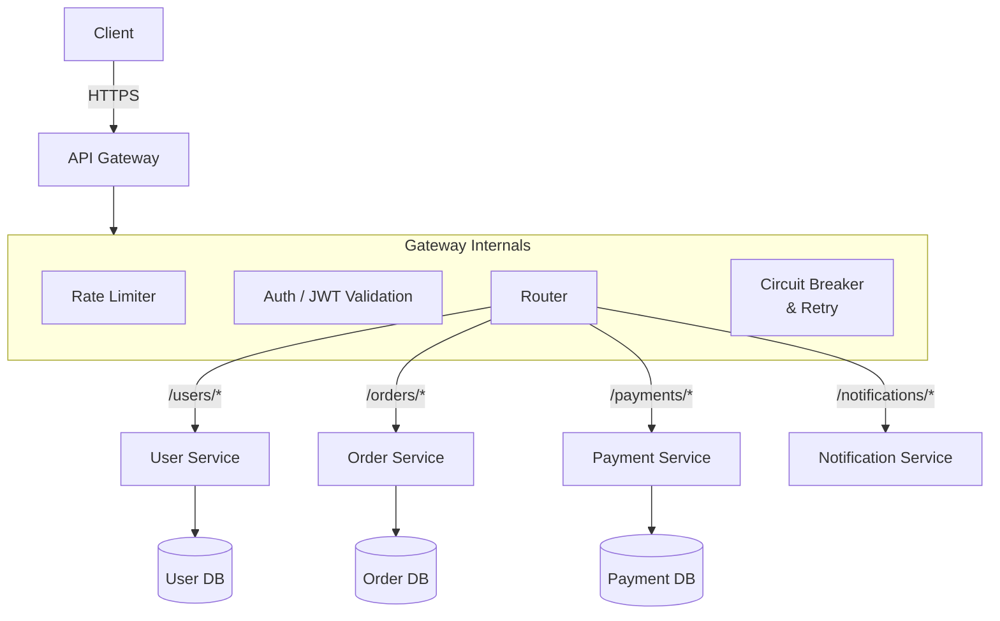

# API Gateway

## What is it?

An API Gateway is a single entry point that sits between clients and backend microservices. It handles cross-cutting concerns so individual services don't have to, and can transform, route, and aggregate requests.

## Gateway Responsibilities

| Concern | Description |
|---------|-------------|
| **Routing** | Forward requests to correct service based on path/headers |
| **Authentication** | Validate JWT, API keys, OAuth tokens |
| **Rate Limiting** | Throttle requests per client, IP, or plan |
| **Aggregation** | Fan-out to multiple services and merge responses |
| **Protocol Translation** | REST ← → gRPC, HTTP ← → WebSocket |
| **Caching** | Cache responses for idempotent GET requests |
| **Request/Response Transformation** | Modify headers, bodies, query params |
| **Circuit Breaking** | Fail fast when downstream services are unhealthy |
| **Access Logging** | Central audit log for all API calls |
| **CORS** | Manage cross-origin policy |

## BFF Pattern (Backend for Frontend)

Instead of a single gateway for all clients, create a dedicated gateway per client type:

**When to use BFF**: Different clients need different payloads, different auth, or different data formats.

## Comparison: API Gateway Solutions

| Feature | Kong | AWS API Gateway | Envoy | Zuul (Netflix) |
|---------|------|----------------|-------|----------------|
| **Type** | Reverse proxy + plugins | Managed service | Sidecar/proxy | JVM filter-based |
| **Performance** | High (Nginx/OpenResty) | Medium (managed) | Very High (C++) | Medium (JVM) |
| **Language** | Lua plugins | Config-driven | C++ | Java filters |
| **Rate Limiting** | Built-in plugin | Built-in | Via Envoy filter | Custom filter |
| **Auth** | OAuth2, JWT, LDAP, OIDC | Cognito, Lambda | JWT, OAuth2 | Custom |
| **Service Discovery** | Consul, DNS, K8s | NLB + targets | EDS, K8s, Consul | Eureka |
| **Custom Logic** | Lua, Go plugins | Lambda functions | Wasm, Lua filters | Java filters |
| **Open Source** | Yes (Community) | No | Yes (CNCF) | Yes (OSS) |
| **Best For** | General purpose, multi-protocol | AWS-native serverless | Edge + service mesh, high perf | JVM / Netflix OSS stack |

## Architecture

## Best Practices

1. **Keep gateways stateless** — scale horizontally behind a load balancer
2. **Use BFF pattern** when clients have significantly different needs
3. **Avoid business logic in the gateway** — it's a proxy, not an orchestrator
4. **Implement rate limiting at multiple levels** — global, per-route, per-client
5. **Use gateway for cross-cutting, not aggregation** — aggregation creates hidden coupling
6. **Monitor gateway metrics** — latency, error rate, request count, throttled requests
7. **Consider multiple gateway layers** — edge gateway (external) + internal gateway
8. **Version your gateway config** — treat like code in CI/CD

## Interview Questions

1. What are the core responsibilities of an API gateway?
2. Explain the BFF (Backend for Frontend) pattern and when to use it.
3. Compare Kong, AWS API Gateway, and Envoy.
4. What should NOT be implemented in an API gateway?
5. How does an API gateway differ from a service mesh sidecar proxy?
6. How would you implement rate limiting in a gateway?

## Cross-Links

- [03-inter-service-communication.md](03-inter-service-communication.md)
- [04-service-discovery.md](04-service-discovery.md)
- [09-Kubernetes/Ingress](../09-Kubernetes/README.md)
- [14-DevOps/API-Management](../14-DevOps/README.md)
