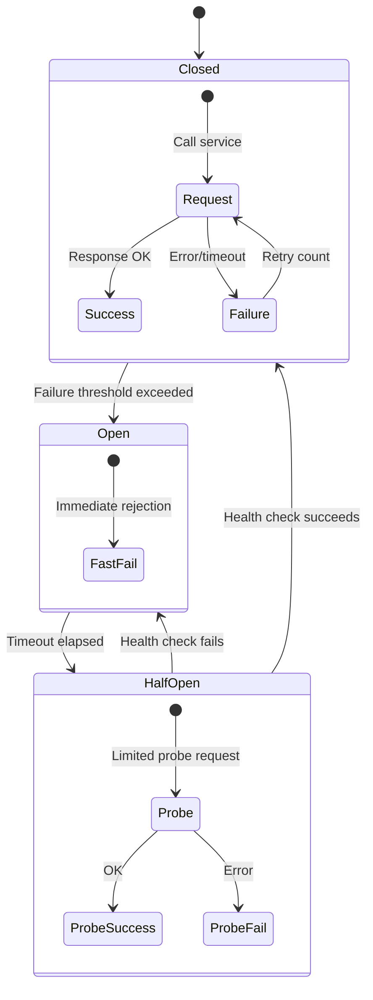
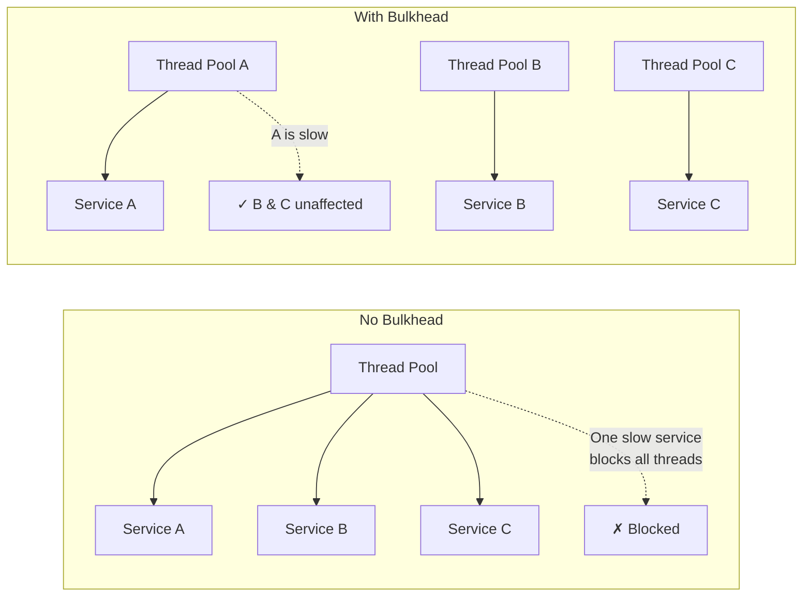

# Circuit Breaker

## What is it?

The **circuit breaker** pattern prevents cascading failures in distributed systems by detecting when a downstream service is failing and stopping calls to it before the failure propagates. Combined with **bulkhead**, **retry**, and **timeout** patterns, it forms the foundation of resilient microservices.

## Circuit Breaker State Machine



| State | Behavior |
|-------|----------|
| **Closed** | Normal operation. Requests pass through. Failures are counted. |
| **Open** | Requests fail immediately without calling the downstream service. A timer starts. |
| **Half-Open** | After the timeout, a limited number of probe requests are allowed. If they succeed → Closed. If they fail → Open. |

## Resilience Patterns

### Circuit Breaker
- Wraps calls to external services
- Monitors failure rate over a sliding window
- Trips to Open when threshold is breached

### Bulkhead
Isolates resources into pools so failure in one pool doesn't starve others.



### Retry with Backoff
- **Exponential backoff**: 100ms → 200ms → 400ms → 800ms...
- **Jitter**: Add randomness to prevent thundering herd
- **Max retries**: Cap at 3-5 retries before giving up

### Timeout
- **Connection timeout**: Time to establish TCP connection (500ms-1s)
- **Read timeout**: Time to receive response body (1s-30s depending on use case)
- **Always set timeouts** — unset timeouts are the #1 cause of cascading failures

## Resilience4j Implementation

Resilience4j is the recommended circuit breaker library for Spring Boot (replaced Hystrix).

| Feature | Resilience4j | Hystrix (deprecated) |
|---------|--------------|---------------------|
| Thread model | No thread pools by default | Thread pool per command |
| Configuration | Per-instance via properties | Annotations + properties |
| Sliding window | Count + time-based | Only count-based |
| Bulkhead | Semaphore + thread pool | Thread pool only |
| Rate limiter | Built-in | Not available |
| Cache | Built-in | Not available |
| Actuator | /actuator/health | /hystrix.stream |

**Example configuration (application.yml):**
```yaml
resilience4j.circuitbreaker:
  instances:
    orderService:
      slidingWindowSize: 10
      failureRateThreshold: 50
      waitDurationInOpenState: 10s
      permittedNumberOfCallsInHalfOpenState: 3
      registerHealthIndicator: true

resilience4j.retry:
  instances:
    orderService:
      maxAttempts: 3
      waitDuration: 500ms
      exponentialBackoffMultiplier: 2

resilience4j.timelimiter:
  instances:
    orderService:
      timeoutDuration: 2s
```

## Best Practices

1. **Always set timeouts** — every network call must have a deadline
2. **Use circuit breakers around ALL remote calls** — REST, gRPC, database, message queue
3. **Set appropriate thresholds** based on business requirements, not arbitrary numbers
4. **Use bulkheads to isolate critical vs non-critical paths**
5. **Combine retry with circuit breakers** — retry before circuit opens, not after
6. **Log and monitor circuit breaker state** — open/half-open transitions are ops signals
7. **Provide fallbacks** — cached data, default values, degraded experience
8. **Test circuit breaker behavior** — chaos engineering, fault injection

## Interview Questions

1. Describe the circuit breaker state machine (closed, open, half-open).
2. How does the bulkhead pattern improve system resilience?
3. Why is jitter important in retry strategies?
4. How would you tune circuit breaker thresholds for a payment service?
5. Compare Resilience4j and Hystrix. Why did Netflix stop using Hystrix?
6. Explain the difference between connection timeout and read timeout.

## Cross-Links

- [03-inter-service-communication.md](03-inter-service-communication.md)
- [08-Docker/Containerization](../08-Docker/README.md)
- [09-Kubernetes/Readiness-Probes](../09-Kubernetes/README.md)
- [14-DevOps/Chaos-Engineering](../14-DevOps/README.md)
