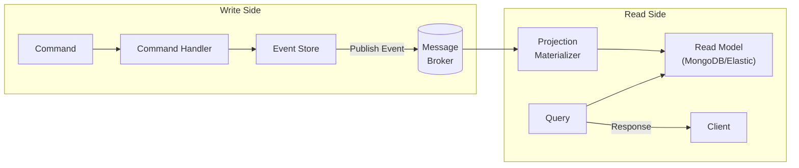
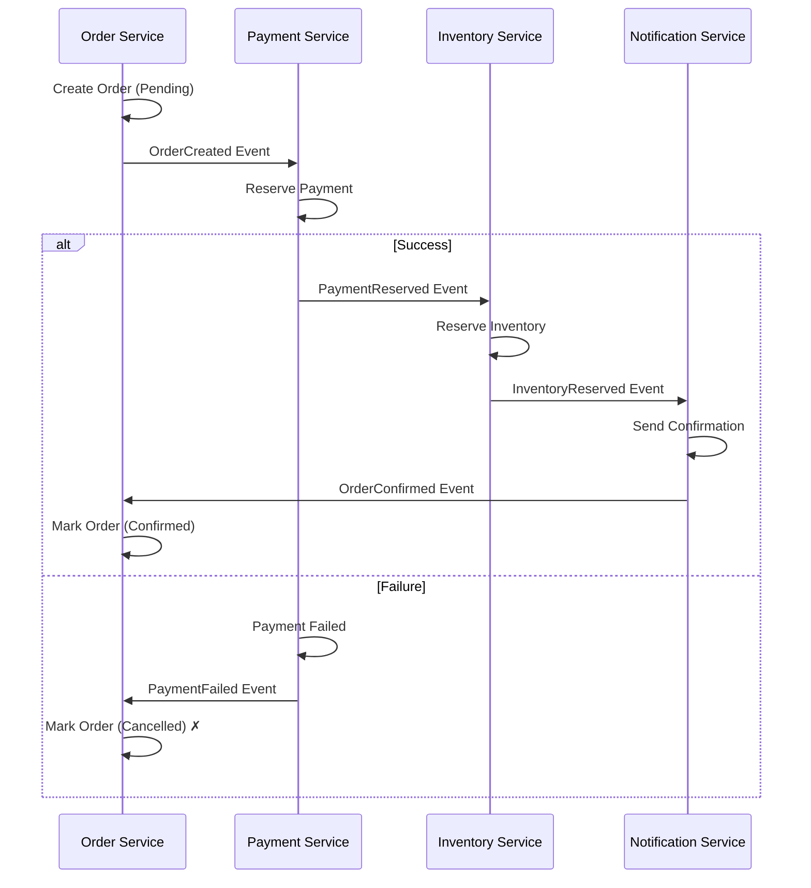
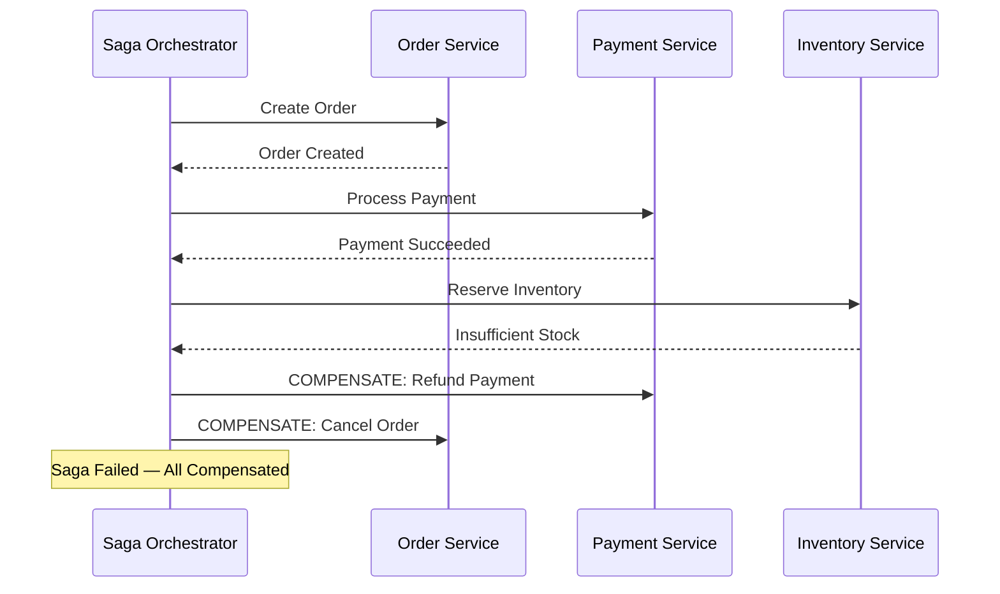
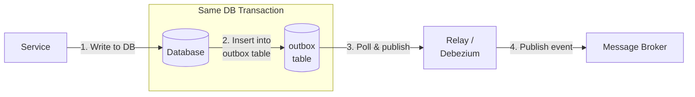
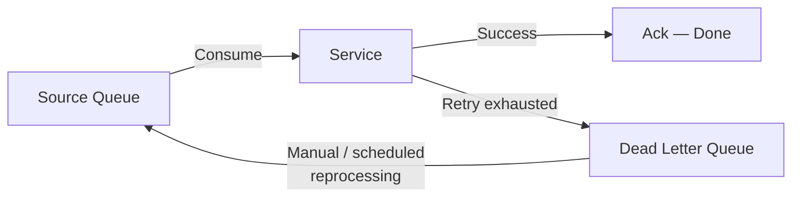

# Event-Driven Microservices

## What is it?

Event-driven architecture (EDA) is a design where services communicate by producing and consuming **events** — immutable records of something that happened. This enables loose coupling, asynchronous processing, and eventual consistency across services.

## Core Patterns

### Event Sourcing

Instead of storing only the current state, store every state change as an **event**. The current state is derived by replaying events.

```
Command: "Create Order #123"
Event:   OrderCreated { orderId: 123, items: [...], amount: 99.99 }

Command: "Ship Order #123"
Event:   OrderShipped { orderId: 123, trackingId: "TRK-456" }

Command: "Deliver Order #123"
Event:   OrderDelivered { orderId: 123, timestamp: ... }
```

**Pros**: Complete audit trail, temporal queries, event replay for debugging
**Cons**: Event store complexity, schema evolution, eventual consistency

### CQRS (Command Query Responsibility Segregation)

Separate read models from write models. Commands update state (write model), queries return data (read model — often a denormalized projection).



### Saga Pattern

A saga is a sequence of local transactions. If one fails, compensating transactions undo previous steps. Two coordination approaches:

#### Choreography Saga (Event-Based)

Each service produces events that trigger the next step. No central coordinator.



#### Orchestration Saga (Command-Based)

A central **orchestrator** service tells each service what to do and handles compensation on failure.



| Aspect | Choreography | Orchestration |
|--------|-------------|---------------|
| Coordination | Decentralized (events) | Centralized (orchestrator) |
| Coupling | Low (no coordinator) | Higher (services depend on orchestrator) |
| Complexity | Harder to trace flow | Explicit flow in orchestrator |
| Best for | Simple linear workflows | Complex workflows with branching/compensation |
| Example | Event-sourced microservices | Workflow engine (Temporal, Camunda, AWS Step Functions) |

### Outbox Pattern

Reliably publish events without dual-write (DB + broker) inconsistency.



The outbox record is written in the **same database transaction** as the business data. A separate process (polling publisher or CDC via Debezium) reads the outbox and publishes events.

### Dead Letter Queues (DLQ)

Messages that fail processing are moved to a DLQ for later analysis and reprocessing.



## Why it matters

- **Loose coupling** — services know nothing about each other
- **Scalability** — consumers can scale independently of producers
- **Resilience** — failures don't cascade, messages can be replayed
- **Audit trail** — every state change is recorded as an event
- **Temporal queries** — ask "what was the state at time T?"

## Best Practices

1. **Design events as facts** — past tense, immutable ("OrderPlaced", not "PlaceOrder")
2. **Version events** — add new fields with defaults, never remove fields
3. **Use event schemas** — Avro, Protobuf, or JSON Schema with Schema Registry
4. **Prefer orchestration for complex sagas** — choreography gets hard to debug
5. **Implement the outbox pattern** to avoid dual-write consistency issues
6. **Set up DLQ monitoring** — a growing DLQ is an ops alert
7. **Make events idempotent** — consumers should handle duplicates safely
8. **Use event sourcing only when you need audit history** — it adds complexity

## Interview Questions

1. Explain the saga pattern. Compare choreography vs orchestration.
2. What is the outbox pattern and why is it needed?
3. How does CQRS work and when would you use it?
4. What is event sourcing and what are its trade-offs?
5. How would you handle event schema evolution?
6. What is a dead letter queue and how do you handle messages in it?

## Cross-Links

- [05-System-Design/Messaging](../05-System-Design/README.md)
- [08-database-per-service.md](08-database-per-service.md)
- [06-Distributed-Systems/Consensus](../06-Distributed-Systems/01-consensus.md)
- [10-observability.md](10-observability.md)
