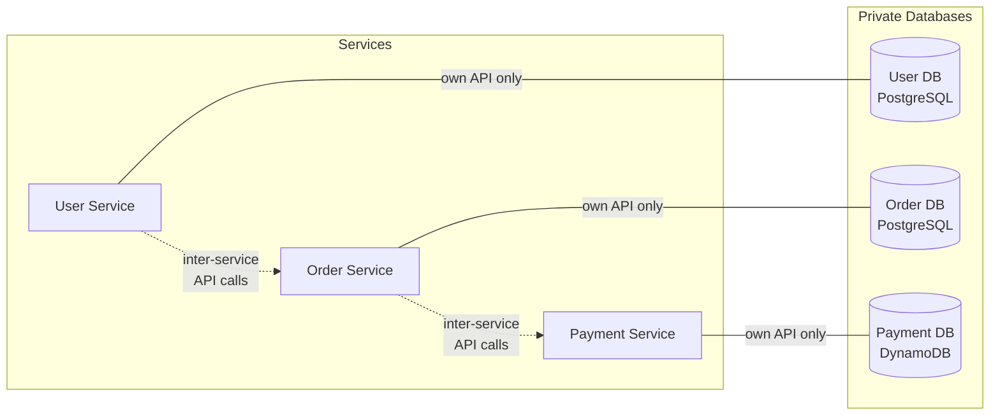
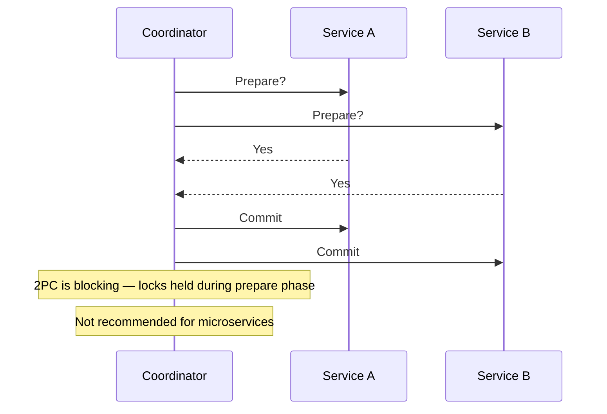
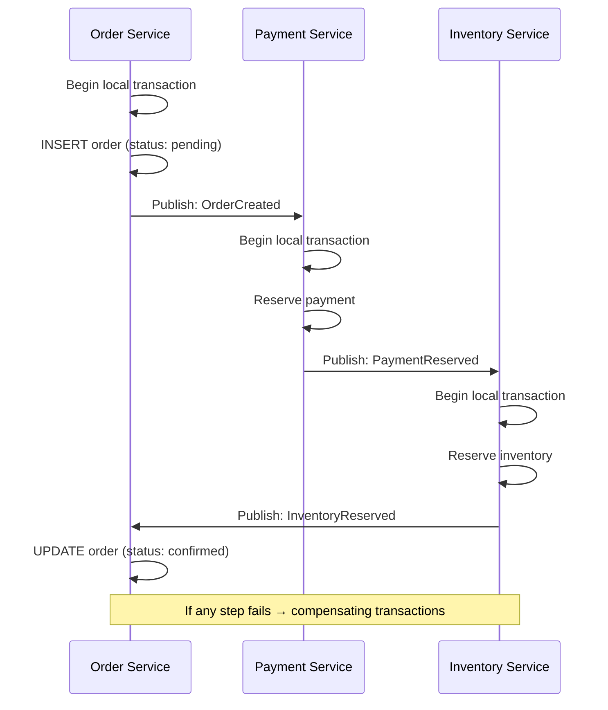

# Database Per Service

## What is it?

The **database-per-service** pattern states that each microservice owns its private database that no other service can access directly. Services communicate only through their API layer — never through shared database access.

## Shared-Database Anti-Pattern

| Approach | Database-Per-Service | Shared Database |
|----------|---------------------|-----------------|
| **Coupling** | Loose — hidden behind API | Tight — schema changes affect all |
| **Scalability** | Independent scaling | Single DB bottleneck |
| **Technology** | Polyglot per service | One DB technology |
| **Transactions** | Local (per service) | Distributed (across tables) |
| **Data ownership** | Clear — one team owns | Ambiguous — who owns what? |
| **Schema change** | Per-service migration | Coordinated across teams |

**When shared database is acceptable:**
- Initial monolith phase before decomposition
- Reporting/analytics — use read replicas, not production DB access
- CQRS read models — denormalized projections across bounded contexts

## Polyglot Persistence

Each service chooses the best database technology for its workload:

| Service | Workload | Database | Why |
|---------|----------|----------|-----|
| User Profile | Document-oriented, key-value lookups | DynamoDB | Low-latency, flexible schema |
| Orders | ACID transactions, relational | PostgreSQL | Strong consistency, joins |
| Product Catalog | Full-text search, faceted | Elasticsearch | Search and aggregation |
| Analytics | High-throughput writes | Cassandra | Write scalability |
| Shopping Cart | Session data, TTL | Redis | In-memory, fast read/write |
| Audit Log | Append-only, immutable | Event Store / Kafka | Temporal ordering |

## Distributed Transactions

### Two-Phase Commit (2PC) — Not Recommended

**Why 2PC fails in microservices:**
- Blocking protocol — locks held during coordination
- Coordinator is a single point of failure
- Doesn't work well with NoSQL databases
- Latency proportional to network round-trips

### Saga Pattern — Recommended

Use saga (choreography or orchestration) for distributed transactions:

### Eventual Consistency

In a distributed system, strict ACID across services is impossible without sacrificing availability (CAP theorem). Instead, aim for **eventual consistency**:

- Accept that data will be temporarily inconsistent across services
- Use idempotent operations for safe retry
- Implement reconciliation jobs (e.g., daily ledger settlement)
- Detect and alert on inconsistency thresholds

## Best Practices

1. **Each service owns its data** — never allow direct database access from other services
2. **Use database-per-service from day one** — extracting a shared DB later is painful
3. **Embrace eventual consistency** — not all data needs to be immediately consistent
4. **Use sagas for multi-service transactions** — avoid 2PC
5. **Implement idempotency keys** for all write operations
6. **Use CQRS to separate read/write concerns** when queries span services
7. **Backup independently** per database — don't create global backup dependencies
8. **Use database migration tools** (Flyway, Liquibase) per service

## Interview Questions

1. Why is shared-database considered an anti-pattern in microservices?
2. What is polyglot persistence and give an example?
3. Why is 2PC not recommended for microservices?
4. How do sagas solve the distributed transaction problem?
5. How do you handle data consistency across services in microservices?
6. What is the difference between strong consistency and eventual consistency?

## Cross-Links

- [04-Databases/README.md](../04-Databases/README.md)
- [07-event-driven-microservices.md](07-event-driven-microservices.md)
- [06-circuit-breaker.md](06-circuit-breaker.md)
- [05-System-Design/CAP](../05-System-Design/README.md)
