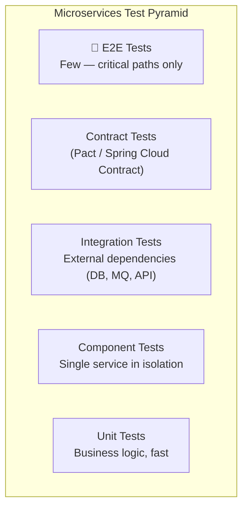
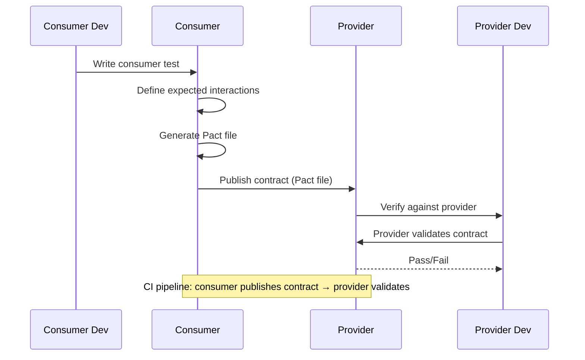
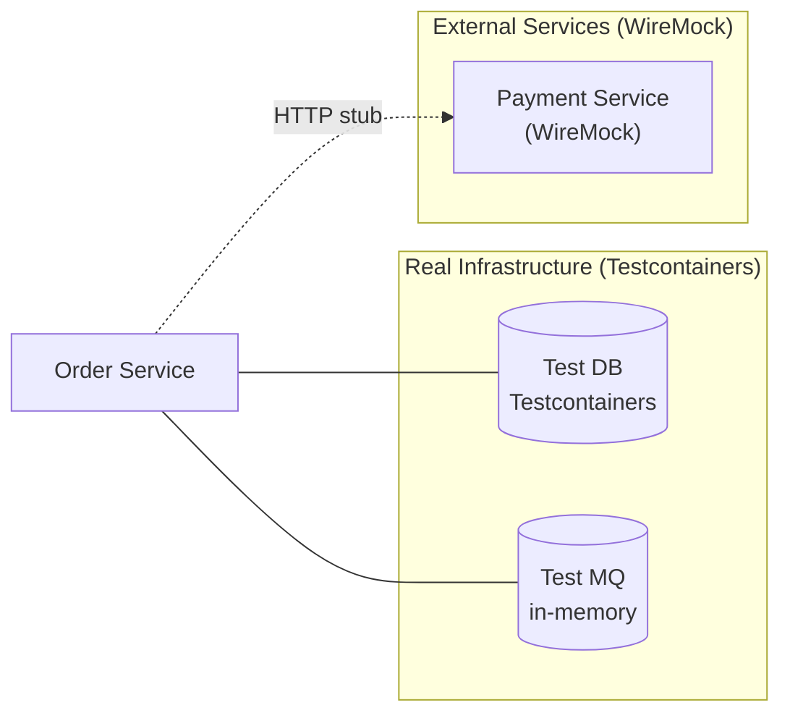
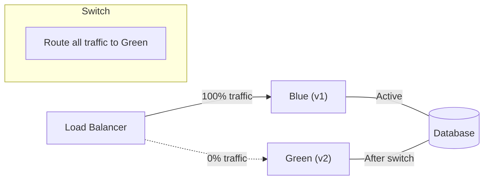
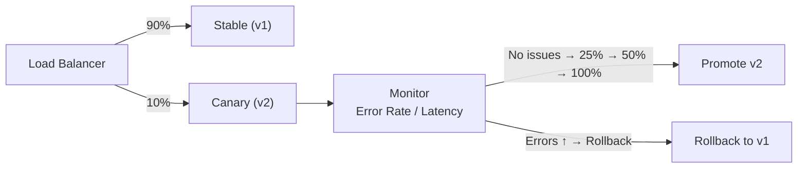

# Testing Strategies for Microservices

## What is it?

Testing microservices is fundamentally harder than testing monoliths because services have network boundaries, independent deployments, and multiple languages/databases. A layered testing strategy with the right automation pyramid is essential.

## Test Pyramid for Microservices

| Layer | Velocity | Scope | Reliability | Cost |
|-------|----------|-------|-------------|------|
| Unit | Fast (ms) | Single class/function | High | Low |
| Component | Fast (s) | Single service | High | Low |
| Integration | Slow (min) | Service + dependencies | Medium | Medium |
| Contract | Medium | Service API compatibility | High | Low |
| E2E | Very Slow (hrs) | Multiple services | Low (flaky) | Very High |

## Contract Testing (Consumer-Driven Contracts)

Contract testing ensures that a service provider meets the expectations of its consumers without running the full system.

### Pact

[Pact](https://pact.io) is the most popular contract testing framework:

- **Consumer** writes a test that defines expected requests and responses
- Pact generates a **contract file** (JSON)
- **Provider** replays the contract against its actual implementation
- If all contracts pass → services are compatible

**Benefits**: Catch breaking API changes before deployment, no need for full environment, parallel development.

## Integration Testing

Test each service with its real dependencies (DB, message queue, cache) but stub external services.

**Tools**: Testcontainers (Java), Docker Compose, LocalStack (AWS services), WireMock

## End-to-End Testing

Run against a full deployment in a staging environment. Focus on critical user journeys:

- User registration → login → place order → payment → confirmation
- Service must be fully deployed (Docker Compose, k8s, or dedicated env)
- Prone to flakiness — retry failed tests and investigate patterns

## Deployment Strategies

### Blue-Green Deployment

- **Blue**: current version
- **Green**: new version (deployed in parallel)
- Switch traffic instantly; rollback is one switch away

### Canary Deployment

Gradually shift traffic to the new version while monitoring metrics. If error rate or latency increases → rollback.

## Best Practices

1. **Invest heavily in unit tests** (70% of effort) — they're fast and cheap
2. **Use contract tests** (Pact) before E2E — catch API mismatches early
3. **Test idempotency** — same request twice produces the same result
4. **Test resilience** — circuit breakers, timeouts, retries (chaos engineering)
5. **Use Testcontainers** for integration tests — real databases in ephemeral containers
6. **Keep E2E tests minimal** (< 5% of total) — test only critical user journeys
7. **Run tests in CI pipeline per service** — don't wait for full system
8. **Implement consumer-driven contracts** — providers know what consumers expect
9. **Canary releases in production** — validate with real traffic before full rollout

## Interview Questions

1. How does the test pyramid differ for microservices vs monoliths?
2. What is consumer-driven contract testing and how does Pact work?
3. Compare blue-green deployment vs canary deployment.
4. How do you test a saga's compensating transactions?
5. How do you avoid flaky E2E tests?
6. How would you test a circuit breaker in integration tests?

## Cross-Links

- [08-Docker/Testing](../08-Docker/README.md)
- [09-Kubernetes/Rolling-Updates](../09-Kubernetes/README.md)
- [14-DevOps/CI-CD](../14-DevOps/README.md)
- [06-circuit-breaker.md](06-circuit-breaker.md)
