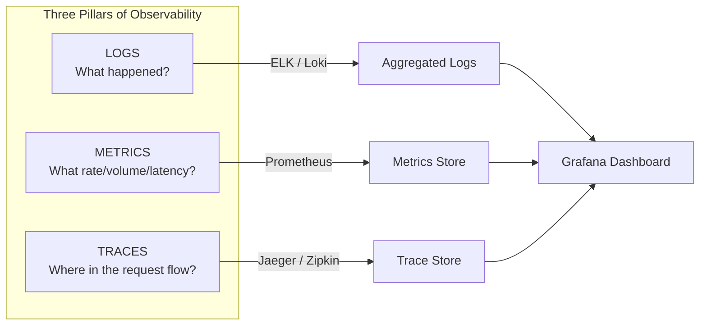
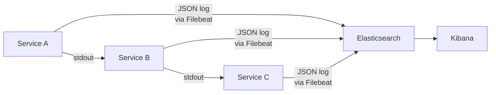
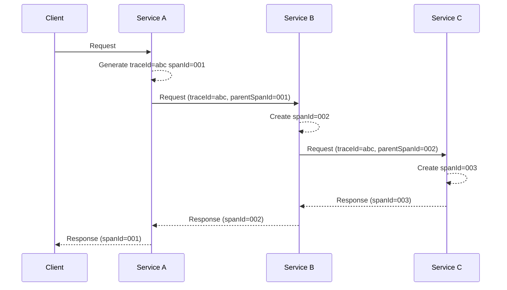
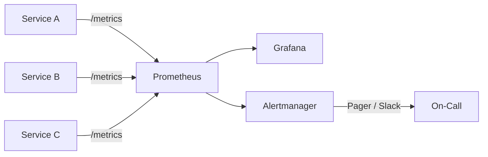

# Observability

## What is it?

Observability is the ability to understand a system's internal state from its external outputs. In microservices, you cannot SSH into running containers — you must rely on **logs**, **metrics**, and **traces** (the "three pillars of observability").

## The Three Pillars



| Pillar | Description | Tooling | Signal Type |
|--------|-------------|---------|-------------|
| **Logs** | Discrete events with timestamps | ELK, Loki, CloudWatch | Text/structured |
| **Metrics** | Aggregated numeric data over time | Prometheus, Datadog | Numeric time series |
| **Traces** | Request lifecycle across services | Jaeger, Zipkin, Tempo | Spans (ID + timing) |

## Centralized Logging

Services emit structured logs (JSON) to stdout. A log aggregator collects, indexes, and makes them searchable.



**Best practice**: Structured JSON logs with `timestamp`, `level`, `service`, `traceId`, `message`, `correlationId`.

## Distributed Tracing

A single request crosses multiple services. Distributed tracing follows it across all hops using **trace context propagation**.



### Correlation IDs

A **correlation ID** (or trace ID) is generated at the entry point and propagated via headers:
- HTTP: `X-Correlation-ID` or `X-Request-ID`
- gRPC: metadata
- Kafka: message headers
- Threads: MDC (Mapped Diagnostic Context)

### W3C Trace Context

Standard propagated headers:
- `traceparent`: version + trace-id + span-id + trace-flags
- `tracestate`: vendor-specific tracing data

## Metrics Aggregation

Collect and query metrics using **Prometheus** (pull model) and visualize in **Grafana**:



**RED Method** (microservices-focused):
- **Rate** — requests per second
- **Errors** — failed requests per second
- **Duration** — latency distribution (p50, p95, p99, p999)

**USE Method** (infrastructure-focused):
- **Utilization** — % of time resource is busy
- **Saturation** — queue length
- **Errors** — error count

## Health Check APIs

Every service should expose health endpoints that a load balancer / orchestrator / monitoring system can query.

### /health

Returns overall health of the service. Used for **liveness probes** (is the service alive?).

```json
GET /health
{
  "status": "UP",
  "components": {
    "db": { "status": "UP" },
    "redis": { "status": "UP" },
    "paymentService": { "status": "DOWN", "error": "Connection refused" }
  },
  "uptime": 3600
}
```

### /ready

Returns whether the service can handle traffic. Used for **readiness probes**.

- Returns `200 OK` only when the service is fully initialized and dependencies are available
- Returns `503 Service Unavailable` during startup or draining

```json
GET /ready
{
  "status": "READY",
  "message": "Warming up cache...",
  "ready": false
}
```

In Kubernetes:
- Liveness probe: `/health` — restart if dead
- Readiness probe: `/ready` — stop sending traffic if not ready
- Startup probe: `/startup` — give slow-starting containers time

## Why it matters

- **Debugging** — trace a single request across 20+ services
- **Alerting** — know when a service degrades before users notice
- **Capacity planning** — understand usage patterns and growth
- **Performance optimization** — identify slow services or queries
- **Postmortems** — reconstruct exactly what happened during an incident

## Best Practices

1. **Standardize on structured JSON logs** — never use free-text log messages
2. **Propagate trace context everywhere** — HTTP, gRPC, async messages
3. **Export metrics via Prometheus format** — `/metrics` endpoint on every service
4. **Expose /health and /ready endpoints** — required for K8s and load balancers
5. **Instrument HTTP clients and servers** automatically — OpenTelemetry auto-instrumentation
6. **Store traces in a backend** (Jaeger, Tempo, Zipkin) — don't lose trace data
7. **Set up SLO-based alerting** — alert on error budget, not every minor issue
8. **Use OpenTelemetry** — the unified standard for observability data collection
9. **Include business metrics** — not just technical (e.g., orders placed / min)

## Interview Questions

1. What are the three pillars of observability? Why do you need all three?
2. How does distributed tracing work across microservice boundaries?
3. What's the difference between a liveness probe and a readiness probe?
4. How do you propagate trace context through an asynchronous message queue?
5. Explain the RED method for microservices monitoring.
6. What is OpenTelemetry and why is it important?

## Cross-Links

- [17-Observability/README.md](../17-Observability/README.md)
- [09-Kubernetes/Probes](../09-Kubernetes/README.md)
- [09-testing-strategies.md](09-testing-strategies.md)
- [14-DevOps/Monitoring](../14-DevOps/README.md)
