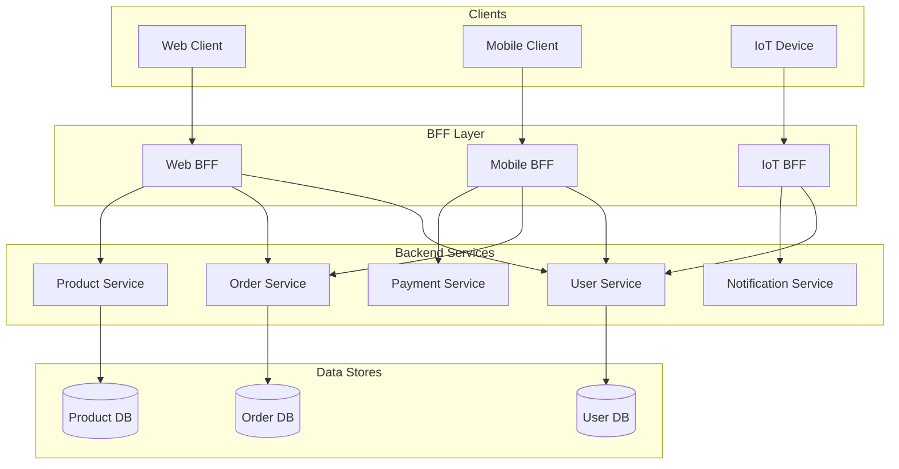
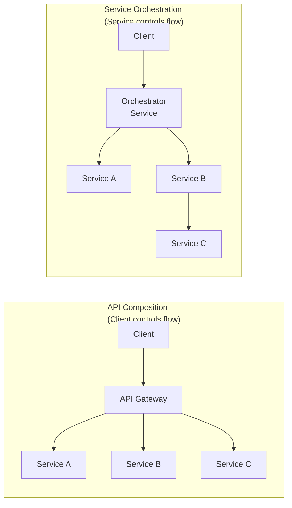
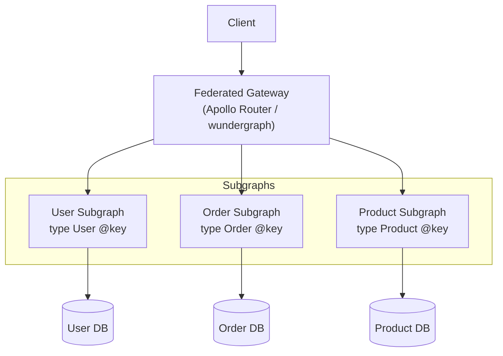
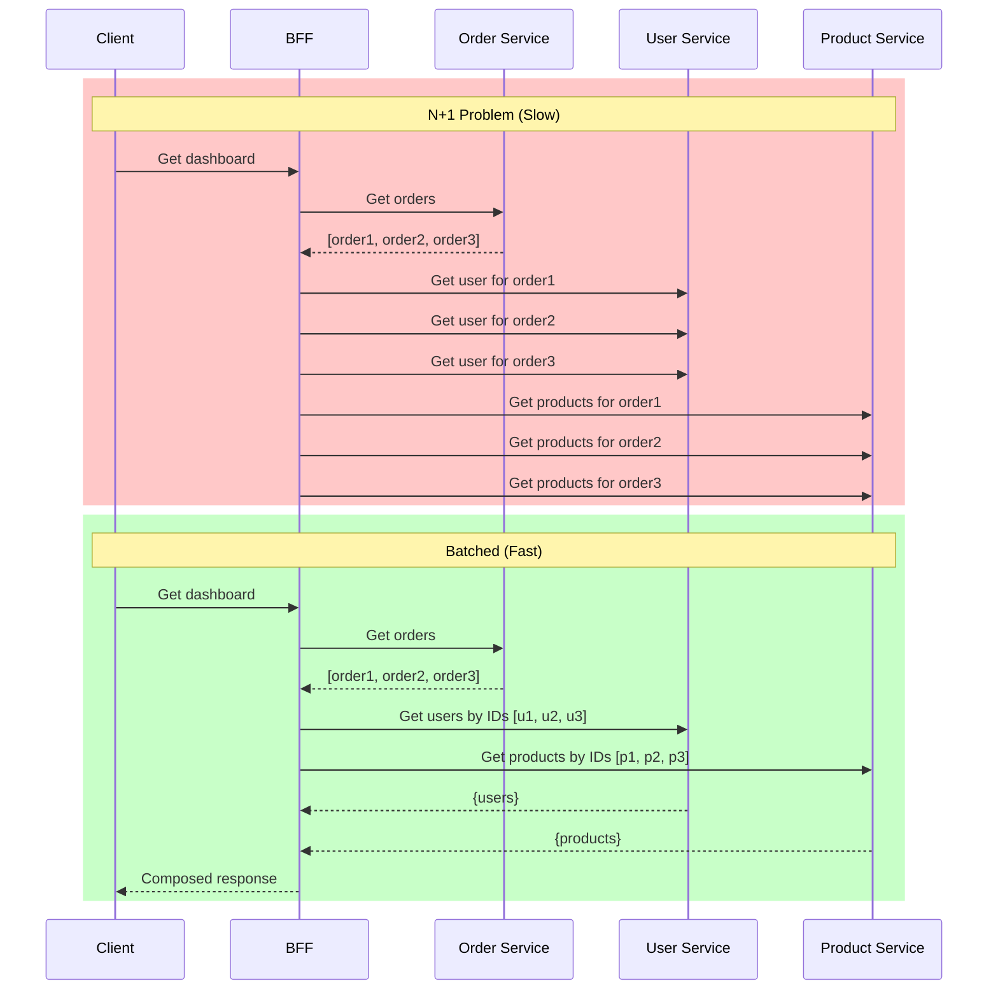

# API Composition & Backend for Frontend (BFF)

## What Is It?

API Composition is a pattern where a dedicated layer aggregates data from multiple microservices into a single response, reducing client-side round trips. The Backend for Frontend (BFF) pattern extends this by creating separate API gateways tailored to each client type (mobile, web, IoT), each owning its own composition logic.



## Why It Was Created

Before BFFs, a single API gateway served all clients. This led to:
- **Over-fetching**: Mobile clients received desktop-sized payloads
- **Under-fetching**: Web clients needed multiple round-trips for a single view
- **Tight coupling**: Client-specific logic leaked into shared gateway code
- **Separate evolution**: Mobile and web teams couldn't independently evolve their APIs

The BFF pattern, popularized by SoundCloud and Phil Calçado, gives each client team ownership of its API surface.

## When to Use It

| Scenario | Use BFF? |
|----------|----------|
| Multiple client types with different data needs | Yes |
| Single SPA web app only | No (API gateway may suffice) |
| Mobile needs smaller payloads than web | Yes |
| IoT devices with constrained bandwidth | Yes |
| Simple CRUD with uniform clients | No |
| GraphQL is already serving all clients | Consider BFF-per-client-type |

## Architecture Deep-Dive

### API Composition vs Service Orchestration



| Aspect | Composition | Orchestration |
|--------|-------------|---------------|
| Who controls flow | Client / API Gateway | A dedicated orchestrator service |
| Coupling | Loose — services unaware of composition | Tighter — orchestrator knows dependencies |
| Latency | Sequential calls can add up | Can parallelize independent calls |
| Complexity | Simpler gateway logic | State machine management (Saga) |
| Error handling | Client handles partial failures | Orchestrator manages compensation |
| Best for | Read-heavy, query-focused | Write-heavy, multi-step transactions |

### GraphQL Federation

GraphQL Federation allows a single GraphQL endpoint to span multiple microservices through a federated gateway.



**Federation primitives:**

```graphql
# User Subgraph
type User @key(fields: "id") {
  id: ID!
  name: String!
  email: String!
}

# Order Subgraph extends User
type User @key(fields: "id") {
  id: ID!
  orders: [Order!]!
}

type Order @key(fields: "id") {
  id: ID!
  total: Float!
  userId: String!
}
```

### Avoiding the N+1 Problem Across Services

The N+1 problem occurs when fetching a list of N entities triggers N additional queries. Across microservices, this is amplified by network latency.



Solutions:
- **DataLoader pattern** (JavaScript) — batch & cache per-request
- **Batch endpoints** — `POST /users/batch` with ID array
- **GraphQL resolvers** — built-in batching via DataLoader
- **API composition with JOIN** — gateway does parallel fan-out

### Performance Considerations

| Factor | Impact | Mitigation |
|--------|--------|------------|
| Serial composition | Latency = sum of service calls | Parallelize independent calls |
| Payload size | Bandwidth + serialization cost | Field selection, compression |
| Connection overhead | TCP handshake per service | Connection pooling, keep-alive |
| Cache misses | Repeated composition | HTTP caching, Redis, CDN |
| Authentication per call | Repeated token validation | Forward JWT, pre-validate at gateway |

## Hands-On Example

### Node.js BFF with Apollo Federation

```typescript
// gateway/index.ts
import { ApolloGateway, IntrospectAndCompose } from '@apollo/gateway'
import { ApolloServer } from '@apollo/server'
import { startStandaloneServer } from '@apollo/server/standalone'

const gateway = new ApolloGateway({
  supergraphSdl: new IntrospectAndCompose({
    subgraphs: [
      { name: 'users', url: 'http://user-service:4001/graphql' },
      { name: 'orders', url: 'http://order-service:4002/graphql' },
      { name: 'products', url: 'http://product-service:4003/graphql' },
    ],
  }),
})

const server = new ApolloServer({ gateway })

startStandaloneServer(server, { listen: { port: 4000 } }).then(({ url }) => {
  console.log(`Federated gateway ready at ${url}`)
})
```

### Spring Boot BFF with WebClient

```java
// OrderCompositionController.java
@RestController
@RequestMapping("/api/dashboard")
public class OrderCompositionController {

    private final WebClient webClient;

    public OrderCompositionController(WebClient.Builder builder) {
        this.webClient = builder.build();
    }

    @GetMapping("/{userId}")
    public Mono<DashboardResponse> getDashboard(@PathVariable String userId) {
        Mono<User> userMono = webClient.get()
            .uri("http://user-service/api/users/{id}", userId)
            .retrieve()
            .bodyToMono(User.class);

        Mono<List<Order>> ordersMono = webClient.get()
            .uri("http://order-service/api/users/{id}/orders", userId)
            .retrieve()
            .bodyToFlux(Order.class)
            .collectList();

        return Mono.zip(userMono, ordersMono)
            .map(tuple -> new DashboardResponse(tuple.getT1(), tuple.getT2()));
    }
}

record DashboardResponse(User user, List<Order> orders) {}
record User(String id, String name, String email) {}
record Order(String id, double total, String status) {}
```

### BFF with Custom DataLoader (Node.js)

```typescript
// bff/loaders.ts
import DataLoader from 'dataloader'

export const createUserLoader = () =>
  new DataLoader<string, User>(async (ids) => {
    const response = await fetch('http://user-service/api/users/batch', {
      method: 'POST',
      headers: { 'Content-Type': 'application/json' },
      body: JSON.stringify({ ids }),
    })
    const users: User[] = await response.json()
    return ids.map((id) => users.find((u) => u.id === id)!)
  })

export const createOrderLoader = () =>
  new DataLoader<string, Order[]>(async (userIds) => {
    const response = await fetch('http://order-service/api/orders/by-users', {
      method: 'POST',
      headers: { 'Content-Type': 'application/json' },
      body: JSON.stringify({ userIds }),
    })
    const data: Record<string, Order[]> = await response.json()
    return userIds.map((uid) => data[uid] || [])
  })
```

## Pricing / Cost Considerations

| Approach | Cost Factor | Notes |
|----------|-------------|-------|
| BFF running on EC2/EKS | Compute + network | 2-4x gateway instances per client type |
| Apollo GraphQL Federation | Router + subgraphs | Apollo Router is free up to 100k ops/min (self-hosted); managed GraphOS from $49/mo |
| AWS AppSync | Per-query pricing | $4 per million queries; caching extra |
| Kong API Gateway | Open source free; Enterprise from $15k/yr | BFF requires custom plugins or decK config |
| Data transfer between services | $0.01-$0.09/GB (AWS inter-AZ) | Aggregation increases internal traffic |

## Best Practices

1. **One BFF per client type** — web, iOS, Android, IoT each get their own
2. **BFFs share no code** — each evolves independently
3. **BFFs are stateless** — scale horizontally behind a load balancer
4. **Prefer parallel requests** — never serialise independent service calls
5. **Implement circuit breakers** on every downstream call in the BFF
6. **Cache aggressively** — Redis at the BFF layer for read-heavy compositions
7. **Use GraphQL federation** for complex domains with many subgraphs
8. **Add timeout budgets** — BFF must fail fast to avoid client-side timeouts
9. **Log composition traces** — each BFF call should emit a trace ID for debugging
10. **Keep BFFs thin** — business logic stays in the services, not the gateway

## Interview Questions

1. How does BFF differ from a traditional API gateway? When would you use both?
2. Explain the difference between API composition and service orchestration.
3. How does GraphQL federation solve the problem of distributed GraphQL schemas?
4. Describe the N+1 problem in microservice composition and how to fix it.
5. How would you handle partial failures in API composition?
6. What are the trade-offs of using a BFF for each client type?
7. How do you version a BFF API without breaking existing clients?
8. Explain how DataLoader batches and caches requests across a single request lifecycle.
9. How would you implement a dashboard endpoint that aggregates data from 5 services?
10. What security considerations are unique to BFFs compared to a shared API gateway?

## Real Company Usage

| Company | Pattern | Details |
|---------|---------|---------|
| **SoundCloud** | BFF originator | Created separate BFFs for web and mobile; eliminated over-fetching |
| **Netflix** | API Gateway + BFF | Zuul routes to service-specific BFFs; each UI team owns its BFF |
| **Shopify** | GraphQL Federation | Single GraphQL endpoint backed by 200+ microservices via federation |
| **Expedia** | BFF per device | Hotel, flight, car BFFs each tailored to their consumer |
| **Nordstrom** | API Composition | API orchestration layer that composes product, inventory, pricing, reviews |
| **Uber** | Domain-oriented BFFs | API gateway routes to domain-specific aggregation layers |
