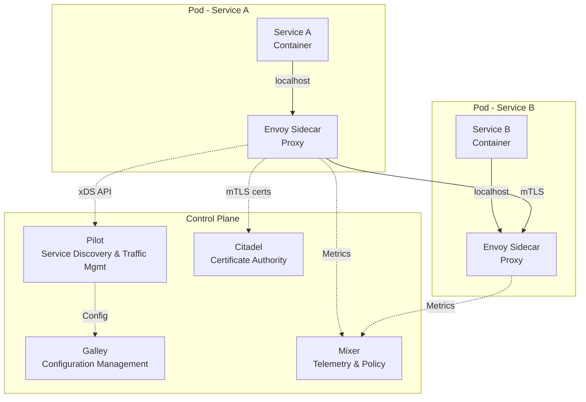
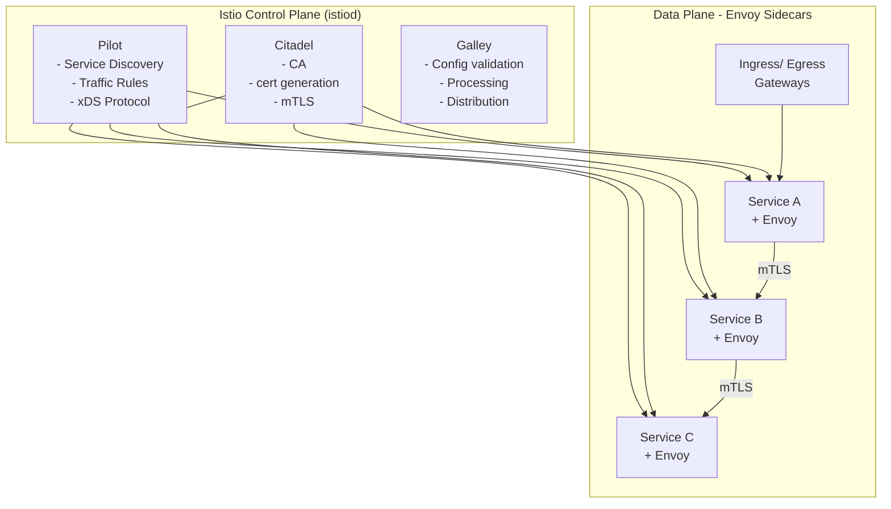
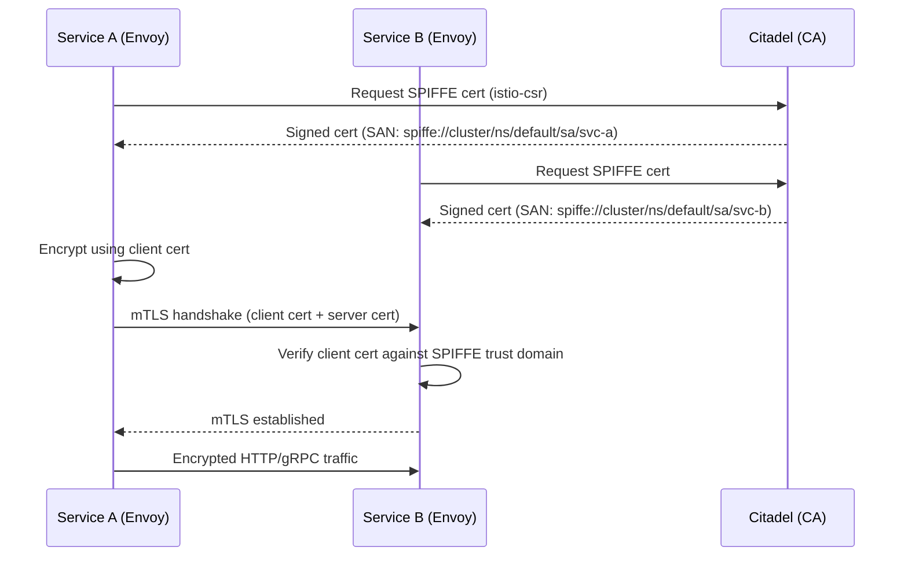
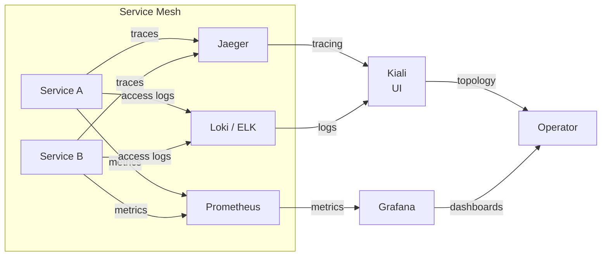
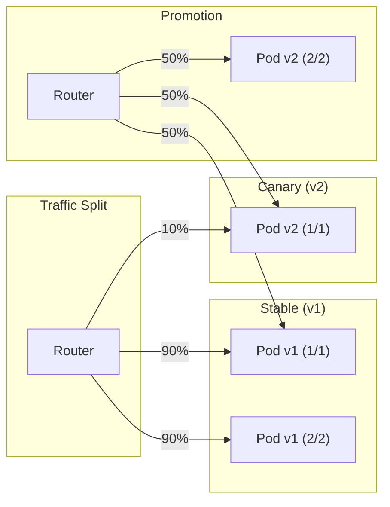
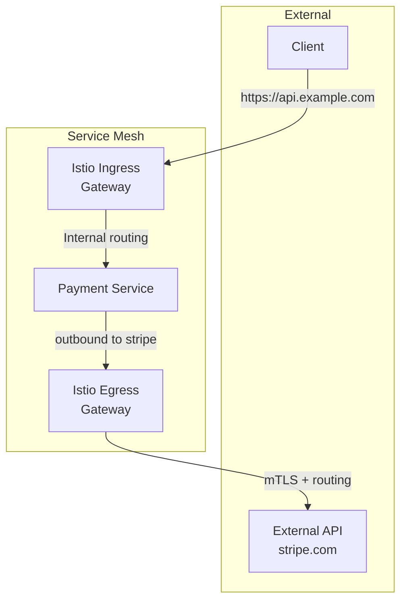

# Service Mesh Deep-Dive

## What Is It?

A **service mesh** is a dedicated infrastructure layer that handles service-to-service communication, security, and observability in a microservice architecture. It moves these concerns out of application code and into a sidecar proxy that intercepts all network traffic, providing traffic management, mTLS, observability, and policy enforcement transparently.



## Why It Was Created

Before service meshes, resilience, observability, and security were implemented in each service's code:
- Every service had to implement retries, timeouts, and circuit breakers
- mTLS required custom certificate management
- Distributed tracing needed manual instrumentation
- Traffic splitting for canary deployments was complex

Istio (launched 2017 by Google, IBM, Lyft) pioneered the sidecar-based approach using Envoy, while Linkerd (2016, Buoyant) introduced the concept with a lighter footprint.

## When to Use It

| Scenario | Use Service Mesh? |
|----------|-------------------|
| 10+ microservices with complex traffic patterns | Yes |
| Compliance requires mTLS between all services | Yes |
| Need canary / blue-green without changing code | Yes |
| Less than 5 services | No (overhead too high) |
| Serverless functions (short-lived) | No (sidecar startup latency) |
| Monolith with 2 services | No |

## Architecture Deep-Dive

### Istio Architecture



| Component | Role |
|-----------|------|
| **Envoy Proxy** | Sidecar proxy intercepting all in/out traffic; implements L7 policies |
| **Pilot** | Converts high-level routing rules (VirtualService, DestinationRule) into Envoy config via xDS |
| **Citadel** | Certificate Authority issuing SPIFFE-compliant identities for mTLS |
| **Galley** | Validates, processes, and distributes Istio configuration |
| **Mixer** (deprecated) | Was used for telemetry and policy; now replaced by Wasm plugins + Envoy filters |
| **Ingress Gateway** | Entry point for external traffic into the mesh |
| **Egress Gateway** | Controlled exit point for traffic leaving the mesh |

### Traffic Management

```yaml
# VirtualService: Route 90% to v1, 10% to v2 (canary)
apiVersion: networking.istio.io/v1beta1
kind: VirtualService
metadata:
  name: reviews
spec:
  hosts:
  - reviews
  http:
  - match:
    - headers:
        end-user:
          exact: test-user
    route:
    - destination:
        host: reviews
        subset: v2
  - route:
    - destination:
        host: reviews
        subset: v1
        weight: 90
    - destination:
        host: reviews
        subset: v2
        weight: 10
---
apiVersion: networking.istio.io/v1beta1
kind: DestinationRule
metadata:
  name: reviews
spec:
  host: reviews
  subsets:
  - name: v1
    labels:
      version: v1
  - name: v2
    labels:
      version: v2
  trafficPolicy:
    connectionPool:
      tcp:
        maxConnections: 100
    loadBalancer:
      simple: ROUND_ROBIN
```

### mTLS Between Services



```yaml
# PeerAuthentication: strict mTLS for the whole namespace
apiVersion: security.istio.io/v1beta1
kind: PeerAuthentication
metadata:
  name: default
  namespace: default
spec:
  mtls:
    mode: STRICT
---
# DestinationRule enforcing mTLS
apiVersion: networking.istio.io/v1beta1
kind: DestinationRule
metadata:
  name: default
  namespace: default
spec:
  host: "*.default.svc.cluster.local"
  trafficPolicy:
    tls:
      mode: ISTIO_MUTUAL
```

### Observability with Istio



Istio generates:
- **Metrics** (Prometheus): request count, duration, size, HTTP responses, TCP stats
- **Distributed traces** (Jaeger/Zipkin): automatic span injection via Envoy
- **Access logs** (Loki/ELK): per-request metadata (source, destination, latency, response code)

### Canary Deployments with Service Mesh



```yaml
# Canary via VirtualService weight
apiVersion: networking.istio.io/v1beta1
kind: VirtualService
metadata:
  name: reviews-canary
spec:
  hosts:
  - reviews
  http:
  - route:
    - destination:
        host: reviews
        subset: v1
      weight: 95
    - destination:
        host: reviews
        subset: v2
      weight: 5
  - route:
    - match:
      - headers:
          x-canary:
            exact: test
      destination:
        host: reviews
        subset: v2
```

### Ingress & Egress Gateways



```yaml
# Ingress Gateway
apiVersion: networking.istio.io/v1beta1
kind: Gateway
metadata:
  name: bookinfo-gateway
spec:
  selector:
    istio: ingressgateway
  servers:
  - port:
      number: 80
      name: http
      protocol: HTTP
    hosts:
    - "*.example.com"
---
# Egress Gateway for external traffic
apiVersion: networking.istio.io/v1beta1
kind: VirtualService
metadata:
  name: external-api-egress
spec:
  hosts:
  - "api.stripe.com"
  gateways:
  - mesh
  - istio-egressgateway
  tls:
  - match:
    - port: 443
      sniHosts:
      - api.stripe.com
    route:
    - destination:
        host: istio-egressgateway.istio-system.svc.cluster.local
        port:
          number: 443
```

### Linkerd Comparison

| Feature | Istio | Linkerd |
|---------|-------|---------|
| Proxy | Envoy (C++) | linkerd2-proxy (Rust) |
| Control plane | istiod (Go) | control-plane (Go) |
| Resource overhead | Higher (~100MB/sidecar) | Lower (~10MB/sidecar) |
| mTLS | Citadel (SPIFFE) | Native mTLS (linkerd-identity) |
| Traffic split | VirtualService/DestinationRule | TrafficSplit CRD |
| TCP support | Full | Full |
| gRPC | First-class | First-class |
| Installation complexity | Moderate | Simple |
| Configurable Envoy filters | Yes (Wasm, Lua) | Limited |
| Mesh expansion (VMs) | Yes | Experimental |
| Kiali visualization | Yes (separate install) | Yes (Buoyant Cloud) |

## Hands-On Example

### Install Istio on Kubernetes

```bash
# Download and install istioctl
curl -L https://istio.io/downloadIstio | sh -
cd istio-1.22.0
export PATH=$PWD/bin:$PATH

# Install Istio with demo profile
istioctl install --set profile=demo -y

# Enable sidecar injection for default namespace
kubectl label namespace default istio-injection=enabled

# Deploy the Bookinfo sample app
kubectl apply -f samples/bookinfo/platform/kube/bookinfo.yaml
kubectl apply -f samples/bookinfo/networking/bookinfo-gateway.yaml

# Verify all pods have 2/2 containers (app + sidecar)
kubectl get pods

# Set ingress IP
export INGRESS_HOST=$(kubectl get svc istio-ingressgateway -n istio-system \
  -o jsonpath='{.status.loadBalancer.ingress[0].hostname}')

# Access the app
curl "http://$INGRESS_HOST/productpage"
```

### Deploy a Canary with Linkerd

```bash
# Install Linkerd CLI and control plane
curl -sL https://run.linkerd.io/install | sh
linkerd install | kubectl apply -f -
linkerd check

# Annotate namespace for proxy injection
kubectl annotate namespace default linkerd.io/inject=enabled

# Deploy stable version
kubectl create deployment web-v1 --image=nginx:1.25
kubectl expose deployment web-v1 --port=80 --name=web

# Deploy canary version
kubectl create deployment web-v2 --image=nginx:1.26

# Split traffic 90/10 using ServiceProfile
cat <<EOF | kubectl apply -f -
apiVersion: split.smi-spec.io/v1alpha4
kind: TrafficSplit
metadata:
  name: web-split
spec:
  service: web
  backends:
  - service: web-v1
    weight: 900
  - service: web-v2
    weight: 100
EOF
```

### mTLS Verification with Istio

```bash
# Verify mTLS is enabled
istioctl authn tls-check productpage-v1-*.default

# Expected output:
# HOST:PORT                                  STATUS     SERVER     CLIENT     AUTHN POLICY     DESTINATION RULE
# details.default.svc.cluster.local:9080     STRICT     mTLS       mTLS       default/         default/
# reviews.default.svc.cluster.local:9080     STRICT     mTLS       mTLS       default/         default/

# Test with curl from within the mesh
kubectl exec deploy/productpage-v1 -- curl -s http://reviews:9080/reviews/0

# Check the access logs
istioctl dashboard jaeger
```

### Observability Dashboards

```bash
# Open Kiali (service graph)
istioctl dashboard kiali

# Open Grafana (metrics)
istioctl dashboard grafana

# Open Jaeger (tracing)
istioctl dashboard jaeger

# Generate traffic to see traces
for i in $(seq 1 100); do
  curl -s "http://$INGRESS_HOST/productpage" > /dev/null
done
```

## Pricing / Cost Considerations

| Component | Cost |
|-----------|------|
| **Istio (self-managed)** | Free / open source; operational cost of control plane infra |
| **Istio on GKE** | Managed Istio included in GKE cluster cost (~$0.10/hr/node) |
| **Linkerd (self-managed)** | Free / open source |
| **Linkerd on Buoyant Cloud** | Free tier (1 cluster); paid from $0.008/hr/core |
| **Envoy resource overhead** | Each sidecar ~50-200MB RAM; for 100 services = 5-20GB extra |
| **AWS App Mesh** | $0.00 for mesh; pay for Envoy sidecars (~$0.05/deployment/hr) |
| **Azure Service Mesh (add-on)** | Free with AKS; operational cost only |
| **Additional cross-AZ traffic** | mTLS + routing adds ~1-3ms latency per hop |

**Resource estimates for 50 pods:**
- Istio: ~2-4 GB memory, ~2-4 vCPU for control plane
- Linkerd: ~0.5-1 GB memory, ~0.5-1 vCPU for control plane
- Per-proxy: Istio ~50MB, Linkerd ~10MB

## Best Practices

1. **Start with a simple mesh** — Istio profile `default`, not `demo`, in production
2. **Enable STRICT mTLS** — mutual TLS between all services; no PERMISSIVE mode in prod
3. **Use namespace isolation** — put each environment (dev/staging/prod) in separate mesh namespaces
4. **Monitor control plane health** — if istiod goes down, Envoy continues with cached config
5. **Set resource limits on sidecars** — prevent Envoy from consuming too much memory
6. **Use Wasm filters for custom logic** — not for replacing Mixer; compile to 5-10KB WebAssembly
7. **Gradually roll out sidecar injection** — use revision-based upgrades to avoid downtime
8. **Configure circuit breakers at mesh level** — DestinationRule `trafficPolicy` before app-level
9. **Enable access logging only when debugging** — high volume of logs impacts performance
10. **Secure ingress with external auth** — integrate OAuth/OIDC at the Ingress Gateway

## Interview Questions

1. How does a service mesh differ from an API gateway? When would you use both?
2. Explain the role of each Istio component: Pilot, Citadel, Galley, Envoy.
3. How does Istio enforce mTLS between services? Describe the SPIFFE identity model.
4. What is the difference between a VirtualService and a DestinationRule?
5. How would you implement a canary deployment using a service mesh?
6. Compare Linkerd and Istio. When would you choose one over the other?
7. How does Istio's sidecar proxy intercept traffic without application changes?
8. Explain Istio's Ingress Gateway vs Egress Gateway. When would you use an Egress Gateway?
9. How does a service mesh improve observability compared to traditional monitoring?
10. What are the performance overheads of running a service mesh? How would you measure them?

## Real Company Usage

| Company | Mesh | Details |
|---------|------|---------|
| **Google** | Istio | Internal product (originated at Google); extensive use across GCP services |
| **eBay** | Istio | 1000+ microservices; mTLS, traffic splitting, observability |
| **Airbnb** | Envoy-only | Custom mesh without Istio control plane; uses Envoy for traffic management |
| **Spotify** | Linkerd | Migrated from custom solution to Linkerd for zero-code security and observability |
| **Walmart** | Istio | Manages 1000s of services with Istio for traffic management and security |
| **HP** | Istio | Multi-cluster mesh across data centers for HP Print services |
| **Adidas** | Istio | Global e-commerce platform with Istio for canary deployments and resilience |
| **HashiCorp** | Consul Connect + Envoy | Service mesh built on Consul service mesh with native Envoy integration |
