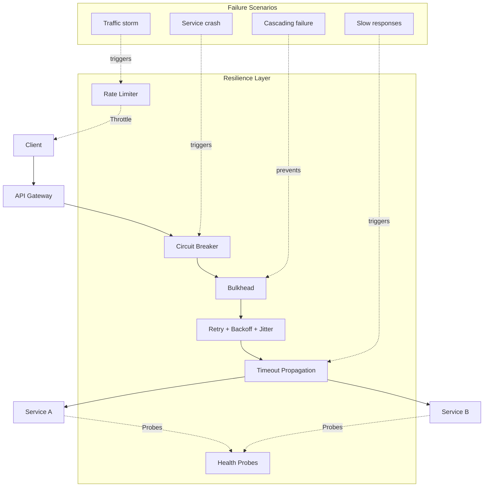
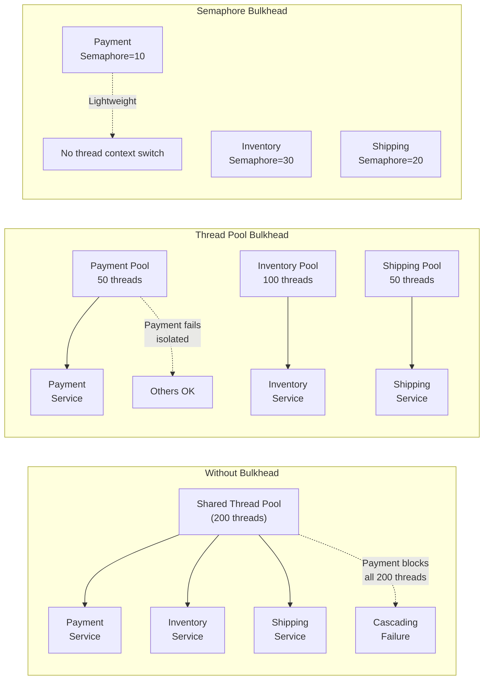
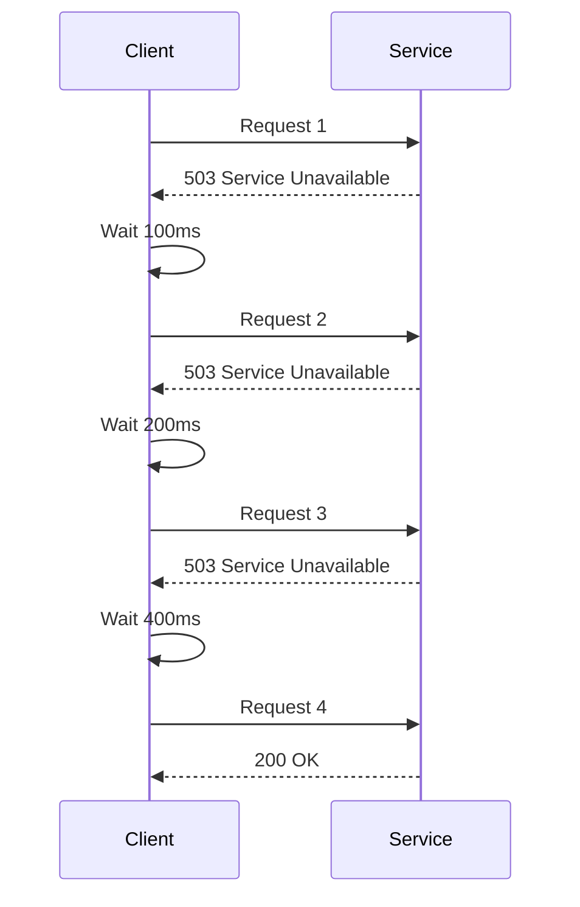
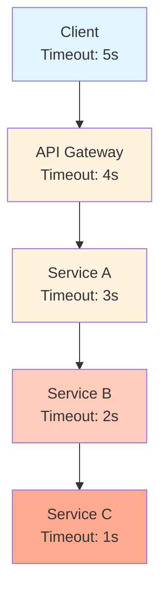
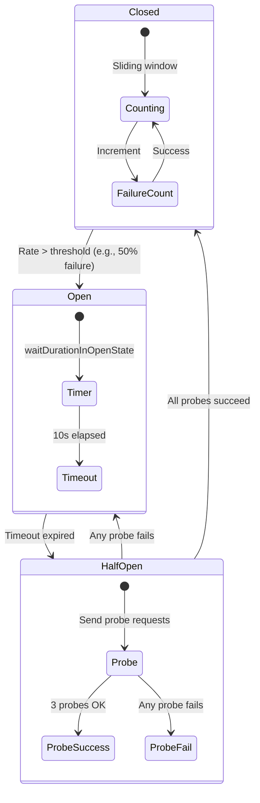
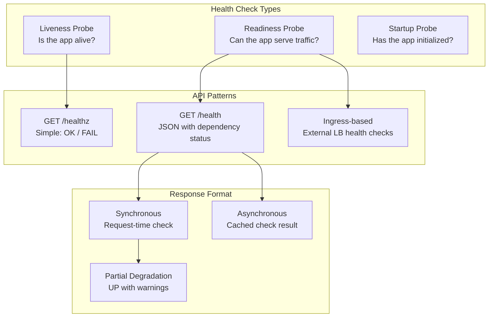
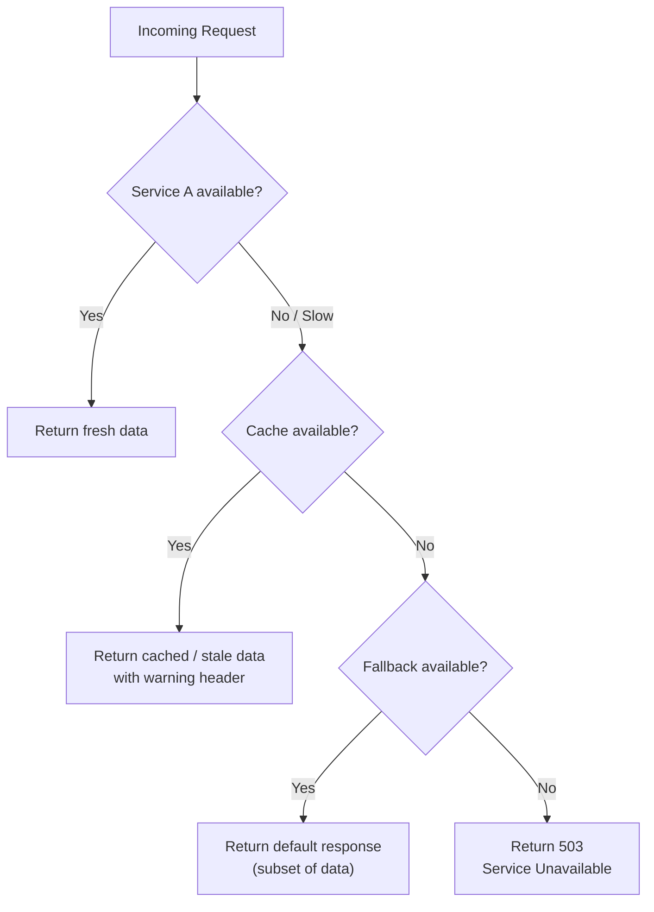

# Resilience Patterns

## What Is It?

Resilience patterns are architectural strategies that enable microservice systems to withstand, recover from, and gracefully degrade under failures. They form the defensive programming layer of distributed systems, handling network partitions, service crashes, resource exhaustion, and latency spikes without cascading outages.



## Why It Was Created

In monolithic applications, failures were contained within a single process. Microservices replaced in-memory calls with network calls, introducing new failure modes: partial failures, latency spikes, network partitions, and cascading failures. The industry learned from:

- **Netflix** — popularized the circuit breaker and bulkhead patterns after AWS outages cascaded
- **Amazon** — documented the "twelve-factor" principles for resilience
- **Google** — shared SRE practices (timeouts, retry budgets, graceful degradation)

These patterns were codified in libraries like Hystrix (Netflix), Resilience4j, and Polly (.NET).

## When to Use It

| Pattern | When to Apply |
|---------|---------------|
| **Circuit Breaker** | Every outbound network call to another service or external API |
| **Bulkhead** | Differentiate between critical and non-critical workloads; isolate tenant traffic |
| **Retry + Backoff** | Transient failures (503, timeout, connection reset); NOT for 4xx client errors |
| **Timeout** | Every single remote call — no exceptions |
| **Rate Limiting** | APIs exposed to clients; prevent abuse and ensure fairness |
| **Health Checks** | Every service: readiness for traffic, liveness for restart |

## Architecture Deep-Dive

### Bulkhead Pattern

Named after ship compartments that prevent flooding from sinking the entire vessel, the bulkhead pattern isolates resources so a failure in one partition doesn't starve others.



| Aspect | Thread Pool Bulkhead | Semaphore Bulkhead |
|--------|---------------------|--------------------|
| Isolation | Complete (separate thread pools) | Partial (shared threads, limited concurrent calls) |
| Timeout support | Yes (thread can be interrupted) | No (cannot interrupt) |
| Context switching | Yes (thread per request) | No (caller's thread) |
| Overhead | Higher | Lower |
| Best for | Long-running / blocking operations | Fast, non-blocking operations |
| Resilience4j | `ThreadPoolBulkhead` | `SemaphoreBulkhead` |

### Retry with Exponential Backoff + Jitter



```java
// Java - Resilience4j retry with exponential backoff + jitter
RetryConfig config = RetryConfig.custom()
    .maxAttempts(5)
    .waitDuration(Duration.ofMillis(100))
    .intervalFunction(IntervalFunction.ofExponentialRandomBackoff(
        Duration.ofMillis(100),  // initial interval
        2.0,                     // multiplier
        Duration.ofMillis(5000), // max interval
        0.5                      // jitter factor (±50%)
    ))
    .retryExceptions(IOException.class, TimeoutException.class)
    .ignoreExceptions(IllegalArgumentException.class)  // Don't retry client errors
    .build();
```

**Jitter Distribution Comparison:**
| Strategy | Formula | Peak Load |
|----------|---------|-----------|
| No backoff | `fixed` | Thundering herd |
| Exponential | `base * 2^n` | Still synchronous spikes |
| Exponential + jitter | `random(base * 2^n, base * 2^(n+1))` | Spread uniformly |
| Full jitter | `random(0, base * 2^n)` | Best distribution |
| Equal jitter | `(base * 2^n) / 2 + random(0, (base * 2^n) / 2)` | Moderate |

### Timeout Propagation



**Timeout propagation rules:**
1. Each downstream hop should have a **shorter** timeout than its caller
2. Reserve 20-30% of the parent timeout for overhead (serialization, network)
3. Propagate deadline via context headers (`Grpc-Timeout`, `X-Deadline`)
4. gRPC natively supports deadline propagation

```typescript
// Node.js - Context-based timeout propagation
import { metadata } from '@grpc/grpc-js'

function propagateDeadline(timeoutMs: number): metadata.Metadata {
  const md = new metadata.Metadata()
  md.set('grpc-timeout', `${timeoutMs}mS`)
  return md
}

// Service A calls Service B with reduced timeout
async function callServiceB(parentTimeoutMs: number) {
  const childTimeout = Math.floor(parentTimeoutMs * 0.7)
  try {
    return await serviceBClient.someMethod(
      request,
      propagateDeadline(childTimeout)
    )
  } catch (e) {
    if (e.code === Status.DEADLINE_EXCEEDED) {
      logger.warn('Service B deadline exceeded within parent timeout')
    }
    throw e
  }
}
```

### Circuit Breaker Deep-Dive



**Metrics-based circuit breaker (sliding window):**
```yaml
resilience4j.circuitbreaker:
  instances:
    paymentService:
      # Count-based sliding window (last 20 calls)
      slidingWindowType: COUNT_BASED
      slidingWindowSize: 20
      minimumNumberOfCalls: 10
      failureRateThreshold: 50
      waitDurationInOpenState: 30s
      permittedNumberOfCallsInHalfOpenState: 3
      recordExceptions:
        - java.io.IOException
        - java.util.concurrent.TimeoutException

    inventoryService:
      # Time-based sliding window (last 60 seconds)
      slidingWindowType: TIME_BASED
      slidingWindowSize: 60
      minimumNumberOfCallsPerHalfPeriod: 6
      failureRateThreshold: 40
      slowCallDurationThreshold: 2s
      slowCallRateThreshold: 50
      waitDurationInOpenState: 15s
```

**Half-open state testing strategies:**
| Strategy | Behavior | Best For |
|----------|----------|----------|
| Fixed probes | Permit N requests; success = close | Simple services |
| Gradual recovery | Start with 1 probe, increase on success | High-throughput services |
| Client-aware | Only probe when client demand exists | Low-traffic services |
| Interval-based | Re-test every M seconds | Services with slow recovery |

### Rate Limiting Per Client

```java
// Java - Resilience4j RateLimiter
RateLimiterConfig config = RateLimiterConfig.custom()
    .limitForPeriod(100)                 // 100 requests
    .limitRefreshPeriod(Duration.ofSeconds(1))  // per second
    .timeoutDuration(Duration.ofMillis(50))     // wait 50ms before giving up
    .build()

RateLimiter rateLimiter = RateLimiter.of("client-api-key-123", config)

// Check permission
boolean permitted = rateLimiter.acquirePermission()
```

```yaml
# API Gateway rate limiting per client (Kong)
plugins:
  - name: rate-limiting
    config:
      second: 100
      minute: 5000
      policy: local
      fault_tolerant: true
      hide_client_headers: false
      redis_host: redis-cluster.example.com
      redis_port: 6379
```

**Rate limiting algorithms:**
| Algorithm | Pros | Cons |
|-----------|------|------|
| Token Bucket | Smooth traffic; burst allowance | Complex state management |
| Leaky Bucket | Constant egress rate | Rejects bursts immediately |
| Sliding Window Log | Precise per-window tracking | Memory intensive for high traffic |
| Sliding Window Counter | Memory efficient (Redis) | Less precise at boundary |
| Fixed Window Counter | Simple | Burst at window boundaries |

### Health Check API Patterns



```typescript
// Node.js - Health check endpoint with dependency status
import express from 'express'
const app = express()

interface HealthStatus {
  status: 'healthy' | 'degraded' | 'unhealthy'
  version: string
  uptime: number
  dependencies: Record<string, {
    status: 'up' | 'down'
    latency: number
    lastChecked: string
  }>
}

const dependencyCache = new Map<string, { status: 'up' | 'down', latency: number, timestamp: number }>()

async function checkDependency(name: string, url: string): Promise<void> {
  const start = Date.now()
  try {
    const controller = new AbortController()
    const timeout = setTimeout(() => controller.abort(), 2000)
    const response = await fetch(url, { signal: controller.signal })
    clearTimeout(timeout)
    dependencyCache.set(name, {
      status: response.ok ? 'up' : 'down',
      latency: Date.now() - start,
      timestamp: Date.now(),
    })
  } catch {
    dependencyCache.set(name, {
      status: 'down',
      latency: Date.now() - start,
      timestamp: Date.now(),
    })
  }
}

app.get('/health', async (_req, res) => {
  const dependencies = ['database', 'redis', 'payment-service', 'queue']
  await Promise.allSettled(dependencies.map(d => checkDependency(d, `http://${d}/healthz`)))

  const deps: HealthStatus['dependencies'] = {}
  let allUp = true

  for (const dep of dependencies) {
    const cached = dependencyCache.get(dep)
    deps[dep] = {
      status: cached?.status ?? 'down',
      latency: cached?.latency ?? 0,
      lastChecked: cached ? new Date(cached.timestamp).toISOString() : 'never',
    }
    if (cached?.status !== 'up') allUp = false
  }

  const status: HealthStatus = {
    status: allUp ? 'healthy' : 'degraded',
    version: process.env.APP_VERSION || '1.0.0',
    uptime: process.uptime(),
    dependencies: deps,
  }

  res.status(allUp ? 200 : 503).json(status)
})
```

### Graceful Degradation



## Hands-On Example

### Resilience4j with Spring Boot

```java
// Application configuration
@Configuration
public class ResilienceConfig {

    @Bean
    public Customizer<Resilience4JCircuitBreakerFactory> circuitBreakerCustomizer() {
        return factory -> factory.configureDefault(id -> new Resilience4JConfigBuilder(id)
            .circuitBreakerConfig(CircuitBreakerConfig.custom()
                .slidingWindowType(SlidingWindowType.COUNT_BASED)
                .slidingWindowSize(20)
                .failureRateThreshold(50)
                .waitDurationInOpenState(Duration.ofSeconds(30))
                .permittedNumberOfCallsInHalfOpenState(5)
                .build())
            .timeLimiterConfig(TimeLimiterConfig.custom()
                .timeoutDuration(Duration.ofSeconds(3))
                .build())
            .build());
    }

    @Bean
    public Bulkhead bulkhead() {
        return Bulkhead.of("paymentBulkhead", BulkheadConfig.custom()
            .maxConcurrentCalls(10)
            .maxWaitDuration(Duration.ofMillis(500))
            .build());
    }
}

// Service with resilience annotations
@Service
public class PaymentService {

    @CircuitBreaker(name = "paymentService", fallbackMethod = "paymentFallback")
    @Bulkhead(name = "paymentBulkhead", type = Bulkhead.Type.SEMAPHORE)
    @Retry(name = "paymentService", fallbackMethod = "paymentFallback")
    @TimeLimiter(name = "paymentService")
    public CompletableFuture<PaymentResponse> processPayment(PaymentRequest request) {
        return CompletableFuture.supplyAsync(() ->
            paymentClient.charge(request)
        );
    }

    public CompletableFuture<PaymentResponse> paymentFallback(
            PaymentRequest request, Throwable t) {
        logger.warn("Payment fallback triggered: {}", t.getMessage());
        return CompletableFuture.completedFuture(
            new PaymentResponse("FAILED", "Payment unavailable, retry later")
        );
    }
}
```

### Polly (.NET) Retry + Circuit Breaker

```csharp
using Polly;
using Polly.CircuitBreaker;
using Polly.Retry;

var retryPolicy = Policy
    .Handle<HttpRequestException>(ex => ex.StatusCode == HttpStatusCode.ServiceUnavailable)
    .Or<TimeoutException>()
    .WaitAndRetryAsync(
        3,
        attempt => TimeSpan.FromMilliseconds(Math.Pow(100, attempt))
            + TimeSpan.FromMilliseconds(new Random().Next(0, 50)),  // jitter
        onRetry: (exception, timeSpan, retryCount, context) =>
        {
            logger.LogWarning("Retry {Count} after {Delay}ms due to: {Error}",
                retryCount, timeSpan.TotalMilliseconds, exception.Message);
        });

var circuitBreakerPolicy = Policy
    .Handle<HttpRequestException>()
    .Or<TimeoutException>()
    .CircuitBreakerAsync(
        handledEventsAllowedBeforeBreaking: 5,
        durationOfBreak: TimeSpan.FromSeconds(30),
        onBreak: (exception, duration) =>
        {
            logger.LogWarning("Circuit opened for {Duration}s due to: {Error}",
                duration.TotalSeconds, exception.Message);
        },
        onReset: () => logger.LogInformation("Circuit reset - closed"),
        onHalfOpen: () => logger.LogInformation("Circuit half-open - probing"));

var resilientPolicy = Policy.WrapAsync(retryPolicy, circuitBreakerPolicy);

await resilientPolicy.ExecuteAsync(() =>
    httpClient.PostAsync("http://payment-service/charge", content));
```

### Kubernetes Probes for Health

```yaml
apiVersion: apps/v1
kind: Deployment
metadata:
  name: payment-service
spec:
  template:
    spec:
      containers:
      - name: payment-service
        image: payment-service:1.0.0
        ports:
        - containerPort: 8080
        startupProbe:
          httpGet:
            path: /health/startup
            port: 8080
          initialDelaySeconds: 10
          periodSeconds: 5
          failureThreshold: 30
        livenessProbe:
          httpGet:
            path: /healthz
            port: 8080
          periodSeconds: 15
          timeoutSeconds: 3
        readinessProbe:
          httpGet:
            path: /health/readiness
            port: 8080
          periodSeconds: 5
          timeoutSeconds: 2
          successThreshold: 1
          failureThreshold: 3
        resources:
          requests:
            memory: "256Mi"
            cpu: "250m"
          limits:
            memory: "512Mi"
            cpu: "500m"
```

### Rate Limiting with Nginx

```nginx
http {
    limit_req_zone $http_x_api_key zone=api_per_key:10m rate=100r/s;
    limit_req_zone $binary_remote_addr zone=ip_per_second:10m rate=10r/s;

    server {
        listen 80;

        location /api/ {
            # Per-API-key rate limit
            limit_req zone=api_per_key burst=20 nodelay;
            limit_req_status 429;

            # Per-IP rate limit as secondary
            limit_req zone=ip_per_second burst=5 nodelay;

            # Response headers
            limit_req_log_level warn;

            proxy_pass http://backend;
        }

        location /api/health {
            limit_req off;
            proxy_pass http://backend/health;
        }
    }
}
```

## Pricing / Cost Considerations

| Pattern | Cost Factor | Notes |
|---------|-------------|-------|
| **Resilience4j** | Library (free) | Zero runtime cost; minor CPU for state management |
| **Envoy circuit breakers** | Included in Envoy | Part of service mesh cost (~50MB RAM per sidecar) |
| **Redis for rate limiting** | $0.10-$0.50/GB/hr | Required for distributed rate limiting |
| **Thread pool bulkhead** | ~1MB per thread | 200 threads = 200MB; limits horizontal scaling |
| **Retry traffic amplification** | Network cost | Each retry = duplicate request; 3 retries = 4x traffic |
| **Health check traffic** | Minimal | ~1 HTTP request per 5-15 seconds per pod |
| **Graceful degradation infra** | Cache + fallback storage | Redis / CDN for cached fallback responses |

## Best Practices

1. **Apply patterns at the right layer** — circuit breaker and retry at the client/mesh level; bulkhead at the service level
2. **Never retry on 4xx errors** — only retry 5xx, network errors, and timeouts
3. **Set retry budgets** — max 1% of request budget should be retries (Google SRE practice)
4. **Combine retry with circuit breaker** — retry before the circuit opens, not after
5. **Use separate bulkheads for critical vs non-critical** — payment bulkhead should never starve from report generation
6. **Propagate context deadlines** — ensure downstream services respect the original timeout
7. **Monitor resilience state** — circuit breaker open/close events must be in dashboards and alerts
8. **Chaos test resilience patterns** — inject failures to verify circuit breakers, bulkheads, fallbacks
9. **Cache fallback responses** — stale data is better than no data for most read paths
10. **Fail fast** — reject requests early when a service is unhealthy, don't queue them

## Interview Questions

1. Explain the bulkhead pattern with an analogy. When would you use semaphore vs thread pool isolation?
2. Describe the circuit breaker state machine in detail. How does the half-open state work?
3. Why is jitter important in retry strategies? What happens without it?
4. How do you propagate timeout context across a distributed call chain?
5. What is the difference between a liveness probe and a readiness probe in Kubernetes?
6. How would you implement rate limiting across multiple instances of a service?
7. Explain graceful degradation. How would you design a service that returns cached data when the database is down?
8. What is a retry budget and why is it important in high-throughput systems?
9. How would you test that a circuit breaker actually works in production?
10. Compare client-side resilience (Resilience4j, Polly) vs infrastructure-level resilience (Envoy, Istio). Which is better?

## Real Company Usage

| Company | Patterns | Details |
|---------|----------|---------|
| **Netflix** | Circuit breaker, bulkhead, retry | Hystrix library (now in maintenance); inspired all modern resilience libraries |
| **Amazon** | Retry + backoff, circuit breaker | AWS SDKs implement exponential backoff with jitter; documented in "Amazon's Dynamo" paper |
| **Uber** | Rate limiting, circuit breaker | Per-tenant rate limiting at API gateway; circuit breakers on all inter-service calls |
| **Stripe** | Idempotency + retry | Idempotency keys ensure safe retries; clients retry with exponential backoff |
| **Google** | Timeout propagation, retry budgets | SRE book defines retry budget (max 1% retries); gRPC deadline propagation |
| **Twilio** | Rate limiting, graceful degradation | Per-account rate limiting; SMS delivery falls back to alternate carriers |
| **LinkedIn** | Bulkhead, circuit breaker | Bulkheads separate feed, messaging, and search resource pools |
| **Slack** | Graceful degradation | Read-only mode when message indexing fails; cached channel lists |
