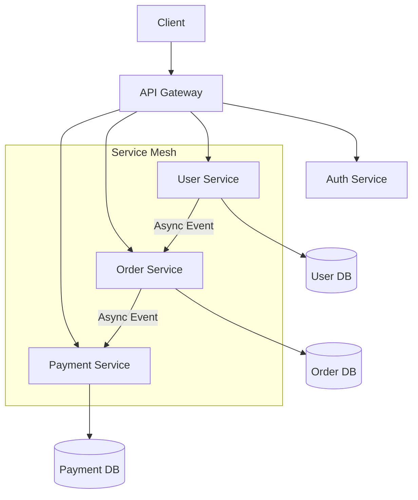

# 07 — Microservices

> From monoliths to distributed microservice architectures — decomposition, communication, resilience, and production-readiness.

## Prerequisites

- [05-System-Design](../05-System-Design/README.md) — messaging, caching, load balancing
- [06-Distributed-Systems](../06-Distributed-Systems/README.md) — consensus, coordination, service discovery

## Table of Contents

| # | Topic | Description |
|---|-------|-------------|
| 1 | [Microservices Basics](01-microservices-basics.md) | Monolith vs microservices, SOA vs microservices, DDD, bounded contexts, when to use microservices |
| 2 | [Service Decomposition](02-service-decomposition.md) | Decomposition strategies, service boundaries, strangler fig pattern, sizing |
| 3 | [Inter-Service Communication](03-inter-service-communication.md) | REST, gRPC, async messaging, API gateway, service mesh (Istio, Linkerd) |
| 4 | [Service Discovery](04-service-discovery.md) | Client-side, server-side, DNS, registry (Consul, Eureka, ZooKeeper), mesh-based |
| 5 | [API Gateway](05-api-gateway.md) | Routing, auth, rate limiting, BFF pattern, Kong vs Envoy vs Zuul |
| 6 | [Circuit Breaker](06-circuit-breaker.md) | Circuit breaker, bulkhead, retry, timeout, Resilience4j, Hystrix |
| 7 | [Event-Driven Microservices](07-event-driven-microservices.md) | Event sourcing, CQRS, saga patterns, outbox, dead letter queues |
| 8 | [Database Per Service](08-database-per-service.md) | Database-per-service pattern, polyglot persistence, distributed transactions, eventual consistency |
| 9 | [Testing Strategies](09-testing-strategies.md) | Test pyramid, contract testing (Pact), consumer-driven contracts, canary & blue-green |
| 10 | [Observability](10-observability.md) | Centralized logging, distributed tracing, metrics, health check APIs |

## Related Modules

- [08-Docker](../08-Docker/README.md) — containerizing microservices
- [09-Kubernetes](../09-Kubernetes/README.md) — orchestrating microservices
- [14-DevOps](../14-DevOps/README.md) — CI/CD pipelines for microservices

---

Previous: [06 — Distributed Systems](../06-Distributed-Systems/README.md)
Next: [08 — Docker](../08-Docker/README.md)
