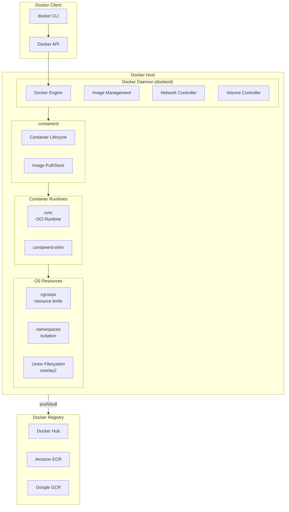

# Docker Basics

## Definition
Docker is a containerization platform that enables developers to package applications with their dependencies into lightweight, portable containers that run consistently across any environment.

## Real-World Example
**Netflix**: Uses Docker containers extensively for their streaming platform. Each microservice runs in its own container, enabling independent scaling, deployment, and failure isolation. Docker's consistency guarantees allow developers to test locally and deploy to production with confidence.

## Docker Architecture



## Container vs VM

```
Containers (Docker)                     Virtual Machines
────────────────────                    ────────────────────

┌──────────────────┐                   ┌──────────────────┐
│   App A          │                   │   App A          │
├──────────────────┤                   ├──────────────────┤
│   Libs / Bins    │                   │   Libs / Bins    │
├──────────────────┤                   ├──────────────────┤
│   Container      │                   │   Guest OS       │
│   Runtime        │                   ├──────────────────┤
├──────────────────┤                   │   Hypervisor     │
│   Host OS        │                   ├──────────────────┤
│   Kernel         │                   │   Host OS        │
└──────────────────┘                   │   Kernel         │
                                       └──────────────────┘

~MB in size                          ~GB in size
~ms to start                          ~minutes to start
Shares host kernel                    Full OS per VM
Process-level isolation               Hardware-level isolation
```

### Key Differences

| Aspect | Container | Virtual Machine |
|--------|-----------|---------------|
| **Startup time** | Milliseconds | Minutes |
| **Size** | MBs | GBs |
| **Isolation** | Process level (namespaces) | Hypervisor level |
| **Kernel** | Shares host kernel | Own kernel per VM |
| **Performance** | Near native | Some overhead |
| **Density** | 10s per host | 1-10 per host |
| **Security boundary** | Weak (shared kernel) | Strong |

## Image vs Container

```
Docker Image (read-only template)
  ┌──────────────────────────────┐
  │   App Binary                  │  Layer 4 (writeable in container)
  ├──────────────────────────────┤
  │   Dependencies (libs)         │  Layer 3
  ├──────────────────────────────┤
  │   OS packages                 │  Layer 2
  ├──────────────────────────────┤
  │   Base OS (Ubuntu, Alpine)    │  Layer 1
  └──────────────────────────────┘
               │ docker run
               ▼
  Docker Container (image + writable layer)
  ┌──────────────────────────────┐
  │   Runtime state (writeable)   │  Container layer (ephemeral)
  ├──────────────────────────────┤
  │   App Binary                  │  Image layer (read-only)
  ├──────────────────────────────┤
  │   Dependencies                │  Image layer (read-only)
  ├──────────────────────────────┤
  │   Base OS                     │  Image layer (read-only)
  └──────────────────────────────┘
```

## Docker Engine Components

| Component | Role |
|-----------|------|
| **dockerd** | Docker daemon — manages images, containers, networks, volumes |
| **containerd** | Industry-standard container runtime (graduated CNCF project) |
| **runc** | OCI-compliant container runtime — creates and runs containers |
| **containerd-shim** | Per-container process that keeps STDIN/STDOUT open after runc exits |
| **BuildKit** | Modern image builder — concurrent, cache-efficient, multi-platform |
| **docker-proxy** | Port forwarding from host to container |
| **CNI plugins** | Container Network Interface for networking |

## Installation

### Ubuntu / Debian
```bash
# Install required packages
sudo apt-get update
sudo apt-get install ca-certificates curl gnupg

# Add Docker's official GPG key
sudo install -m 0755 -d /etc/apt/keyrings
curl -fsSL https://download.docker.com/linux/ubuntu/gpg | sudo gpg --dearmor -o /etc/apt/keyrings/docker.gpg

# Set up repository
echo "deb [arch=$(dpkg --print-architecture) signed-by=/etc/apt/keyrings/docker.gpg] https://download.docker.com/linux/ubuntu $(lsb_release -cs) stable" | sudo tee /etc/apt/sources.list.d/docker.list > /dev/null

# Install Docker Engine
sudo apt-get update
sudo apt-get install docker-ce docker-ce-cli containerd.io docker-buildx-plugin docker-compose-plugin

# Verify installation
sudo docker run hello-world
```

### macOS / Windows
```
Download Docker Desktop from https://www.docker.com/products/docker-desktop/

Includes:
  - Docker Engine
  - Docker CLI
  - Docker Compose
  - Docker BuildKit
  - Kubernetes (optional)
```

### Post-Install Steps
```bash
# Manage Docker as non-root user
sudo groupadd docker
sudo usermod -aG docker $USER
newgrp docker

# Start on boot
sudo systemctl enable docker.service
sudo systemctl enable containerd.service
```

## Docker Object Labels

Every Docker object can be tagged with labels for organization:

```bash
docker run -l "env=production" -l "team=backend" nginx
docker run --label "com.example.vendor=ACME" nginx
```

## Basic Commands

```bash
# Image management
docker pull ubuntu:22.04
docker build -t myapp:latest .
docker images
docker rmi myapp:latest

# Container lifecycle
docker run -d --name web -p 8080:80 nginx
docker ps -a
docker stop web
docker start web
docker rm web

# Execute in container
docker exec -it web bash
docker logs -f web

# System maintenance
docker system df
docker system prune -a
docker container prune
docker image prune
```

## Best Practices

| Practice | Detail |
|----------|--------|
| **Use specific tags** | Never use `latest` in production — pin versions |
| **Run as non-root** | Add USER directive in Dockerfile, avoid root inside container |
| **One process per container** | Keeps containers focused, manageable |
| **Use .dockerignore** | Exclude node_modules, .git, build artifacts |
| **Set resource limits** | Use --memory and --cpus to prevent noisy neighbors |
| **Keep images small** | Use Alpine, multi-stage builds, minimize layers |
| **Log to stdout/stderr** | Docker collects logs from stdout/stderr automatically |
| **Use healthchecks** | Docker restarts unhealthy containers automatically |
| **Ephemeral containers** | Containers should be disposable — no local state |
| **Label everything** | Use labels for organization, automation, and cleanup |

## Interview Questions

1. How does Docker achieve container isolation using Linux namespaces?
2. What is the difference between an image and a container?
3. How does Docker's layered filesystem (overlay2) work?
4. Compare Docker containers to virtual machines — when would you use each?
5. What is containerd and how does it relate to Docker?
6. How do cgroups enforce resource limits on Docker containers?
7. Why does Docker recommend one process per container?
8. What happens to data written inside a container when it stops?
