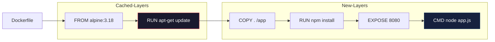

# Dockerfile

## Definition
A Dockerfile is a text document containing instructions to assemble a Docker image. Each instruction creates a layer in the image, which is cached and reused to speed up subsequent builds.

## Real-World Example
**Uber**: Uses multi-stage Dockerfiles to build Go microservices. The builder stage compiles the binary with all dependencies, then a scratch stage copies only the binary, producing images under 10MB for fast deployment across thousands of services.

## Dockerfile Instructions

| Instruction | Description | Example |
|-------------|-------------|---------|
| **FROM** | Sets base image for subsequent instructions | `FROM alpine:3.18` |
| **RUN** | Executes commands in a new layer | `RUN apt-get update && apt-get install -y curl` |
| **CMD** | Provides defaults for executing container | `CMD ["python", "app.py"]` |
| **ENTRYPOINT** | Configures container as executable | `ENTRYPOINT ["docker-entrypoint.sh"]` |
| **COPY** | Copies files from build context | `COPY . /app` |
| **ADD** | Same as COPY + URL/tar extraction | `ADD https://example.com/file.tar.gz /tmp/` |
| **ENV** | Sets environment variables | `ENV NODE_ENV=production` |
| **EXPOSE** | Documents container port | `EXPOSE 8080` |
| **WORKDIR** | Sets working directory | `WORKDIR /app` |
| **USER** | Sets user for RUN/CMD/ENTRYPOINT | `USER appuser` |
| **ARG** | Build-time variable | `ARG VERSION=1.0` |
| **LABEL** | Adds metadata to image | `LABEL maintainer="dev@example.com"` |
| **HEALTHCHECK** | Container health check command | `HEALTHCHECK CMD curl -f http://localhost/` |
| **SHELL** | Overrides default shell | `SHELL ["/bin/bash", "-c"]` |
| **VOLUME** | Creates mount point for external volumes | `VOLUME /data` |
| **STOPSIGNAL** | Sets system call for stopping container | `STOPSIGNAL SIGQUIT` |
| **ONBUILD** | Adds trigger for downstream builds | `ONBUILD COPY . /app/src` |

## Docker Layer Architecture



## Exec Form vs Shell Form

### Shell Form
```dockerfile
RUN apt-get install -y curl
CMD python app.py
ENTRYPOINT entrypoint.sh param1
```
- Runs as `/bin/sh -c "command"`
- Expands shell variables ($HOME)
- Does not handle signals properly (PID 1 is shell)
- String syntax (no brackets)

### Exec Form (JSON array)
```dockerfile
RUN ["apt-get", "install", "-y", "curl"]
CMD ["python", "app.py"]
ENTRYPOINT ["entrypoint.sh", "param1"]
```
- Runs directly (no shell)
- Does NOT expand shell variables
- Handles signals correctly (PID 1 is the process)
- Array syntax (no quotes on variables)
- **Preferred** for CMD and ENTRYPOINT

## CMD vs ENTRYPOINT

```
ENTRYPOINT  │  CMD          │  Result
────────────┼───────────────┼──────────────────────────
No          │ cmd           │ cmd (default command)
entrypoint  │               │
────────────┼───────────────┼──────────────────────────
entrypoint  │ No            │ entrypoint
────────────┼───────────────┼──────────────────────────
entrypoint  │ cmd           │ entrypoint cmd
            │               │ (cmd becomes default args)
────────────┼───────────────┼──────────────────────────
entrypoint  │ docker run    │ entrypoint docker-run-args
            │ <args>        │ (args override CMD)
```

### Best Practice Pattern
```dockerfile
ENTRYPOINT ["docker-entrypoint.sh"]
CMD ["postgres"]
```
- Users can run `docker run myimage --help` to get help
- Users can override defaults: `docker run myimage other-command`
- Entrypoint script can handle setup logic before exec'ing CMD

## Multi-Stage Builds

```dockerfile
# Stage 1: Builder
FROM golang:1.21 AS builder
WORKDIR /app
COPY go.mod go.sum ./
RUN go mod download
COPY . .
RUN CGO_ENABLED=0 GOOS=linux go build -o /app/server

# Stage 2: Runtime
FROM alpine:3.18
RUN apk --no-cache add ca-certificates tzdata
COPY --from=builder /app/server /server
EXPOSE 8080
USER 1001:1001
ENTRYPOINT ["/server"]
```

### Benefits
- Final image contains only runtime artifacts (no build tools)
- Dramatically reduces image size (1.2GB → 15MB for Go apps)
- Separate build dependencies per stage
- Can copy from any previous stage or external image (`COPY --from=nginx:alpine`)

## Layer Caching

```
Dockerfile execution creates layers:
  ┌─────────────────────────────┐
  │ FROM alpine:3.18        ◄── │  Cached (image hash)
  ├─────────────────────────────┤
  │ RUN apk add curl        ◄── │  Cached (RUN command hash)
  ├─────────────────────────────┤
  │ COPY package.json ./    ◄── │  Cached (file checksum)
  ├─────────────────────────────┤
  │ RUN npm install         ◄── │  CACHED (if package.json same)
  ├─────────────────────────────┤
  │ COPY . .                ◄── │  MISSED (source changed)
  ├─────────────────────────────┤
  │ RUN npm run build       ◄── │  Rebuilt
  └─────────────────────────────┘
```

### Cache Optimization Tips
- Order layers from least to most frequently changing
- Copy dependency files first (`package.json`, `go.mod`)
- Install dependencies before copying source code
- Use `--cache-from` in CI/CD to reuse remote cache
- Separate `RUN apt-get update && apt-get install` into a single RUN to minimize layers

## .dockerignore

```
# Version
.git/
.gitignore
README.md

# Dependencies
node_modules/
vendor/
.cache/

# Build output
dist/
build/
*.exe
*.dll

# IDE
.idea/
.vscode/
*.swp

# Environment
.env
.env.local
*.env
```

## Best Practices

| Rule | Why | How |
|------|-----|-----|
| **Minimize layers** | Each instruction adds a layer | Combine RUN commands with `&&` |
| **Use specific base images** | Reproducibility | `FROM alpine:3.18` not `FROM alpine` |
| **Use .dockerignore** | Speed up build context | Exclude unnecessary files |
| **Multi-stage builds** | Smaller final image | Build in one stage, copy artifacts |
| **Run as non-root** | Security | `USER 1001` before CMD |
| **Pin package versions** | Reproducibility | `RUN apt-get install curl=7.88.1-10` |
| **Use exec form** | Signal handling | `CMD ["python", "app.py"]` |
| **Add HEALTHCHECK** | Self-healing | `HEALTHCHECK CMD curl -f http://localhost/` |
| **No secrets in build** | Security | Use build args or Docker secrets |
| **Sort multi-line args** | Cache hits | Alphabetical order reduces change impact |

```dockerfile
# Example: Production-optimized Node.js Dockerfile
FROM node:20-alpine AS builder
WORKDIR /app
COPY package.json package-lock.json ./
RUN npm ci --only=production
COPY . .
RUN npm run build

FROM node:20-alpine AS runtime
RUN apk --no-cache add tini
WORKDIR /app
COPY --from=builder /app/dist ./dist
COPY --from=builder /app/node_modules ./node_modules
COPY --from=builder /app/package.json ./
EXPOSE 3000
USER node
ENTRYPOINT ["/sbin/tini", "--"]
CMD ["node", "dist/server.js"]
```

## Interview Questions

1. What is the difference between COPY and ADD in a Dockerfile?
2. Explain the difference between CMD and ENTRYPOINT with examples
3. How do multi-stage builds reduce image size?
4. What is Docker layer caching and how do you optimize it?
5. When would you use exec form vs shell form for RUN/CMD/ENTRYPOINT?
6. How does .dockerignore affect the build process?
7. What happens to RUN apt-get update layers if you don't clean apt caches?
8. How do you pass build-time and runtime variables to a Dockerfile?
9. What's the purpose of HEALTHCHECK in a Dockerfile?
10. How would you debug a failed Docker image build?
