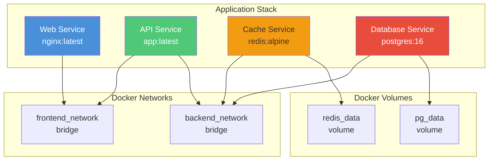

# Docker Compose

## Definition
Docker Compose is a tool for defining and running multi-container Docker applications using a YAML file. It enables single-command deployment of application stacks with service networking, volumes, and configuration.

## Real-World Example
**GitLab**: Provides a Docker Compose file for self-hosted GitLab instances. The compose file defines services for GitLab Rails, PostgreSQL, Redis, Gitaly (Git storage), and Sidekiq (background jobs), all configured to work together with a single `docker compose up` command.

## Architecture



## Compose File Structure

```yaml
# docker-compose.yml
version: "3.9"

services:
  web:
    image: nginx:alpine
    ports:
      - "80:80"
    networks:
      - frontend
    depends_on:
      - api

  api:
    build:
      context: ./api
      dockerfile: Dockerfile
    environment:
      - DB_HOST=db
      - REDIS_HOST=cache
    networks:
      - frontend
      - backend
    depends_on:
      db:
        condition: service_healthy
      cache:
        condition: service_healthy

  db:
    image: postgres:16
    volumes:
      - pgdata:/var/lib/postgresql/data
    environment:
      POSTGRES_DB: myapp
      POSTGRES_PASSWORD: ${DB_PASSWORD}
    healthcheck:
      test: ["CMD-SHELL", "pg_isready"]
      interval: 5s
      timeout: 5s
      retries: 5
    networks:
      - backend

  cache:
    image: redis:7-alpine
    volumes:
      - redis_data:/data
    networks:
      - backend

networks:
  frontend:
    driver: bridge
  backend:
    driver: bridge

volumes:
  pgdata:
    driver: local
  redis_data:
    driver: local
```

## Key Sections

### Services
The core of Compose — defines each containerized component.

```yaml
services:
  web:
    image: nginx:alpine              # Use existing image
    build: ./dir                      # Build from Dockerfile
    build:
      context: ./dir
      dockerfile: Dockerfile.dev
      args:
        buildno: 1
    container_name: my-web            # Custom container name
    restart: unless-stopped           # Restart policy
    ports:
      - "8080:80"                     # Host:Container
      - "443:443"
    expose:
      - "3000"                        # Expose to linked services only
    environment:
      - NODE_ENV=production
      - SECRET_KEY=${SECRET_KEY}      # From .env file
    env_file:
      - ./config/prod.env
    volumes:
      - ./html:/usr/share/nginx/html  # Bind mount
      - web_data:/var/www             # Named volume
    depends_on:                       # Startup order
      - db
      - cache
```

### Networks
Isolated communication between services.

```yaml
networks:
  frontend:
    driver: bridge
    ipam:
      config:
        - subnet: 172.20.0.0/16
  backend:
    driver: bridge
    internal: true                   # No external access
  monitoring:
    external: true                   # Use existing network
    name: mon-net                    # External network name
```

### Volumes
Persistent storage for stateful services.

```yaml
volumes:
  pgdata:
    driver: local
    driver_opts:
      type: none
      device: /mnt/data/pgdata
      o: bind
  logs:
    driver: local
  cache_data:
    driver: local
```

## depends_on Configurations

```yaml
# Basic startup ordering
services:
  app:
    depends_on:
      - db
      - redis

# Advanced with health checks
services:
  app:
    depends_on:
      db:
        condition: service_healthy
      redis:
        condition: service_healthy
      migration:
        condition: service_completed_successfully

  migration:
    image: myapp:migrate
    depends_on:
      db:
        condition: service_healthy
```

## Profiles

Profiles allow selective service activation for different environments.

```yaml
services:
  app:
    image: myapp:latest

  db:
    image: postgres:16
    profiles: ["db", "dev"]

  redis:
    image: redis:7-alpine
    profiles: ["cache", "dev"]

  adminer:
    image: adminer:latest
    profiles: ["dev"]

  monitoring:
    image: prom/prometheus
    profiles: ["monitoring", "prod"]
```

```bash
# Start only app + db + cache (default)
docker compose up

# Start with dev profile (adds adminer)
docker compose --profile dev up

# Start with monitoring
docker compose --profile monitoring up
```

## Deploy Section (Swarm Mode)

```yaml
services:
  app:
    image: myapp:latest
    deploy:
      mode: replicated
      replicas: 3
      resources:
        limits:
          cpus: "0.5"
          memory: 512M
        reservations:
          cpus: "0.25"
          memory: 256M
      restart_policy:
        condition: on-failure
        delay: 5s
        max_attempts: 3
        window: 120s
      update_config:
        parallelism: 1
        delay: 10s
        failure_action: rollback
        monitor: 60s
      placement:
        constraints:
          - node.role == worker
          - node.labels.zone == us-east
```

## Environment Variables

### Using .env File
```
# .env (in project root, loaded automatically)
DB_PASSWORD=secure_password
SECRET_KEY=abc123
NODE_ENV=production
IMAGE_TAG=v2.1.0
```

```yaml
# compose file references
services:
  web:
    image: myapp:${IMAGE_TAG:-latest}
    environment:
      - NODE_ENV=${NODE_ENV}
      - DB_PASSWORD=${DB_PASSWORD}
```

### Variable Substitution
| Syntax | Behavior |
|--------|----------|
| `${VAR}` | Use VAR value, error if unset |
| `${VAR:-default}` | Use default if VAR unset |
| `${VAR:?error}` | Error with message if VAR unset |
| `${VAR:+replacement}` | Use replacement if VAR is set |

## docker-compose vs docker stack

| Feature | docker compose | docker stack |
|---------|---------------|--------------|
| **Mode** | Local development | Production Swarm |
| **Deploy** | Single host | Multi-host cluster |
| **Replicas** | Single container per service | Multiple replicas |
| **Rolling updates** | Manual | Automatic with deploy config |
| **Secrets** | No | Yes |
| **Configs** | No | Yes |
| **Health checks** | Basic | Integrated with Swarm |
| **Networking** | Bridge/overlay | Overlay only |
| **Use case** | Dev, CI/CD | Production |

## Common Commands

```bash
# Start services
docker compose up -d

# Build and start
docker compose up --build -d

# View logs
docker compose logs -f web

# Scale service
docker compose up -d --scale web=3

# Execute command in service
docker compose exec web bash

# Run one-off command
docker compose run --rm web npm test

# Stop services
docker compose down

# Stop + remove volumes
docker compose down -v

# Rebuild specific service
docker compose build web

# List running services
docker compose ps

# Check configuration
docker compose config
```

## Best Practices

| Practice | Detail |
|----------|--------|
| **Use .env files** | Keep secrets out of compose files |
| **Pin image versions** | Specify exact tags for reproducibility |
| **Add healthchecks** | Ensure services are ready before startup |
| **Use profiles** | Separate dev/prod/monitoring dependencies |
| **External volumes** | Don't manage production data with Compose volume lifecycle |
| **Network isolation** | Use multiple networks to segment services |
| **Limit resources** | Set memory/cpu limits in production |
| **Use depends_on** | Control startup order (with conditions) |
| **Separate compose files** | Use `-f docker-compose.override.yml` for overrides |
| **Readonly root** | Set `read_only: true` for immutable containers |

## Interview Questions

1. How does Docker Compose handle service discovery between containers?
2. What is the difference between depends_on and healthcheck conditions?
3. How do you pass environment variables to a Docker Compose service?
4. Compare docker compose and docker stack for production use
5. How do profiles work in Docker Compose and when would you use them?
6. What's the difference between ports and expose in Compose?
7. How do you scale a service in Docker Compose?
8. How would you set up a development environment with hot-reload using Compose?
9. What happens to volumes when you run `docker compose down -v`?
10. How do you handle multiple environments (dev/staging/prod) with Compose?
