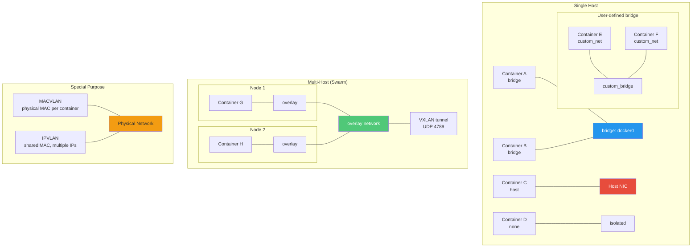
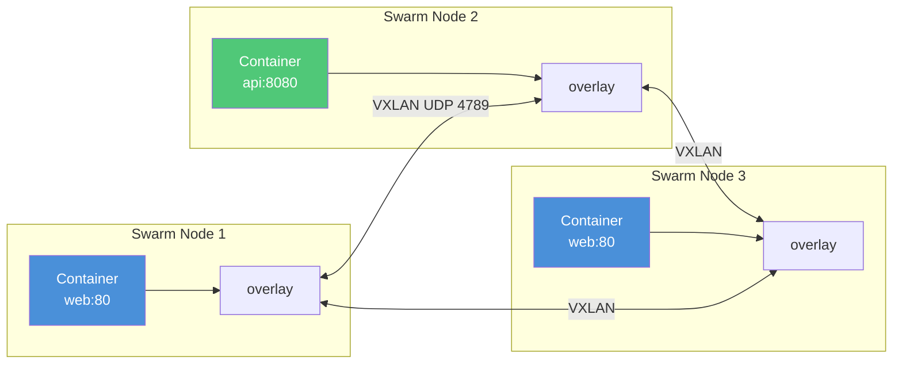

# Docker Networking

## Definition
Docker networking enables containers to communicate with each other and the outside world through various network drivers that provide isolation, service discovery, and load balancing.

## Real-World Example
**Airbnb**: Uses Docker overlay networks in production to connect microservices across multiple Swarm hosts. Each service gets its own overlay network, providing isolation and encrypted communication. Service discovery via Docker's built-in DNS allows services to find each other by service name.

## Network Drivers



## Bridge Network

### Default Bridge (docker0)
```bash
# Default network created by Docker
docker network inspect bridge

# Containers connected by IP only (no DNS)
docker run --rm alpine ping 172.17.0.2

# No automatic service discovery
docker run --name container1 alpine
docker run --name container2 alpine
# container2 CANNOT ping "container1" by name
```

### User-Defined Bridge
```bash
# Create custom bridge network
docker network create -d bridge --subnet 172.30.0.0/16 mynetwork

# Connect containers with DNS resolution
docker run -d --name web --network mynetwork nginx
docker run -d --name api --network mynetwork myapp

# Automatic DNS — containers resolve by name
docker exec web ping api    # Works!
docker exec api ping web    # Works!

# Customize network
docker network create \
  --driver bridge \
  --subnet 10.10.0.0/16 \
  --ip-range 10.10.0.0/24 \
  --gateway 10.10.0.1 \
  --label env=prod \
  mynetwork
```

### Bridge Features
- **DNS resolution** (user-defined only): Containers resolve by name
- **Better isolation**: Only containers on the same network can communicate
- **Attach/detach**: Add/remove containers at runtime
- **Link isolation**: Fine-grained network boundaries

## Host Network

The container shares the host's network stack — no network isolation.

```bash
# Use host networking
docker run --network host nginx

# Container sees host's localhost
# Port mapping is automatic (no -p flag needed)
# Best for: performance-critical, network monitoring

# Use cases:
#   - nginx as reverse proxy (need real client IP)
#   - Network benchmarks
#   - Applications needing direct host port access
```

```
Container with host network:
  ┌─────────────────────────────┐
  │ Host Network Stack          │
  │                             │
  │  eth0: 192.168.1.100        │
  │  lo:   127.0.0.1            │
  │                             │
  │  Container sees same        │
  │  network as host process    │
  └─────────────────────────────┘

No:
  - Network isolation
  - Port mapping (uses host ports directly)
  - Multiple containers on same port
```

## Overlay Network (Swarm)

Encapsulates container traffic across multiple hosts using VXLAN tunnels.

```yaml
# Create overlay network in Swarm
docker network create \
  --driver overlay \
  --subnet 10.0.10.0/24 \
  --gateway 10.0.10.1 \
  --opt encrypted \
  myservice_network
```



### Overlay Features
- **Multi-host**: Spans all Swarm nodes
- **Encryption**: AES-GCM with automatic key rotation (`--opt encrypted`)
- **Load balancing**: Built-in DNS round-robin (VIP via IPVS)
- **Service discovery**: DNS resolution across cluster
- **Scalable**: No manual configuration for new nodes

## MACVLAN Network

Assigns a real MAC address to each container, making them appear as physical devices.

```bash
# Create MACVLAN network
docker network create \
  --driver macvlan \
  --subnet 192.168.1.0/24 \
  --gateway 192.168.1.1 \
  --opt parent=eth0 \
  macvlan_prod

# Run container on MACVLAN
docker run --network macvlan_prod \
  --ip 192.168.1.100 \
  -d nginx
```

### MACVLAN Characteristics
- Each container gets a unique MAC address
- Containers are directly accessible from the physical network
- No port mapping needed
- IP exhaustion concern (each container uses an IP)
- Some switches restrict many MACs per port (port security)

## IPVLAN Network

Shares host MAC address but assigns unique IP addresses.

```bash
# Create IPVLAN network (L3 mode)
docker network create \
  --driver ipvlan \
  --subnet 10.0.0.0/24 \
  --gateway 10.0.0.1 \
  --opt parent=eth0.100 \
  --opt ipvlan_mode=l3 \
  ipvlan_network
```

### IPVLAN Modes
- **L2 mode**: Same as MACVLAN but shared MAC
- **L3 mode**: Routing between subnets (no broadcast)

## None Network

Complete network isolation.

```bash
# No network at all
docker run --network none alpine

# Container has only loopback interface
# Cannot reach internet or other containers
# Use case: offline computation, batch processing
```

## DNS Resolution

```yaml
# Custom DNS configuration
services:
  web:
    image: nginx
    dns:
      - 8.8.8.8
      - 1.1.1.1
    dns_search:
      - example.com
      - internal.corp
    hostname: web-server
    domainname: example.com
    extra_hosts:
      - "host.docker.internal:host-gateway"
```

## Port Publishing

```bash
# Default: publish to all interfaces
docker run -p 8080:80 nginx

# Publish to specific interface
docker run -p 127.0.0.1:8080:80 nginx

# Random host port
docker run -p 80 nginx

# UDP port
docker run -p 53:53/udp dns-server

# Range of ports
docker run -p 3000-3005:3000-3005 app

# Multiple ports
docker run -p 80:80 -p 443:443 -p 3000:3000 app
```

```
Traffic Flow:
  Internet → Host:8080 → docker-proxy → Container:80
  
  docker-proxy binds to host port
  Forwards traffic to container
  NAT rules in iptables handle routing
```

## Network Aliases

```yaml
services:
  web:
    image: nginx
    networks:
      frontend:
        aliases:
          - webserver
          - www
      backend:
        aliases:
          - web-cache
```

```bash
# Container resolves to multiple names
docker exec api ping webserver   # Resolves to web container
docker exec api ping www         # Resolves to web container
```

## Network Plugins

| Plugin | Description | Provider |
|--------|-------------|----------|
| **Calico** | Network policy enforcement, BGP routing | Tigera |
| **Weave** | Simple overlay, encryption | Weaveworks |
| **Cilium** | eBPF-based networking, security | Isovalent |
| **Flannel** | Simple overlay (VXLAN, host-gw) | CoreOS |
| **Contiv** | Policy-based networking | Cisco |
| **SR-IOV** | High-performance direct NIC access |

### Installing a Plugin
```bash
# Install Weave plugin
docker plugin install weaveworks/net-plugin:latest_release

# Use plugin
docker network create --driver weave mynetwork
```

## Best Practices

| Practice | Detail |
|----------|--------|
| **Use user-defined bridges** | Always prefer over default bridge for DNS and isolation |
| **Segregate networks** | Frontend services on one network, backend on another |
| **Use network labels** | Tag networks with env, team, project metadata |
| **Avoid host network** | Use only when absolutely necessary (security risk) |
| **Limit exposed ports** | Only expose ports that need external access |
| **Use host-gateway** | For containers accessing host services via host.docker.internal |
| **Network encryption** | Enable encrypted overlay for sensitive traffic |
| **Monitor network usage** | Track container bandwidth with docker stats |
| **Clean up networks** | Remove unused docker network prune |
| **CIDR planning** | Plan subnet ranges to avoid IP exhaustion |

## Interview Questions

1. How does Docker's default bridge network differ from user-defined bridge networks?
2. What is the host network driver and when would you use it?
3. How does overlay networking enable multi-host communication in Swarm?
4. Explain the difference between MACVLAN and IPVLAN drivers
5. How does Docker DNS resolution work for containers on a user-defined bridge?
6. What port range does Docker use for publishing ports?
7. How would you isolate containers so they cannot communicate with each other?
8. What is VXLAN and how does Docker use it for overlay networks?
9. How does Docker's embedded DNS work with overlay networks?
10. Compare Calico vs Flannel vs Cilium for container networking
